# BTC / Gold / Silver Rule-Based Accumulation — Backtest Results

Generated from live Yahoo Finance data via `yfinance`. Full spec: [`btc-gold-silver-backtest-spec.md`](../btc-gold-silver-backtest-spec.md). Reusable pipeline: `run_all.py` + `src/backtest/`.

## Data coverage

- **BTC**: 628 weekly candles, 2014-09-21 → 2026-09-27
- **Gold**: 1361 weekly candles, 2000-09-03 → 2026-09-27
- **Silver**: 1361 weekly candles, 2000-09-03 → 2026-09-27

## Scoping notes (read this first)

- The **headline metrics grid** below covers the full spec'd grid: 3 assets × 2 signals × p ∈ {1, 2.5, 5, 10, 15} = 30 combinations, run in full.
- The **robustness suite** (random-timing Monte Carlo, block bootstrap, rolling windows) is compute-heavy (thousands of full backtests per combination), so it is run in depth at **p = 5** for all 3 assets × 2 signals (6 combinations) rather than across all 30 grid points. Monte Carlo uses 300 simulations; block bootstrap uses 150 simulations per variant (raw + de-trended). p=5 sits in the middle of the tested grid and is not cherry-picked from the results.
- Block-bootstrap synthetic price paths reconstruct OHLC from a resampled weekly log-return path; the Open/High/Low are approximated from the real series' median range-to-body ratio (intraweek range is not itself resampled). This is a documented simplification — it preserves the close-to-close return structure that both signals and the ATR indicator ultimately depend on.
- Rebalance-band benchmark deploys its full budget as a lump sum at the start of the window (target weight = the signal strategy's own average invested fraction), rather than accumulating over time — this matches the spec's 'same total dollars' framing for a lump-sum comparison strategy.

## 1. Headline metrics grid

**Wealth/Inv** = ending wealth ÷ total money invested (primary metric, matched budgets across all strategies). **MaxDD** is computed on a synthetic NAV/unit-price basis so new deposits can't mask real losses.

| Asset | Signal | p% | #Buy | #Sell | Wealth/Inv | DCA | Buy&Hold | Buy-only | Rebal-band | XIRR | MaxDD | Sharpe | Sortino | Calmar | Avg cost |
|---|---|---|---|---|---|---|---|---|---|---|---|---|---|---|---|
| BTC | A (shock) | 1.0 | 3 | 6 | 6.50 | 53.23 | 182.04 | 14.00 | 24.69 | 33.8% | -73.9% | 0.63 | 0.88 | 0.28 | 6055.55 |
| BTC | A (shock) | 2.5 | 8 | 14 | 5.35 | 53.23 | 182.04 | 23.59 | 12.64 | 28.9% | -61.6% | 0.89 | 1.35 | 0.52 | 3595.05 |
| BTC | A (shock) | 5.0 | 24 | 32 | 2.88 | 53.23 | 182.04 | 29.86 | 6.97 | 17.9% | -46.9% | 0.92 | 1.35 | 0.54 | 2839.86 |
| BTC | A (shock) | 10.0 | 59 | 64 | 1.82 | 53.23 | 182.04 | 32.75 | 3.59 | 10.3% | -21.7% | 1.00 | 1.57 | 0.77 | 2589.65 |
| BTC | A (shock) | 15.0 | 82 | 95 | 1.44 | 53.23 | 182.04 | 36.56 | 2.95 | 6.4% | -21.2% | 0.81 | 1.06 | 0.46 | 2319.98 |
| BTC | B (trend-stretch) | 1.0 | 32 | 17 | 3.01 | 53.23 | 182.04 | 7.97 | 10.08 | 19.6% | -70.4% | 0.47 | 0.66 | 0.20 | 10643.72 |
| BTC | B (trend-stretch) | 2.5 | 50 | 22 | 2.62 | 53.23 | 182.04 | 7.41 | 9.39 | 18.3% | -73.9% | 0.43 | 0.58 | 0.16 | 11451.48 |
| BTC | B (trend-stretch) | 5.0 | 75 | 37 | 1.76 | 53.23 | 182.04 | 7.59 | 4.97 | 10.6% | -75.2% | 0.27 | 0.38 | 0.08 | 11166.47 |
| BTC | B (trend-stretch) | 10.0 | 112 | 54 | 1.54 | 53.23 | 182.04 | 7.19 | 4.49 | 8.4% | -74.8% | 0.19 | 0.25 | 0.05 | 11793.48 |
| BTC | B (trend-stretch) | 15.0 | 144 | 71 | 1.51 | 53.23 | 182.04 | 7.36 | 4.12 | 8.3% | -84.1% | -0.00 | -0.00 | -0.05 | 11526.75 |
| Gold | A (shock) | 1.0 | 10 | 23 | 1.62 | 5.25 | 15.85 | 3.98 | 3.05 | 3.7% | -17.1% | 0.40 | 0.49 | 0.25 | 1091.92 |
| Gold | A (shock) | 2.5 | 24 | 29 | 1.62 | 5.25 | 15.85 | 4.42 | 3.38 | 3.7% | -12.1% | 0.50 | 0.59 | 0.43 | 981.52 |
| Gold | A (shock) | 5.0 | 59 | 71 | 1.46 | 5.25 | 15.85 | 4.94 | 2.39 | 2.8% | -8.9% | 0.44 | 0.49 | 0.40 | 879.06 |
| Gold | A (shock) | 10.0 | 123 | 143 | 1.36 | 5.25 | 15.85 | 4.79 | 2.12 | 2.4% | -4.6% | 0.49 | 0.64 | 0.70 | 906.43 |
| Gold | A (shock) | 15.0 | 179 | 206 | 1.34 | 5.25 | 15.85 | 4.84 | 1.97 | 2.2% | -5.8% | 0.41 | 0.51 | 0.48 | 896.33 |
| Gold | B (trend-stretch) | 1.0 | 38 | 40 | 1.39 | 5.25 | 15.85 | 3.65 | 2.96 | 3.4% | -19.0% | 0.48 | 0.61 | 0.23 | 1188.69 |
| Gold | B (trend-stretch) | 2.5 | 65 | 50 | 1.34 | 5.25 | 15.85 | 3.69 | 2.89 | 2.8% | -22.1% | 0.42 | 0.53 | 0.18 | 1176.87 |
| Gold | B (trend-stretch) | 5.0 | 125 | 103 | 1.32 | 5.25 | 15.85 | 4.02 | 2.44 | 2.4% | -16.3% | 0.36 | 0.45 | 0.20 | 1081.13 |
| Gold | B (trend-stretch) | 10.0 | 182 | 166 | 1.32 | 5.25 | 15.85 | 3.99 | 2.34 | 2.4% | -14.2% | 0.38 | 0.47 | 0.23 | 1088.39 |
| Gold | B (trend-stretch) | 15.0 | 239 | 224 | 1.34 | 5.25 | 15.85 | 4.28 | 2.28 | 2.4% | -12.6% | 0.40 | 0.46 | 0.27 | 1013.35 |
| Silver | A (shock) | 1.0 | 10 | 23 | 1.86 | 5.23 | 13.19 | 4.62 | 3.20 | 4.5% | -26.2% | 0.35 | 0.39 | 0.19 | 14.13 |
| Silver | A (shock) | 2.5 | 20 | 40 | 1.61 | 5.23 | 13.19 | 4.81 | 3.20 | 3.6% | -22.9% | 0.31 | 0.33 | 0.19 | 13.59 |
| Silver | A (shock) | 5.0 | 53 | 71 | 1.48 | 5.23 | 13.19 | 5.11 | 2.69 | 2.9% | -15.7% | 0.31 | 0.33 | 0.23 | 12.79 |
| Silver | A (shock) | 10.0 | 127 | 153 | 1.37 | 5.23 | 13.19 | 4.83 | 2.15 | 2.4% | -8.0% | 0.33 | 0.37 | 0.35 | 13.52 |
| Silver | A (shock) | 15.0 | 184 | 215 | 1.35 | 5.23 | 13.19 | 5.18 | 2.02 | 2.2% | -5.7% | 0.26 | 0.29 | 0.43 | 12.61 |
| Silver | B (trend-stretch) | 1.0 | 29 | 47 | 1.45 | 5.23 | 13.19 | 3.70 | 2.99 | 3.2% | -36.2% | 0.33 | 0.40 | 0.14 | 17.62 |
| Silver | B (trend-stretch) | 2.5 | 47 | 63 | 1.40 | 5.23 | 13.19 | 3.52 | 2.94 | 3.0% | -31.6% | 0.36 | 0.45 | 0.16 | 18.54 |
| Silver | B (trend-stretch) | 5.0 | 92 | 103 | 1.41 | 5.23 | 13.19 | 3.64 | 2.64 | 2.8% | -24.5% | 0.41 | 0.53 | 0.21 | 17.91 |
| Silver | B (trend-stretch) | 10.0 | 150 | 201 | 1.32 | 5.23 | 13.19 | 3.71 | 2.37 | 2.4% | -20.1% | 0.37 | 0.46 | 0.20 | 17.62 |
| Silver | B (trend-stretch) | 15.0 | 190 | 267 | 1.33 | 5.23 | 13.19 | 4.10 | 2.27 | 2.3% | -18.0% | 0.36 | 0.45 | 0.19 | 15.93 |

Full grid: [`grid_metrics.csv`](grid_metrics.csv)

## 2. Grid heatmaps

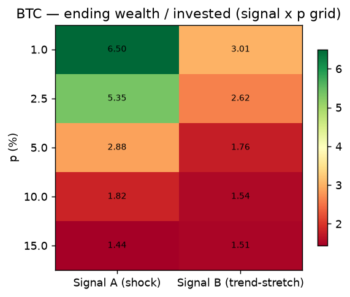

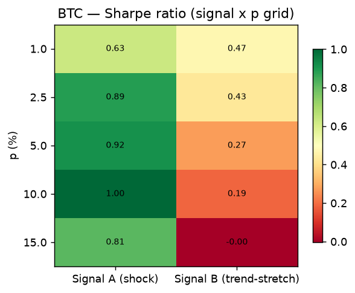

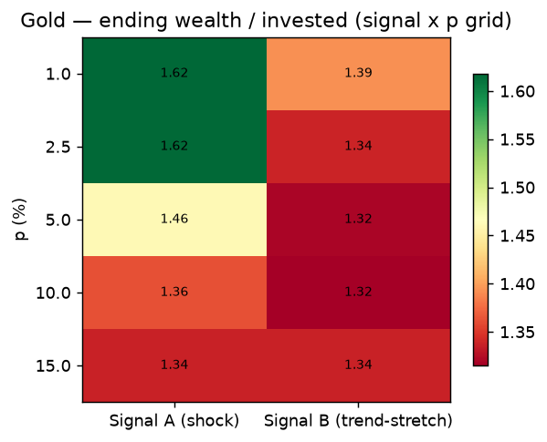

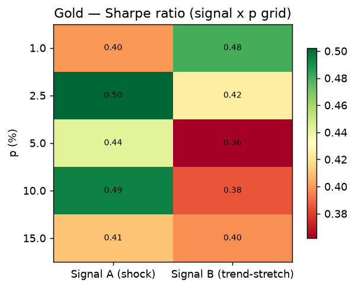

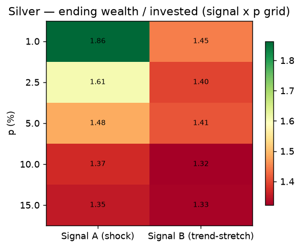

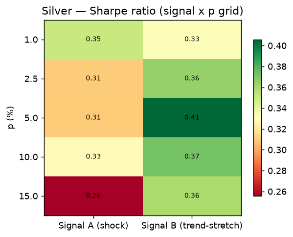

## 3. Deep dive at p=5 (robustness tests)

### BTC — Signal A (shock) (p=5)

- Trades: 24 buys, 32 sells, total invested $12,000, ending wealth $34,520 (**2.88×** invested; DCA on the same budget: **53.23×**)
- XIRR: 17.9%, MaxDD: -46.9%, Sharpe: 0.92, Sortino: 1.35, Calmar: 0.54
- Avg cost basis: $2839.86

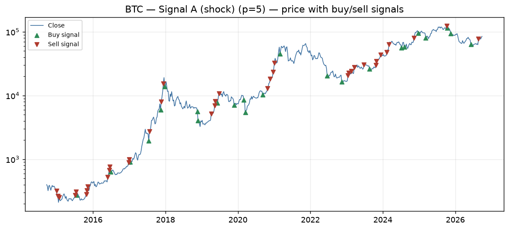

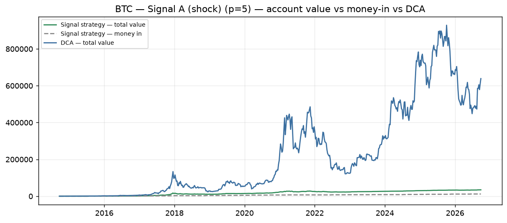

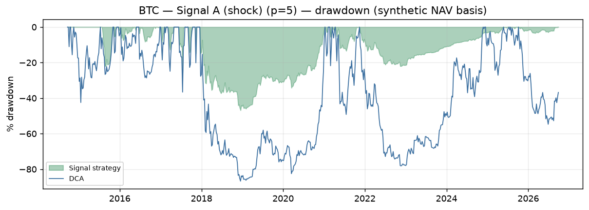

**Robustness test 1 — random-timing Monte Carlo (300 sims):** same number of buys/sells, random weeks. Percentile of the real strategy within that random distribution (need to clear ~95th percentile for the result to look like more than luck):

- Ending wealth/invested: **25.0th percentile**
- Sharpe: **84.7th percentile**
- Max drawdown (higher/shallower = better): **30.3th percentile**

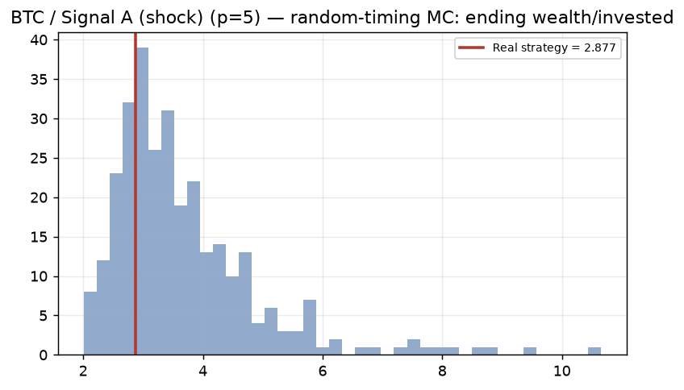

**Robustness test 2 — block bootstrap (150 sims × raw + de-trended):** win rate of the strategy vs DCA on resampled alternate price histories:

- return (raw): 2.7%
- drawdown (raw): 98.0%
- sharpe (raw): 39.3%
- return (detrended): 57.3%
- drawdown (detrended): 97.3%
- sharpe (detrended): 34.7%

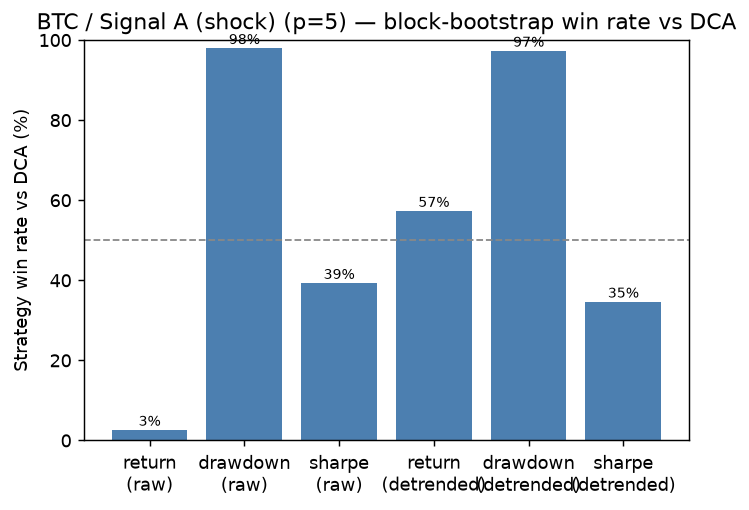

**Robustness test 3 — rolling windows:**

- 2y windows: 40 total, 38 scored (rest flagged low-signal-count) — strategy beats DCA on return in 13.2% of scored windows, on drawdown in 94.7%, on Sharpe in 44.7%
  - Most recent 2y window (2024-09-08 → 2026-08-30, 12 signals): strategy 0.91× vs DCA 0.93×, strategy MaxDD -52.1% vs DCA MaxDD -53.6%

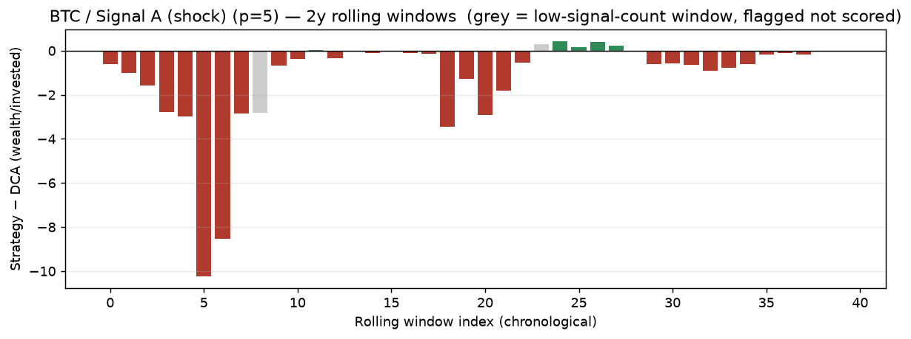

**Signal quality — forward returns after each signal fires, vs unconditional average:**

**After buy signals**

| Horizon | Avg return after signal | Unconditional avg return | Edge | n obs |
|---|---|---|---|---|
| 1m | 12.7% | 5.6% | 7.1% | 24 |
| 3m | 21.0% | 21.0% | 0.0% | 24 |
| 6m | 80.9% | 51.2% | 29.7% | 23 |
| 12m | 233.8% | 142.6% | 91.2% | 21 |

**After sell signals**

| Horizon | Avg return after signal | Unconditional avg return | Edge | n obs |
|---|---|---|---|---|
| 1m | 12.6% | 5.6% | 7.0% | 37 |
| 3m | 30.0% | 21.0% | 9.0% | 36 |
| 6m | 49.1% | 51.2% | -2.1% | 36 |
| 12m | 181.3% | 142.6% | 38.7% | 35 |

---

### BTC — Signal B (trend-stretch) (p=5)

- Trades: 75 buys, 37 sells, total invested $37,500, ending wealth $66,000 (**1.76×** invested; DCA on the same budget: **53.23×**)
- XIRR: 10.6%, MaxDD: -75.2%, Sharpe: 0.27, Sortino: 0.38, Calmar: 0.08
- Avg cost basis: $11166.47

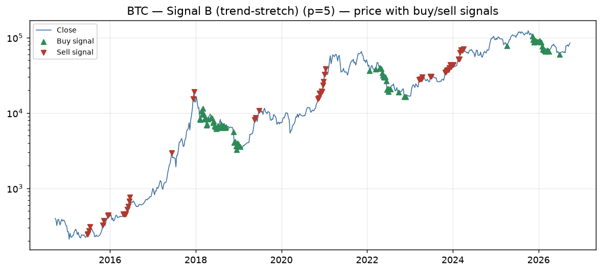

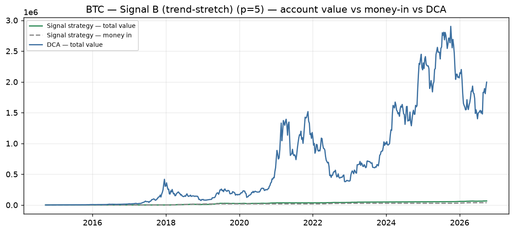

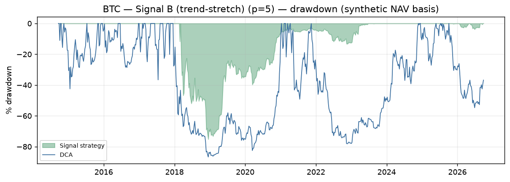

**Robustness test 1 — random-timing Monte Carlo (300 sims):** same number of buys/sells, random weeks. Percentile of the real strategy within that random distribution (need to clear ~95th percentile for the result to look like more than luck):

- Ending wealth/invested: **0.0th percentile**
- Sharpe: **0.0th percentile**
- Max drawdown (higher/shallower = better): **99.0th percentile**

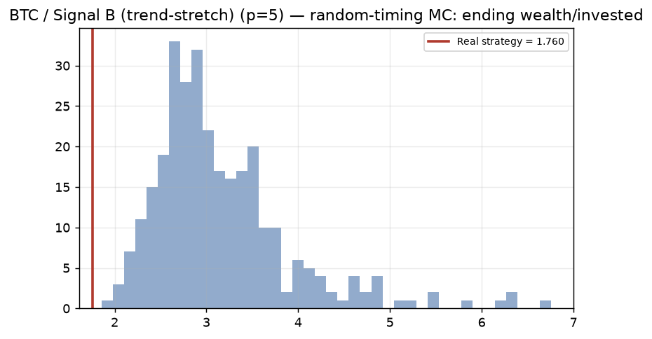

**Robustness test 2 — block bootstrap (150 sims × raw + de-trended):** win rate of the strategy vs DCA on resampled alternate price histories:

- return (raw): 4.0%
- drawdown (raw): 98.7%
- sharpe (raw): 24.7%
- return (detrended): 61.3%
- drawdown (detrended): 94.7%
- sharpe (detrended): 35.3%

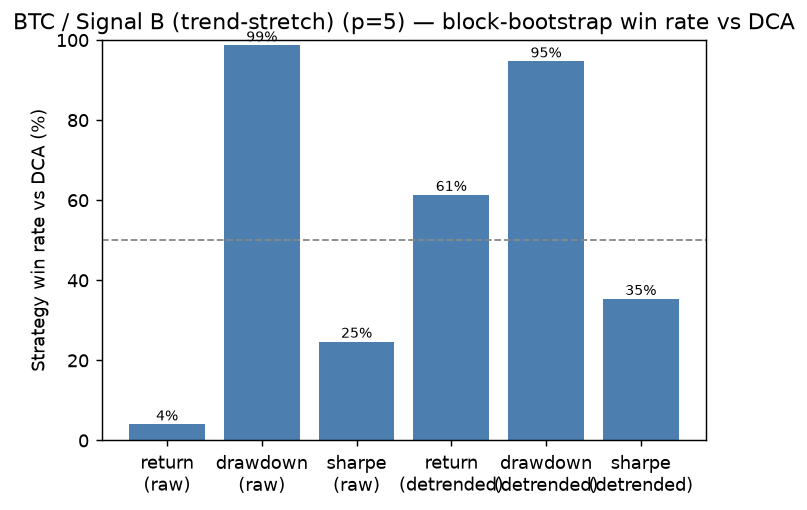

**Robustness test 3 — rolling windows:**

- 2y windows: 29 total, 29 scored (rest flagged low-signal-count) — strategy beats DCA on return in 20.7% of scored windows, on drawdown in 93.1%, on Sharpe in 27.6%
  - Most recent 2y window (2024-09-08 → 2026-08-30, 13 signals): strategy 0.98× vs DCA 0.93×, strategy MaxDD -58.3% vs DCA MaxDD -53.6%

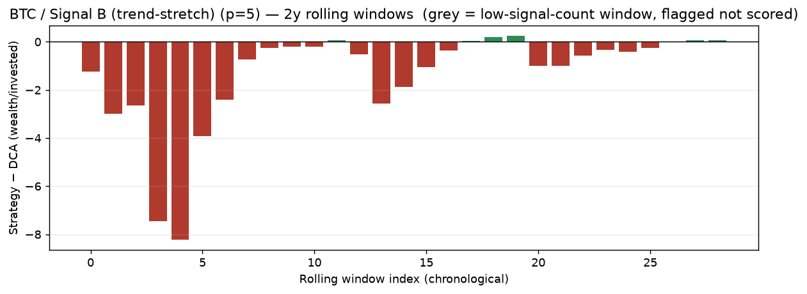

**Signal quality — forward returns after each signal fires, vs unconditional average:**

**After buy signals**

| Horizon | Avg return after signal | Unconditional avg return | Edge | n obs |
|---|---|---|---|---|
| 1m | -2.1% | 5.6% | -7.7% | 75 |
| 3m | -9.2% | 21.0% | -30.2% | 75 |
| 6m | -3.1% | 51.2% | -54.3% | 74 |
| 12m | 23.2% | 142.6% | -119.4% | 56 |

**After sell signals**

| Horizon | Avg return after signal | Unconditional avg return | Edge | n obs |
|---|---|---|---|---|
| 1m | 10.9% | 5.6% | 5.3% | 56 |
| 3m | 36.3% | 21.0% | 15.4% | 56 |
| 6m | 46.6% | 51.2% | -4.6% | 56 |
| 12m | 128.4% | 142.6% | -14.2% | 56 |

---

### Gold — Signal A (shock) (p=5)

- Trades: 59 buys, 71 sells, total invested $29,500, ending wealth $43,111 (**1.46×** invested; DCA on the same budget: **5.25×**)
- XIRR: 2.8%, MaxDD: -8.9%, Sharpe: 0.44, Sortino: 0.49, Calmar: 0.40
- Avg cost basis: $879.06

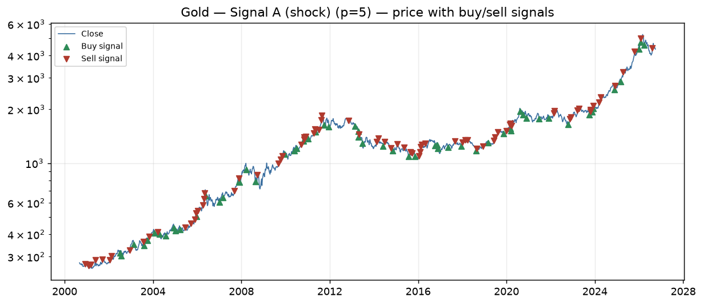

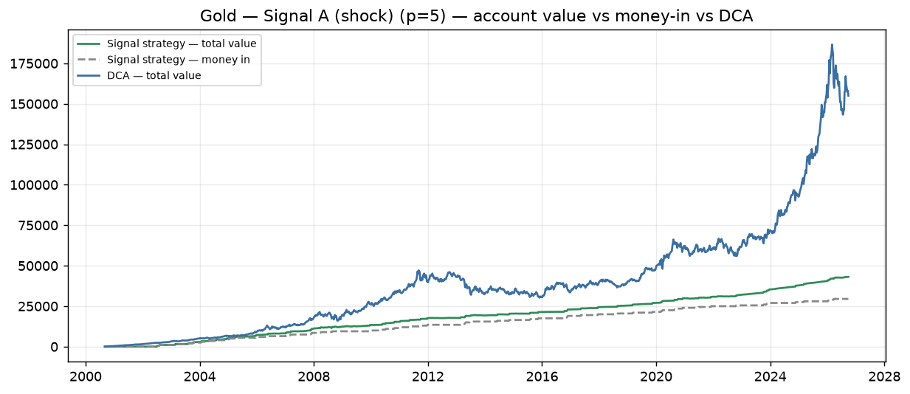

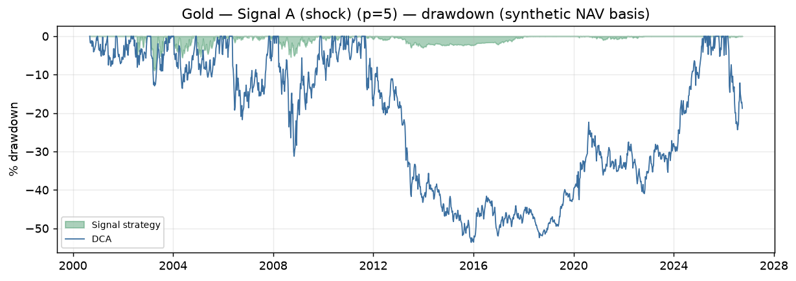

**Robustness test 1 — random-timing Monte Carlo (300 sims):** same number of buys/sells, random weeks. Percentile of the real strategy within that random distribution (need to clear ~95th percentile for the result to look like more than luck):

- Ending wealth/invested: **59.0th percentile**
- Sharpe: **82.0th percentile**
- Max drawdown (higher/shallower = better): **82.3th percentile**

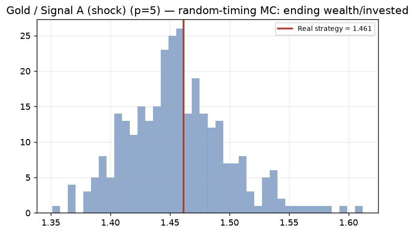

**Robustness test 2 — block bootstrap (150 sims × raw + de-trended):** win rate of the strategy vs DCA on resampled alternate price histories:

- return (raw): 2.7%
- drawdown (raw): 100.0%
- sharpe (raw): 38.7%
- return (detrended): 64.7%
- drawdown (detrended): 100.0%
- sharpe (detrended): 38.7%

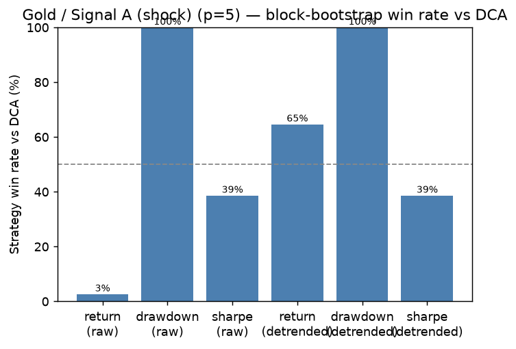

**Robustness test 3 — rolling windows:**

- 3y windows: 93 total, 93 scored (rest flagged low-signal-count) — strategy beats DCA on return in 30.1% of scored windows, on drawdown in 100.0%, on Sharpe in 77.4%
  - Most recent 3y window (2023-08-06 → 2026-07-26, 12 signals): strategy 1.05× vs DCA 1.44×, strategy MaxDD -15.1% vs DCA MaxDD -27.5%

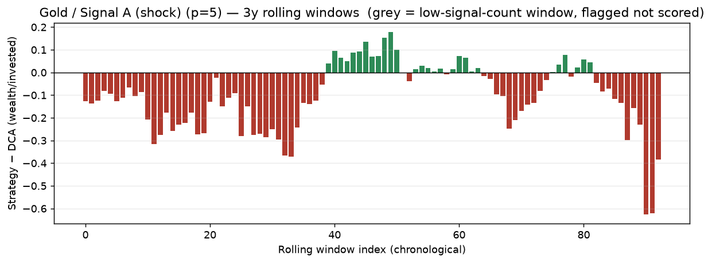

- 5y windows: 85 total, 85 scored (rest flagged low-signal-count) — strategy beats DCA on return in 29.4% of scored windows, on drawdown in 100.0%, on Sharpe in 80.0%
  - Most recent 5y window (2021-08-08 → 2026-07-26, 21 signals): strategy 1.26× vs DCA 1.75×, strategy MaxDD -8.6% vs DCA MaxDD -26.4%

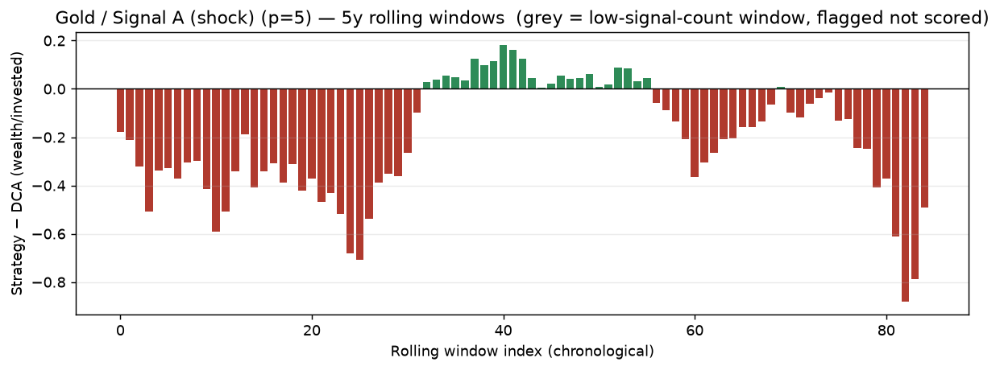

**Signal quality — forward returns after each signal fires, vs unconditional average:**

**After buy signals**

| Horizon | Avg return after signal | Unconditional avg return | Edge | n obs |
|---|---|---|---|---|
| 1m | 2.1% | 0.9% | 1.2% | 59 |
| 3m | 3.9% | 3.0% | 0.9% | 59 |
| 6m | 7.2% | 6.2% | 1.0% | 59 |
| 12m | 15.0% | 13.2% | 1.9% | 56 |

**After sell signals**

| Horizon | Avg return after signal | Unconditional avg return | Edge | n obs |
|---|---|---|---|---|
| 1m | 0.6% | 0.9% | -0.4% | 78 |
| 3m | 1.9% | 3.0% | -1.1% | 77 |
| 6m | 6.2% | 6.2% | -0.0% | 77 |
| 12m | 12.1% | 13.2% | -1.1% | 75 |

---

### Gold — Signal B (trend-stretch) (p=5)

- Trades: 125 buys, 103 sells, total invested $62,500, ending wealth $82,465 (**1.32×** invested; DCA on the same budget: **5.25×**)
- XIRR: 2.4%, MaxDD: -16.3%, Sharpe: 0.36, Sortino: 0.45, Calmar: 0.20
- Avg cost basis: $1081.13

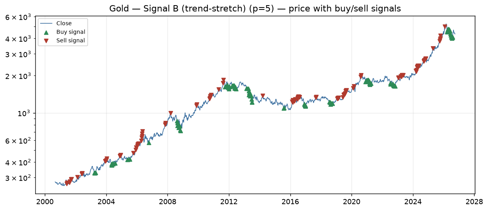

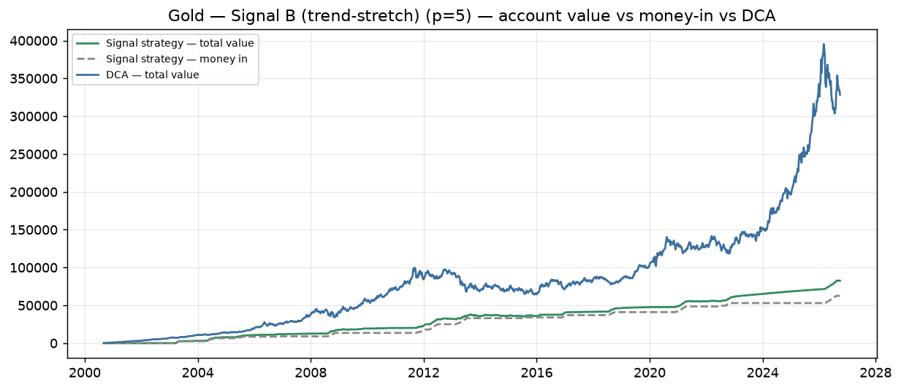

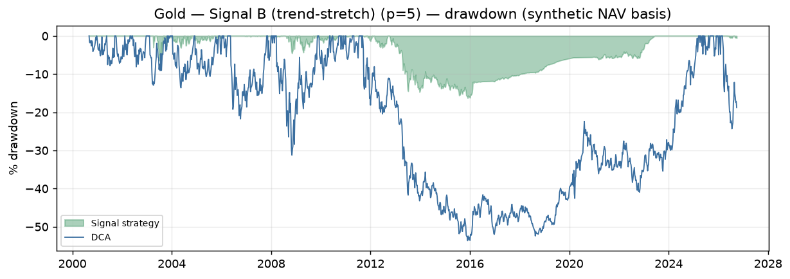

**Robustness test 1 — random-timing Monte Carlo (300 sims):** same number of buys/sells, random weeks. Percentile of the real strategy within that random distribution (need to clear ~95th percentile for the result to look like more than luck):

- Ending wealth/invested: **0.0th percentile**
- Sharpe: **67.7th percentile**
- Max drawdown (higher/shallower = better): **100.0th percentile**

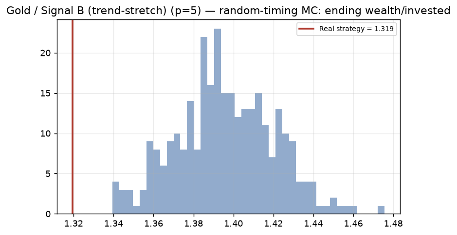

**Robustness test 2 — block bootstrap (150 sims × raw + de-trended):** win rate of the strategy vs DCA on resampled alternate price histories:

- return (raw): 2.7%
- drawdown (raw): 99.3%
- sharpe (raw): 27.3%
- return (detrended): 63.3%
- drawdown (detrended): 98.7%
- sharpe (detrended): 29.3%

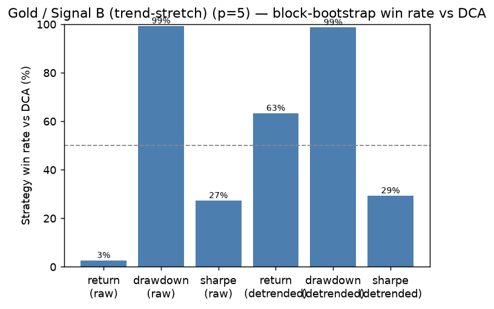

**Robustness test 3 — rolling windows:**

- 3y windows: 82 total, 82 scored (rest flagged low-signal-count) — strategy beats DCA on return in 42.7% of scored windows, on drawdown in 95.1%, on Sharpe in 59.8%
  - Most recent 3y window (2023-08-06 → 2026-07-26, 31 signals): strategy 1.01× vs DCA 1.44×, strategy MaxDD -19.8% vs DCA MaxDD -27.5%

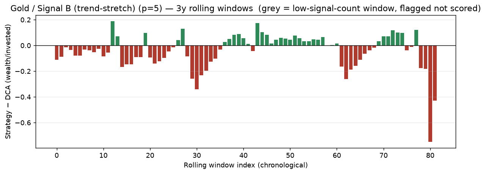

- 5y windows: 85 total, 85 scored (rest flagged low-signal-count) — strategy beats DCA on return in 17.6% of scored windows, on drawdown in 94.1%, on Sharpe in 55.3%
  - Most recent 5y window (2021-08-08 → 2026-07-26, 51 signals): strategy 0.96× vs DCA 1.75×, strategy MaxDD -14.4% vs DCA MaxDD -26.4%

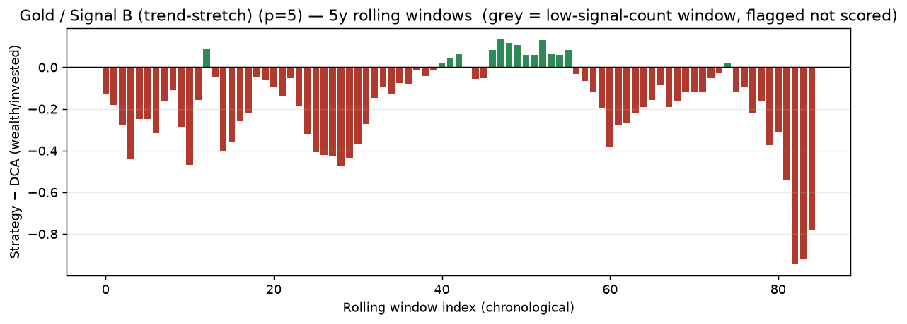

**Signal quality — forward returns after each signal fires, vs unconditional average:**

**After buy signals**

| Horizon | Avg return after signal | Unconditional avg return | Edge | n obs |
|---|---|---|---|---|
| 1m | 1.1% | 0.9% | 0.2% | 125 |
| 3m | 1.7% | 3.0% | -1.3% | 120 |
| 6m | 6.3% | 6.2% | 0.0% | 108 |
| 12m | 9.3% | 13.2% | -3.8% | 106 |

**After sell signals**

| Horizon | Avg return after signal | Unconditional avg return | Edge | n obs |
|---|---|---|---|---|
| 1m | -0.3% | 0.9% | -1.2% | 113 |
| 3m | 1.5% | 3.0% | -1.5% | 113 |
| 6m | 5.0% | 6.2% | -1.2% | 113 |
| 12m | 15.0% | 13.2% | 1.8% | 109 |

---

### Silver — Signal A (shock) (p=5)

- Trades: 53 buys, 71 sells, total invested $26,500, ending wealth $39,320 (**1.48×** invested; DCA on the same budget: **5.23×**)
- XIRR: 2.9%, MaxDD: -15.7%, Sharpe: 0.31, Sortino: 0.33, Calmar: 0.23
- Avg cost basis: $12.79

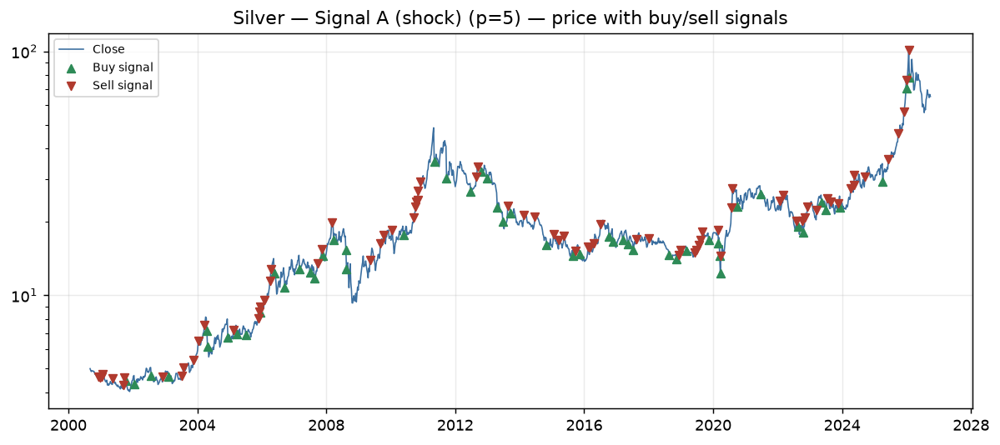

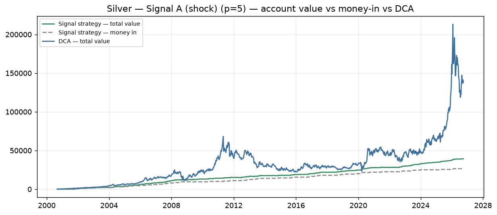

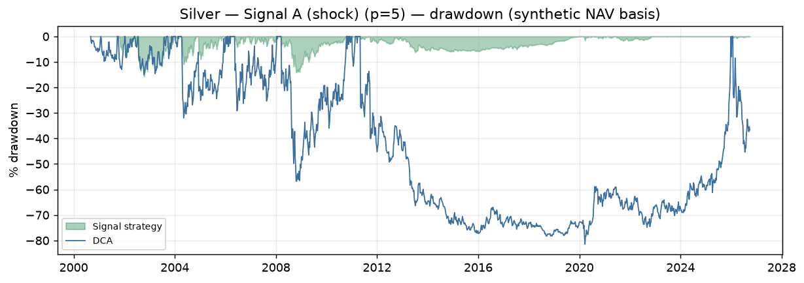

**Robustness test 1 — random-timing Monte Carlo (300 sims):** same number of buys/sells, random weeks. Percentile of the real strategy within that random distribution (need to clear ~95th percentile for the result to look like more than luck):

- Ending wealth/invested: **47.7th percentile**
- Sharpe: **75.3th percentile**
- Max drawdown (higher/shallower = better): **58.0th percentile**

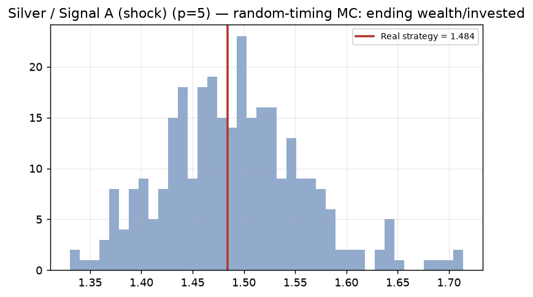

**Robustness test 2 — block bootstrap (150 sims × raw + de-trended):** win rate of the strategy vs DCA on resampled alternate price histories:

- return (raw): 14.0%
- drawdown (raw): 100.0%
- sharpe (raw): 32.7%
- return (detrended): 60.0%
- drawdown (detrended): 100.0%
- sharpe (detrended): 30.0%

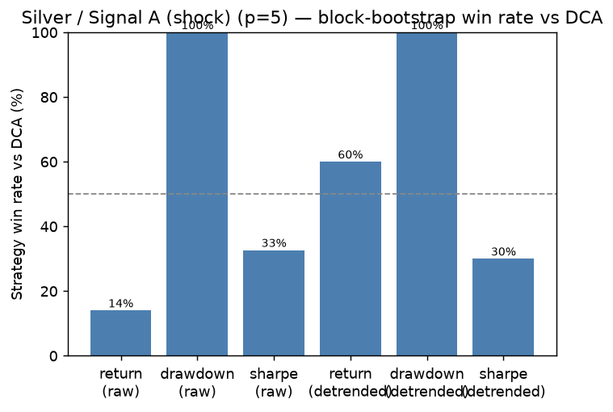

**Robustness test 3 — rolling windows:**

- 3y windows: 93 total, 93 scored (rest flagged low-signal-count) — strategy beats DCA on return in 36.6% of scored windows, on drawdown in 94.6%, on Sharpe in 61.3%
  - Most recent 3y window (2023-08-06 → 2026-07-26, 13 signals): strategy 1.44× vs DCA 1.73×, strategy MaxDD -20.6% vs DCA MaxDD -49.7%

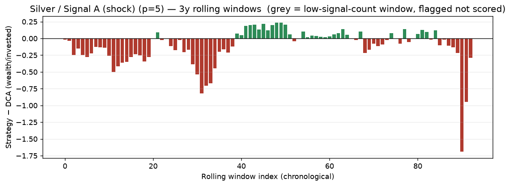

- 5y windows: 85 total, 85 scored (rest flagged low-signal-count) — strategy beats DCA on return in 35.3% of scored windows, on drawdown in 96.5%, on Sharpe in 54.1%
  - Most recent 5y window (2021-08-08 → 2026-07-26, 20 signals): strategy 1.38× vs DCA 2.08×, strategy MaxDD -15.9% vs DCA MaxDD -47.9%

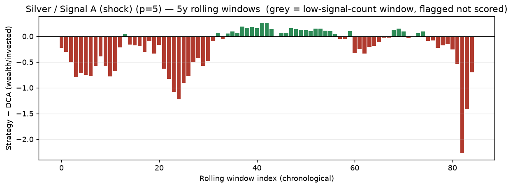

**Signal quality — forward returns after each signal fires, vs unconditional average:**

**After buy signals**

| Horizon | Avg return after signal | Unconditional avg return | Edge | n obs |
|---|---|---|---|---|
| 1m | 1.6% | 1.1% | 0.5% | 53 |
| 3m | 5.0% | 3.7% | 1.4% | 53 |
| 6m | 11.8% | 7.7% | 4.1% | 53 |
| 12m | 19.6% | 16.1% | 3.5% | 51 |

**After sell signals**

| Horizon | Avg return after signal | Unconditional avg return | Edge | n obs |
|---|---|---|---|---|
| 1m | 2.0% | 1.1% | 0.8% | 78 |
| 3m | 4.6% | 3.7% | 0.9% | 78 |
| 6m | 9.6% | 7.7% | 1.9% | 78 |
| 12m | 15.9% | 16.1% | -0.1% | 75 |

---

### Silver — Signal B (trend-stretch) (p=5)

- Trades: 92 buys, 103 sells, total invested $46,000, ending wealth $64,826 (**1.41×** invested; DCA on the same budget: **5.23×**)
- XIRR: 2.8%, MaxDD: -24.5%, Sharpe: 0.41, Sortino: 0.53, Calmar: 0.21
- Avg cost basis: $17.91

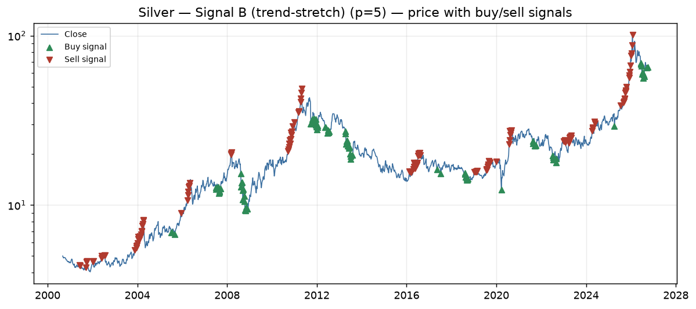

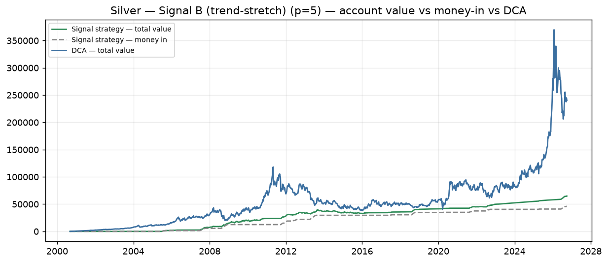

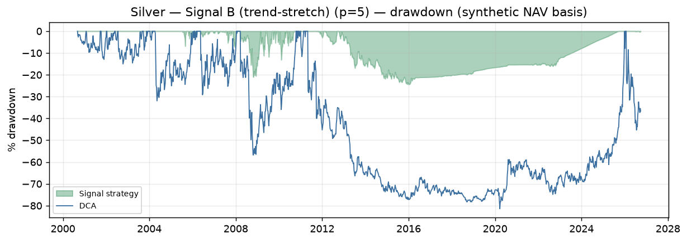

**Robustness test 1 — random-timing Monte Carlo (300 sims):** same number of buys/sells, random weeks. Percentile of the real strategy within that random distribution (need to clear ~95th percentile for the result to look like more than luck):

- Ending wealth/invested: **43.3th percentile**
- Sharpe: **99.3th percentile**
- Max drawdown (higher/shallower = better): **99.3th percentile**

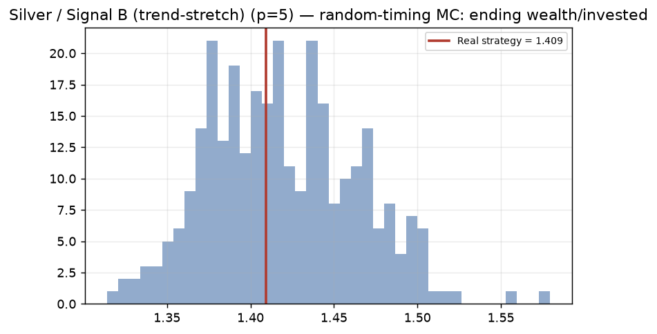

**Robustness test 2 — block bootstrap (150 sims × raw + de-trended):** win rate of the strategy vs DCA on resampled alternate price histories:

- return (raw): 14.0%
- drawdown (raw): 98.7%
- sharpe (raw): 32.7%
- return (detrended): 60.7%
- drawdown (detrended): 98.7%
- sharpe (detrended): 30.7%

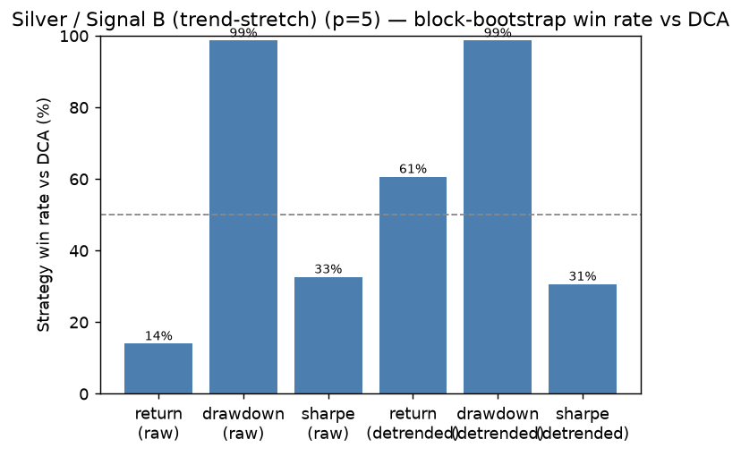

**Robustness test 3 — rolling windows:**

- 3y windows: 82 total, 81 scored (rest flagged low-signal-count) — strategy beats DCA on return in 60.5% of scored windows, on drawdown in 95.1%, on Sharpe in 50.6%
  - Most recent 3y window (2023-08-06 → 2026-07-26, 17 signals): strategy 1.20× vs DCA 1.73×, strategy MaxDD -34.1% vs DCA MaxDD -49.7%

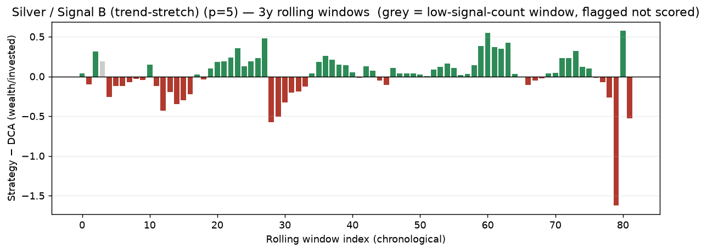

- 5y windows: 84 total, 84 scored (rest flagged low-signal-count) — strategy beats DCA on return in 29.8% of scored windows, on drawdown in 95.2%, on Sharpe in 50.0%
  - Most recent 5y window (2021-08-08 → 2026-07-26, 50 signals): strategy 1.01× vs DCA 2.08×, strategy MaxDD -16.0% vs DCA MaxDD -47.9%

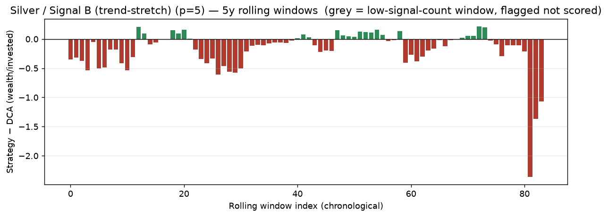

**Signal quality — forward returns after each signal fires, vs unconditional average:**

**After buy signals**

| Horizon | Avg return after signal | Unconditional avg return | Edge | n obs |
|---|---|---|---|---|
| 1m | 1.1% | 1.1% | -0.1% | 91 |
| 3m | 5.0% | 3.7% | 1.4% | 86 |
| 6m | 12.7% | 7.7% | 5.0% | 82 |
| 12m | 16.4% | 16.1% | 0.3% | 82 |

**After sell signals**

| Horizon | Avg return after signal | Unconditional avg return | Edge | n obs |
|---|---|---|---|---|
| 1m | 1.7% | 1.1% | 0.6% | 134 |
| 3m | 5.0% | 3.7% | 1.4% | 134 |
| 6m | 8.4% | 7.7% | 0.7% | 134 |
| 12m | 10.6% | 16.1% | -5.5% | 123 |

---

## 4. Reproducing this report

```bash
python3 -m venv .venv && source .venv/bin/activate
pip install -r requirements.txt
python run_all.py
```

Data is cached in `data/*.csv` after the first fetch (delete those files, or pass `force=True` to `backtest.data.fetch_all`, to refresh from Yahoo Finance).
