# BTC / Gold / Silver Accumulation — v2 Backtest Results

Spec: [`btc-gold-silver-backtest-spec-v2.md`](../../btc-gold-silver-backtest-spec-v2.md). Live Yahoo Finance + FRED data. Reusable pipeline: `run_v2.py` + `src/backtest/v2/`.

v1 tested buy-the-dip / trim-the-spike (results: [`../report.md`](../report.md)) and found it underperformed plain DCA. v2 tests three strategies that stay fully invested and change *how much* or *where* to buy, instead of *whether* to be in the market: **SmartDCA** (buy more below the trend, less above), **ADCA** (buy more in favorable macro/market regimes), and a **rebalanced BTC/gold/silver portfolio** (direct new money to whichever asset is most underweight; rebalance on drift bands).

## Implementation checks (spec §11)

- ✅ `smartdca_rho0_equals_dca`
- ✅ `adca_neutral_equals_dca`
- ✅ `rebalance_single_asset_equals_dca`
- ✅ `no_lookahead_smartdca`

## Scoping notes

- Headline grids are run in full: SmartDCA (3 assets × 12 parameter combos = 36), ADCA (3 assets × 2 variants = 6), rebalanced portfolio (7 grid rows × 2 eras = 14, plus single-asset benchmarks).
- The robustness suite (rolling windows, block bootstrap, placebo) runs in depth on one representative variant per strategy family rather than the whole grid: SmartDCA at rho=2/m_max=3/sweep=on, both ADCA variants, and the rebalanced portfolio at C2 and C3 (both on 5/25 bands, the grid's primary trigger).
- Block bootstrap uses 200 simulations per variant for single-asset strategies and 60 for the portfolio (more expensive per simulation); placebo tests use 200. The spec's 1,000-simulation target is reduced for runtime, consistent with how v1's robustness suite was scoped.
- FRED's `UNRATE`/`TCU` are monthly; ADCA B1's 'last 12 available monthly values' is approximated as a trailing 52-week mean on the forward-filled weekly series.

## Strategy A — SmartDCA

Buys more when price is below its 52-week trend, less when above. **Caveat from the spec itself: the paper's 'guaranteed lower cost per unit' result assumes a fixed reference price; v2 uses a moving 52-week average instead (since BTC rose ~100x, a fixed reference breaks). That trade lets the guarantee fail in practice** — see the cost-basis columns below.

| Asset | rho | m_max | sweep | #Buy | Wealth/Inv | DCA W/I | Avg cost | DCA cost | MaxDD | DCA MaxDD | Sharpe | DCA Sharpe |
|---|---|---|---|---|---|---|---|---|---|---|---|---|
| BTC | 1 | 2 | off | 628 | 47.26 | 52.90 | 1641.88 | 1600.59 | -81.0% | -81.7% | 0.96 | 0.97 |
| BTC | 1 | 2 | on | 628 | 47.92 | 52.90 | 1737.43 | 1600.59 | -81.4% | -81.7% | 0.96 | 0.97 |
| BTC | 1 | 3 | off | 628 | 47.30 | 52.90 | 1644.30 | 1600.59 | -81.0% | -81.7% | 0.96 | 0.97 |
| BTC | 1 | 3 | on | 628 | 47.95 | 52.90 | 1736.06 | 1600.59 | -81.4% | -81.7% | 0.96 | 0.97 |
| BTC | 2 | 2 | off | 628 | 43.39 | 52.90 | 1696.43 | 1600.59 | -80.6% | -81.7% | 0.95 | 0.97 |
| BTC | 2 | 2 | on | 628 | 46.25 | 52.90 | 1841.79 | 1600.59 | -81.4% | -81.7% | 0.95 | 0.97 |
| BTC | 2 | 3 | off | 628 | 44.07 | 52.90 | 1810.96 | 1600.59 | -80.6% | -81.7% | 0.95 | 0.97 |
| BTC | 2 | 3 | on | 628 | 46.24 | 52.90 | 1841.91 | 1600.59 | -81.5% | -81.7% | 0.95 | 0.97 |
| BTC | 3 | 2 | off | 628 | 40.64 | 52.90 | 1720.23 | 1600.59 | -80.3% | -81.7% | 0.94 | 0.97 |
| BTC | 3 | 2 | on | 628 | 45.64 | 52.90 | 1866.59 | 1600.59 | -81.5% | -81.7% | 0.95 | 0.97 |
| BTC | 3 | 3 | off | 628 | 41.61 | 52.90 | 1929.33 | 1600.59 | -80.3% | -81.7% | 0.94 | 0.97 |
| BTC | 3 | 3 | on | 628 | 45.58 | 52.90 | 1868.76 | 1600.59 | -81.5% | -81.7% | 0.95 | 0.97 |
| GOLD | 1 | 2 | off | 1361 | 5.07 | 5.24 | 825.92 | 828.26 | -42.8% | -43.6% | 0.59 | 0.59 |
| GOLD | 1 | 2 | on | 1361 | 5.11 | 5.24 | 841.19 | 828.26 | -43.2% | -43.6% | 0.59 | 0.59 |
| GOLD | 1 | 3 | off | 1361 | 5.07 | 5.24 | 825.92 | 828.26 | -42.8% | -43.6% | 0.59 | 0.59 |
| GOLD | 1 | 3 | on | 1361 | 5.11 | 5.24 | 841.19 | 828.26 | -43.2% | -43.6% | 0.59 | 0.59 |
| GOLD | 2 | 2 | off | 1361 | 4.93 | 5.24 | 825.31 | 828.26 | -42.1% | -43.6% | 0.59 | 0.59 |
| GOLD | 2 | 2 | on | 1361 | 5.08 | 5.24 | 846.46 | 828.26 | -43.3% | -43.6% | 0.59 | 0.59 |
| GOLD | 2 | 3 | off | 1361 | 4.93 | 5.24 | 825.31 | 828.26 | -42.1% | -43.6% | 0.59 | 0.59 |
| GOLD | 2 | 3 | on | 1361 | 5.08 | 5.24 | 846.46 | 828.26 | -43.3% | -43.6% | 0.59 | 0.59 |
| GOLD | 3 | 2 | off | 1361 | 4.80 | 5.24 | 826.30 | 828.26 | -41.4% | -43.6% | 0.59 | 0.59 |
| GOLD | 3 | 2 | on | 1361 | 5.06 | 5.24 | 849.68 | 828.26 | -43.4% | -43.6% | 0.58 | 0.59 |
| GOLD | 3 | 3 | off | 1361 | 4.81 | 5.24 | 826.41 | 828.26 | -41.4% | -43.6% | 0.59 | 0.59 |
| GOLD | 3 | 3 | on | 1361 | 5.06 | 5.24 | 849.67 | 828.26 | -43.4% | -43.6% | 0.58 | 0.59 |
| SILVER | 1 | 2 | off | 1361 | 5.13 | 5.21 | 12.40 | 12.52 | -73.9% | -74.6% | 0.41 | 0.41 |
| SILVER | 1 | 2 | on | 1361 | 5.15 | 5.21 | 12.54 | 12.52 | -74.3% | -74.6% | 0.41 | 0.41 |
| SILVER | 1 | 3 | off | 1361 | 5.13 | 5.21 | 12.40 | 12.52 | -73.9% | -74.6% | 0.41 | 0.41 |
| SILVER | 1 | 3 | on | 1361 | 5.15 | 5.21 | 12.54 | 12.52 | -74.3% | -74.6% | 0.41 | 0.41 |
| SILVER | 2 | 2 | off | 1361 | 5.09 | 5.21 | 12.38 | 12.52 | -73.5% | -74.6% | 0.41 | 0.41 |
| SILVER | 2 | 2 | on | 1361 | 5.12 | 5.21 | 12.63 | 12.52 | -74.3% | -74.6% | 0.41 | 0.41 |
| SILVER | 2 | 3 | off | 1361 | 5.11 | 5.21 | 12.37 | 12.52 | -73.6% | -74.6% | 0.41 | 0.41 |
| SILVER | 2 | 3 | on | 1361 | 5.13 | 5.21 | 12.59 | 12.52 | -74.3% | -74.6% | 0.41 | 0.41 |
| SILVER | 3 | 2 | off | 1361 | 5.05 | 5.21 | 12.43 | 12.52 | -73.1% | -74.6% | 0.41 | 0.41 |
| SILVER | 3 | 2 | on | 1361 | 5.10 | 5.21 | 12.66 | 12.52 | -74.4% | -74.6% | 0.41 | 0.41 |
| SILVER | 3 | 3 | off | 1361 | 5.10 | 5.21 | 12.42 | 12.52 | -73.5% | -74.6% | 0.41 | 0.41 |
| SILVER | 3 | 3 | on | 1361 | 5.11 | 5.21 | 12.65 | 12.52 | -74.4% | -74.6% | 0.41 | 0.41 |

Full grid: [`smartdca_grid.csv`](smartdca_grid.csv)

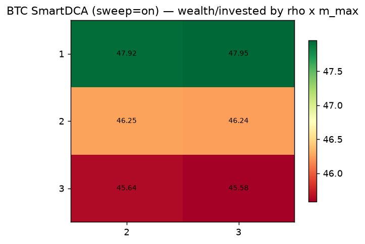

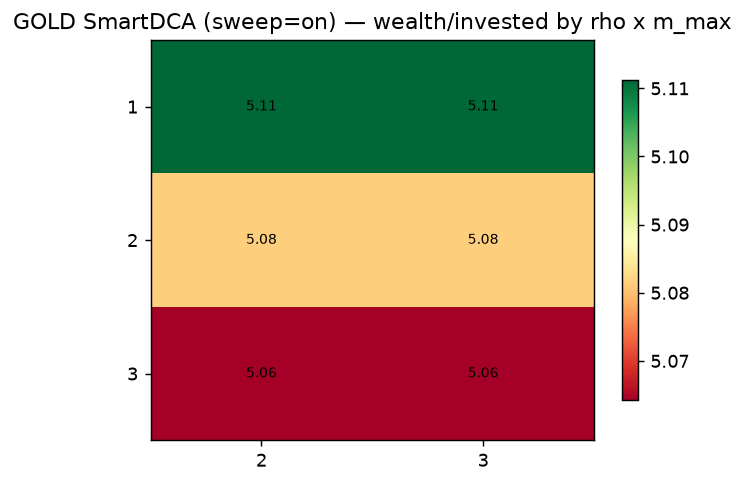

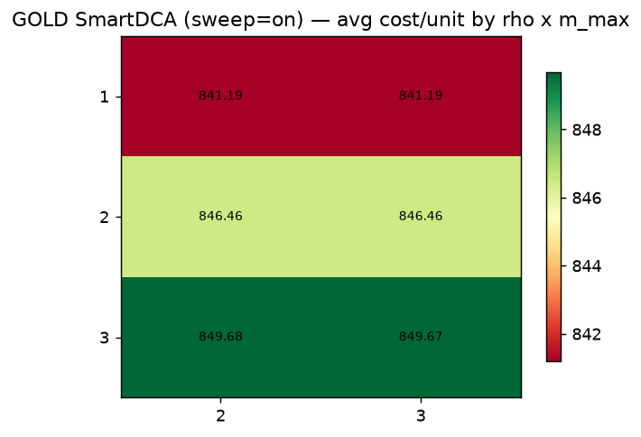

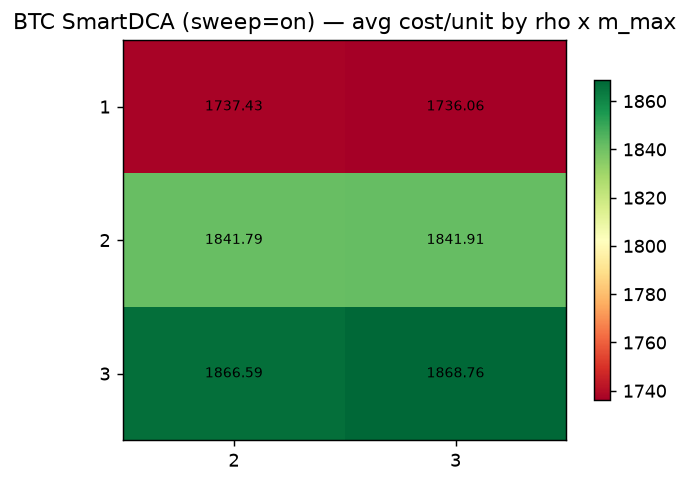

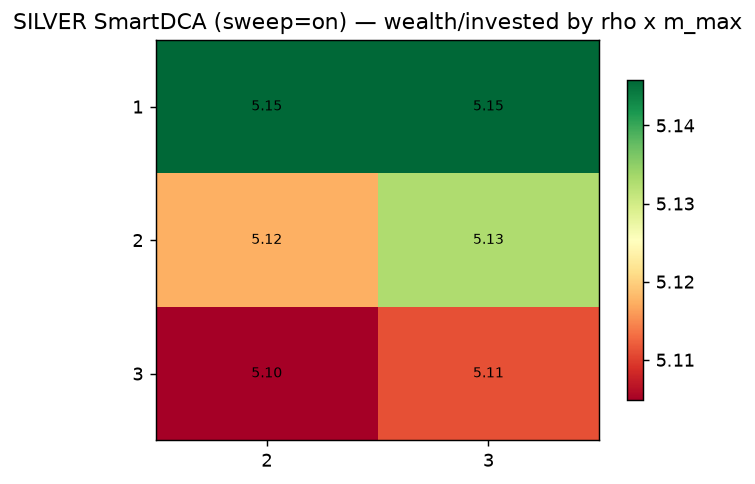

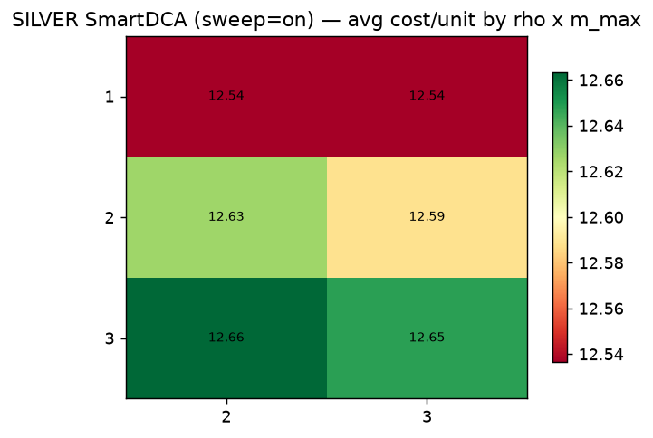

### BTC — SmartDCA deep dive (rho=2, m_max=3, sweep=on)

- Wealth/invested: **46.24×** vs DCA **52.90×** (invested $314,000 both)
- Avg cost per unit: **1841.91** vs DCA **1600.59** (HIGHER — guarantee broke down)
- MaxDD: -81.5% vs DCA -81.7%; Sharpe: 0.95 vs DCA 0.97; avg cash share: 2.4%

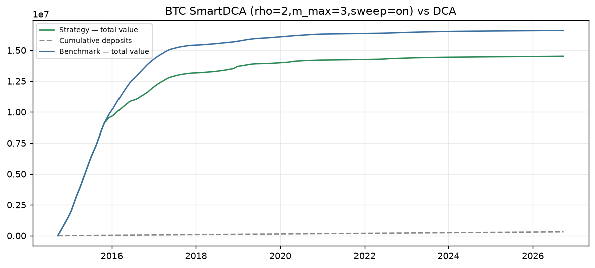

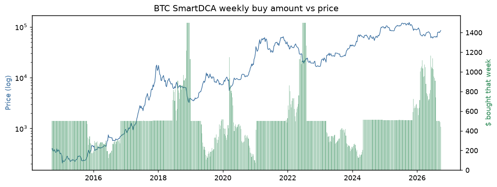

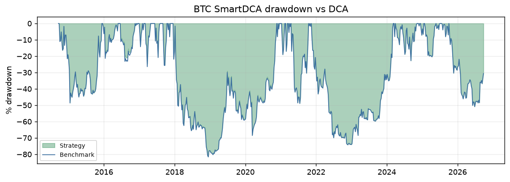

**Rolling windows vs DCA:**

- 2y: 41 windows, wins on wealth 43.9%, on Sharpe 56.1%

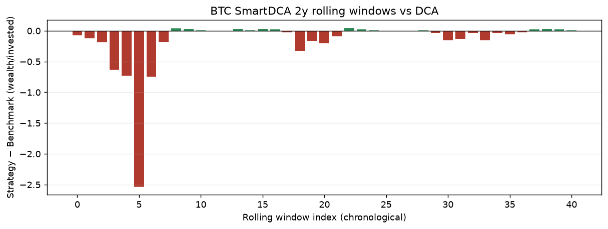

- 3y: 37 windows, wins on wealth 35.1%, on Sharpe 40.5%

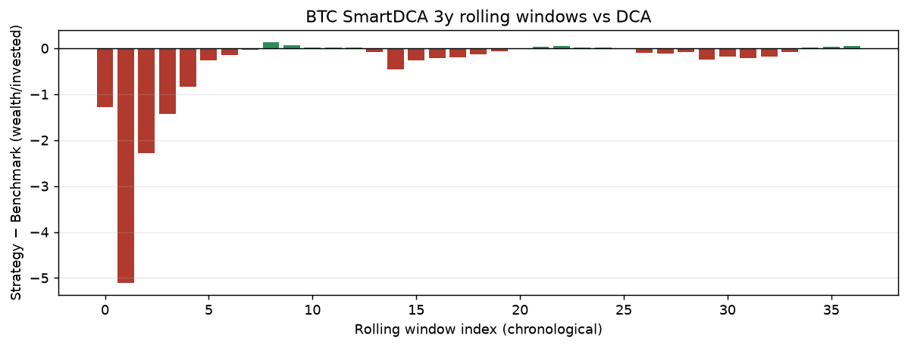

**Block bootstrap win rate vs DCA:**

- wealth (raw): 25.5%
- sharpe (raw): 47.5%
- wealth (detrended): 67.0%
- sharpe (detrended): 60.0%

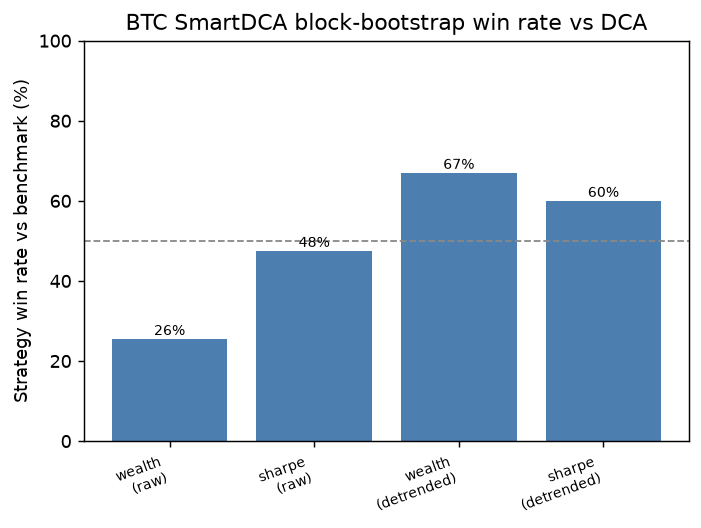

---

### GOLD — SmartDCA deep dive (rho=2, m_max=3, sweep=on)

- Wealth/invested: **5.08×** vs DCA **5.24×** (invested $680,500 both)
- Avg cost per unit: **846.46** vs DCA **828.26** (HIGHER — guarantee broke down)
- MaxDD: -43.3% vs DCA -43.6%; Sharpe: 0.59 vs DCA 0.59; avg cash share: 2.6%

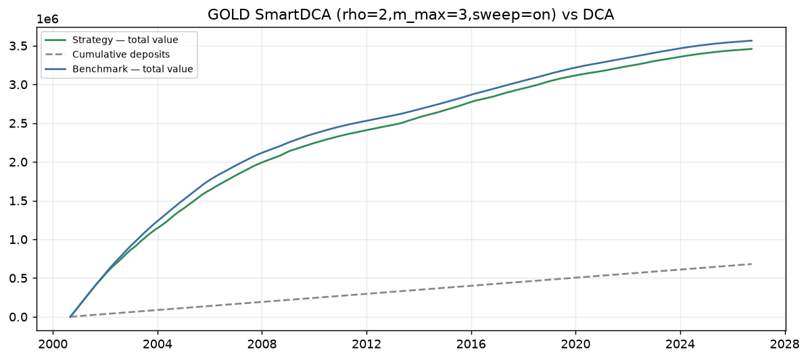

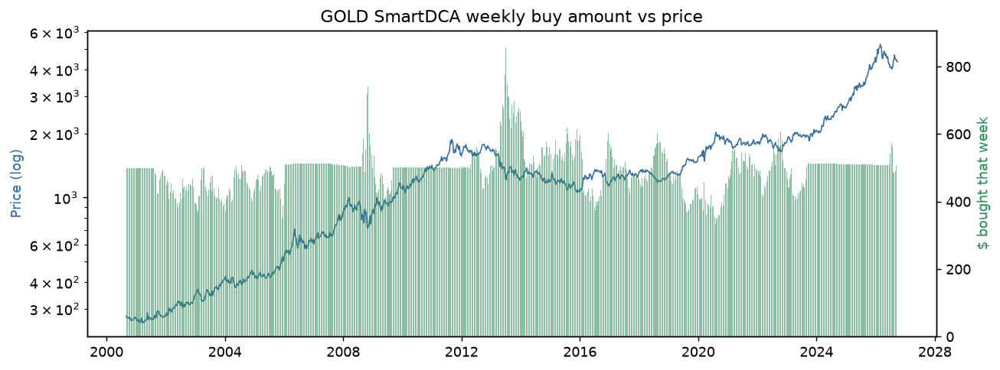


**Rolling windows vs DCA:**

- 3y: 93 windows, wins on wealth 36.6%, on Sharpe 69.9%

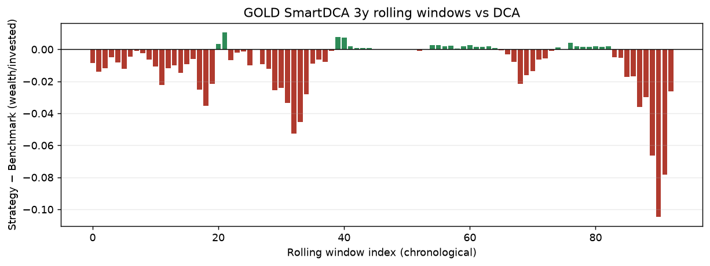

- 5y: 85 windows, wins on wealth 29.4%, on Sharpe 74.1%

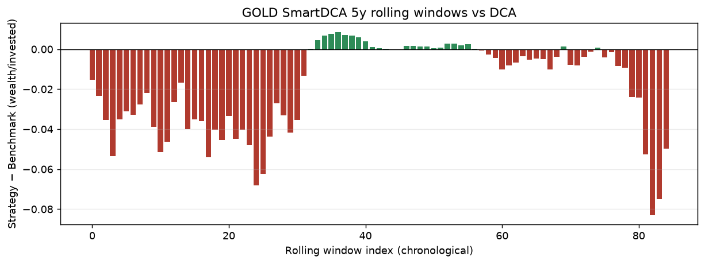

**Block bootstrap win rate vs DCA:**

- wealth (raw): 3.0%
- sharpe (raw): 50.5%
- wealth (detrended): 70.0%
- sharpe (detrended): 64.0%

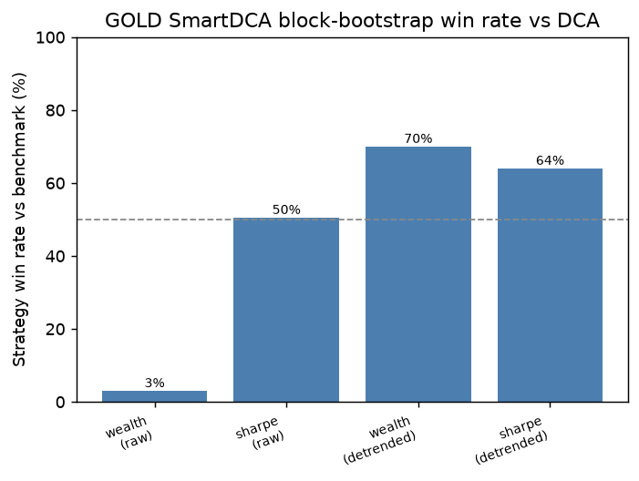

---

### SILVER — SmartDCA deep dive (rho=2, m_max=3, sweep=on)

- Wealth/invested: **5.13×** vs DCA **5.21×** (invested $680,500 both)
- Avg cost per unit: **12.59** vs DCA **12.52** (HIGHER — guarantee broke down)
- MaxDD: -74.3% vs DCA -74.6%; Sharpe: 0.41 vs DCA 0.41; avg cash share: 1.9%

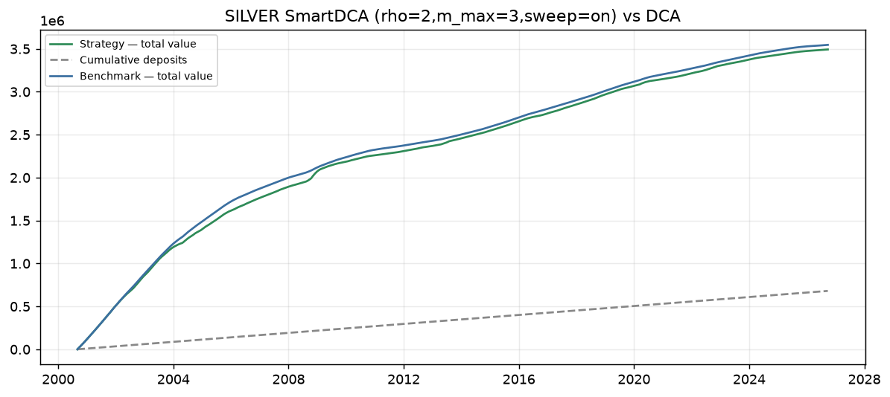

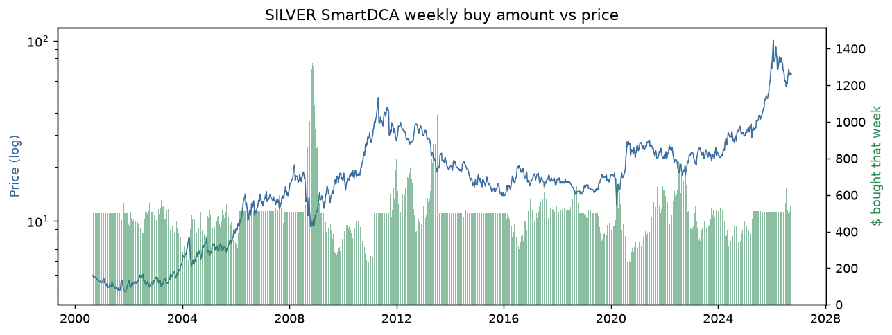


**Rolling windows vs DCA:**

- 3y: 93 windows, wins on wealth 52.7%, on Sharpe 71.0%

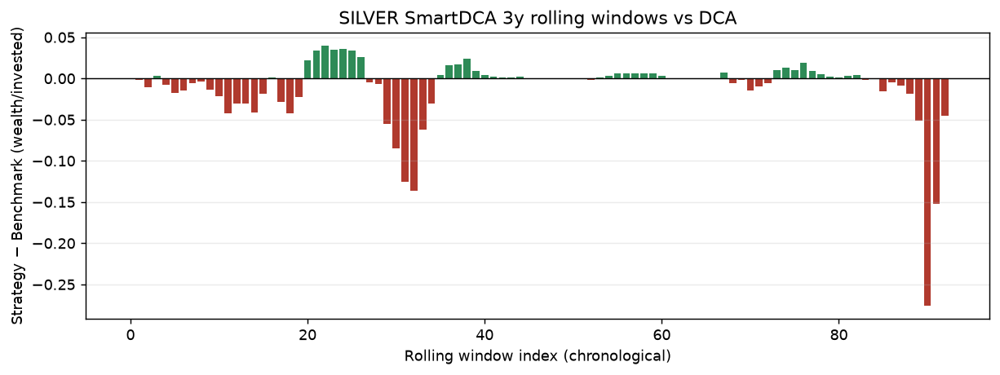

- 5y: 85 windows, wins on wealth 58.8%, on Sharpe 72.9%

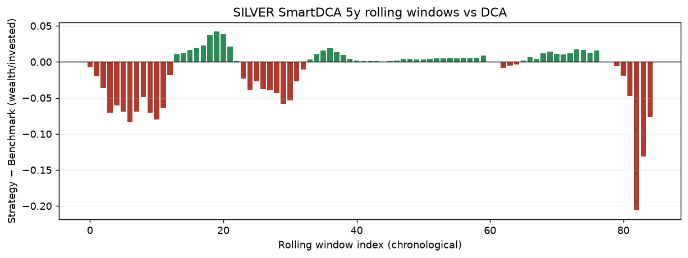

**Block bootstrap win rate vs DCA:**

- wealth (raw): 24.5%
- sharpe (raw): 52.0%
- wealth (detrended): 64.0%
- sharpe (detrended): 53.0%

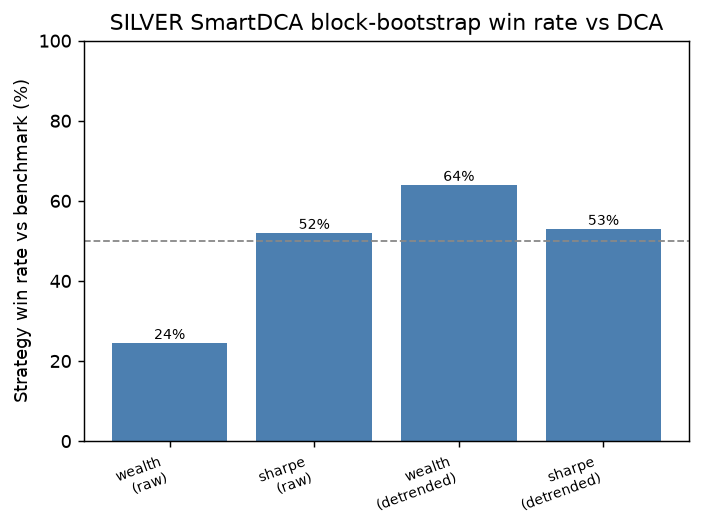

---

## Strategy B — ADCA (Augmented DCA)

Buys more in 'aggressive' regimes (low VIX + favorable macro/trend), less in 'conservative' ones.

| Asset | Variant | #Buy | Wealth/Inv | DCA W/I | MaxDD | DCA MaxDD | Sharpe | DCA Sharpe | Avg cash share |
|---|---|---|---|---|---|---|---|---|---|
| BTC | B1 | 628 | 48.17 | 52.90 | -81.7% | -81.7% | 0.96 | 0.97 | 2.1% |
| BTC | B2 | 628 | 52.38 | 52.90 | -81.4% | -81.7% | 0.97 | 0.97 | 1.3% |
| GOLD | B1 | 1361 | 5.04 | 5.24 | -43.6% | -43.6% | 0.58 | 0.59 | 3.0% |
| GOLD | B2 | 1361 | 5.16 | 5.24 | -43.6% | -43.6% | 0.59 | 0.59 | 1.5% |
| SILVER | B1 | 1361 | 5.00 | 5.21 | -74.6% | -74.6% | 0.41 | 0.41 | 3.2% |
| SILVER | B2 | 1361 | 5.15 | 5.21 | -74.6% | -74.6% | 0.41 | 0.41 | 1.8% |

Full grid: [`adca_grid.csv`](adca_grid.csv)

### BTC — ADCA B1

- Wealth/invested: **48.17×** vs DCA **52.90×**
- MaxDD: -81.7% vs DCA -81.7%; Sharpe: 0.96 vs DCA 0.97
- **Placebo test** (shuffled regime score, 200 sims): real result sits at the **48.0th percentile** on wealth, **31.5th percentile** on Sharpe, of what a regime score with NO real link to conditions would produce

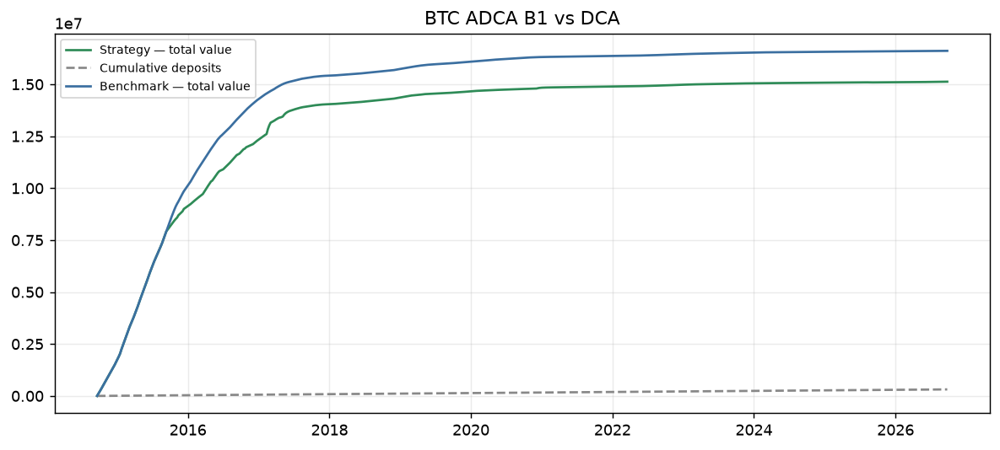


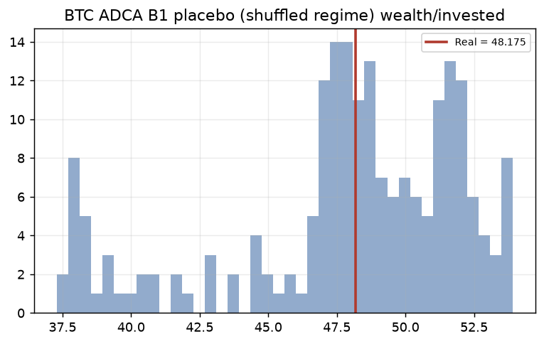

**Rolling windows vs DCA:**

- 2y: 41 windows, wins on wealth 9.8%, on Sharpe 14.6%
- 3y: 37 windows, wins on wealth 5.4%, on Sharpe 10.8%

**Block bootstrap win rate vs DCA:**

- wealth (raw): 12.5%
- sharpe (raw): 32.5%
- wealth (detrended): 53.0%
- sharpe (detrended): 36.0%

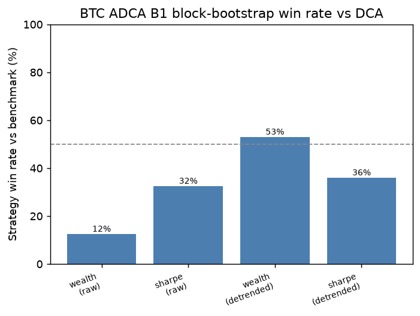

---

### BTC — ADCA B2

- Wealth/invested: **52.38×** vs DCA **52.90×**
- MaxDD: -81.4% vs DCA -81.7%; Sharpe: 0.97 vs DCA 0.97
- **Placebo test** (shuffled regime score, 200 sims): real result sits at the **79.5th percentile** on wealth, **50.5th percentile** on Sharpe, of what a regime score with NO real link to conditions would produce

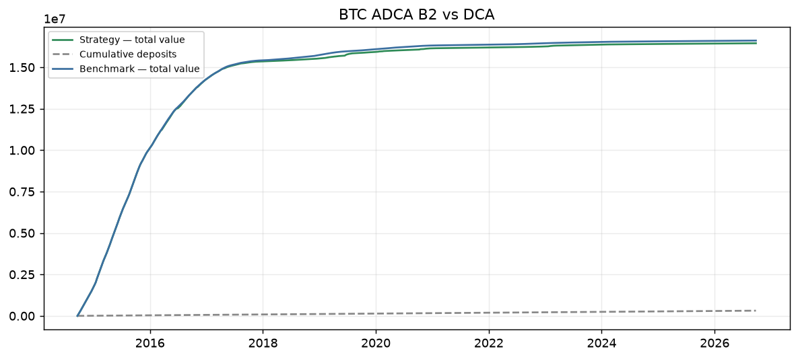


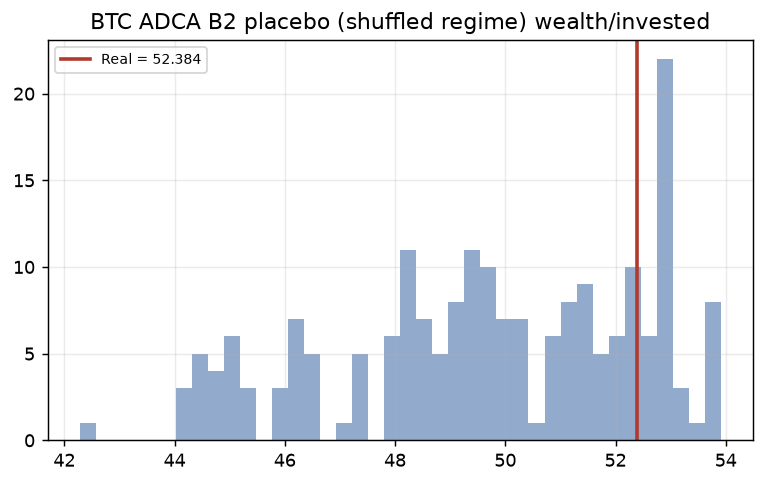

**Rolling windows vs DCA:**

- 2y: 41 windows, wins on wealth 34.1%, on Sharpe 46.3%
- 3y: 37 windows, wins on wealth 24.3%, on Sharpe 37.8%

**Block bootstrap win rate vs DCA:**

- wealth (raw): 3.5%
- sharpe (raw): 15.5%
- wealth (detrended): 39.0%
- sharpe (detrended): 17.0%

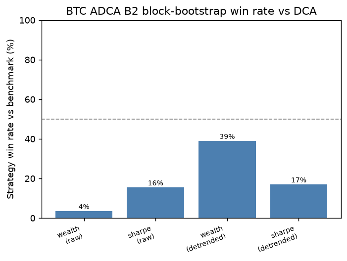

---

### GOLD — ADCA B1

- Wealth/invested: **5.04×** vs DCA **5.24×**
- MaxDD: -43.6% vs DCA -43.6%; Sharpe: 0.58 vs DCA 0.59
- **Placebo test** (shuffled regime score, 200 sims): real result sits at the **6.0th percentile** on wealth, **5.0th percentile** on Sharpe, of what a regime score with NO real link to conditions would produce

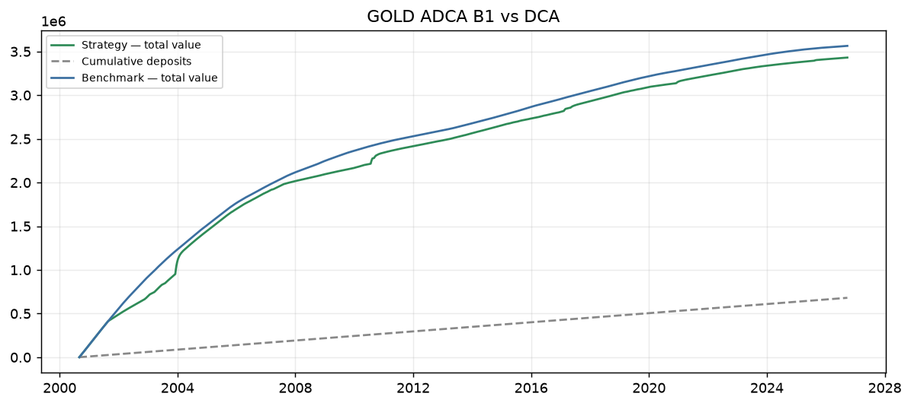

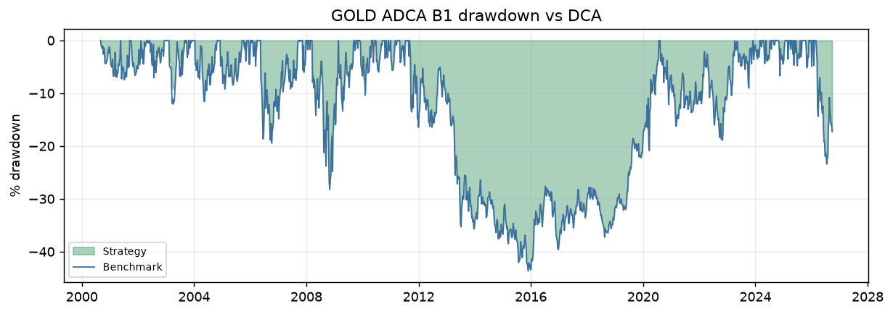

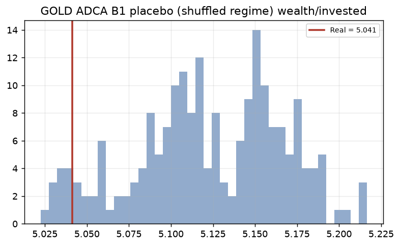

**Rolling windows vs DCA:**

- 3y: 93 windows, wins on wealth 26.9%, on Sharpe 37.6%
- 5y: 85 windows, wins on wealth 14.1%, on Sharpe 32.9%

**Block bootstrap win rate vs DCA:**

- wealth (raw): 6.5%
- sharpe (raw): 41.5%
- wealth (detrended): 60.0%
- sharpe (detrended): 43.5%

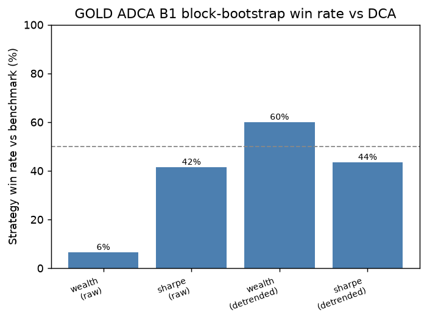

---

### GOLD — ADCA B2

- Wealth/invested: **5.16×** vs DCA **5.24×**
- MaxDD: -43.6% vs DCA -43.6%; Sharpe: 0.59 vs DCA 0.59
- **Placebo test** (shuffled regime score, 200 sims): real result sits at the **84.5th percentile** on wealth, **56.5th percentile** on Sharpe, of what a regime score with NO real link to conditions would produce

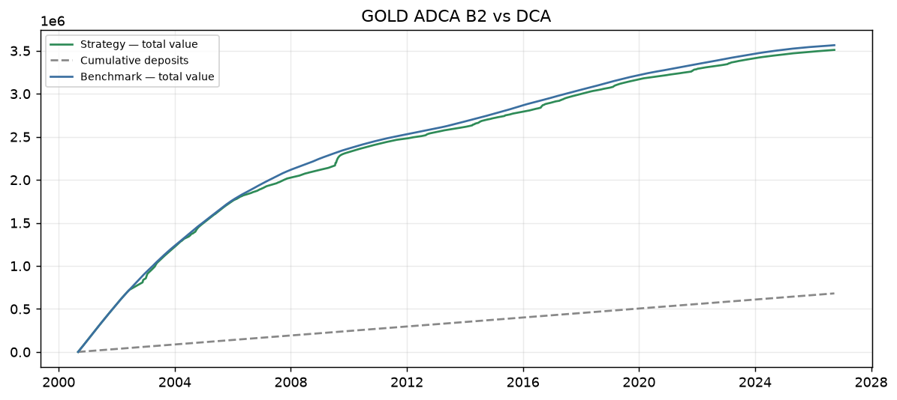


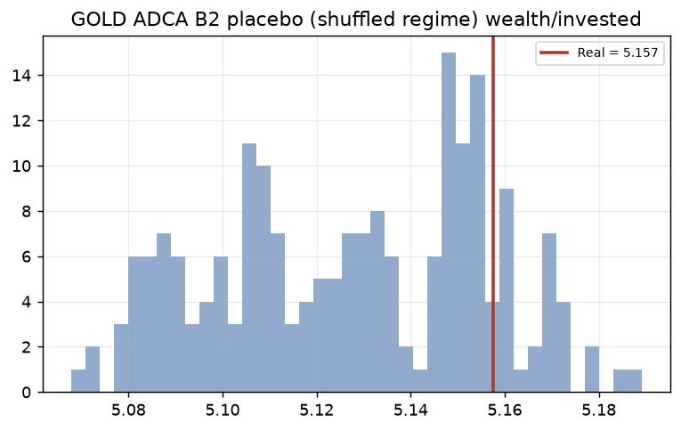

**Rolling windows vs DCA:**

- 3y: 93 windows, wins on wealth 21.5%, on Sharpe 36.6%
- 5y: 85 windows, wins on wealth 12.9%, on Sharpe 49.4%

**Block bootstrap win rate vs DCA:**

- wealth (raw): 2.5%
- sharpe (raw): 27.5%
- wealth (detrended): 52.0%
- sharpe (detrended): 28.5%

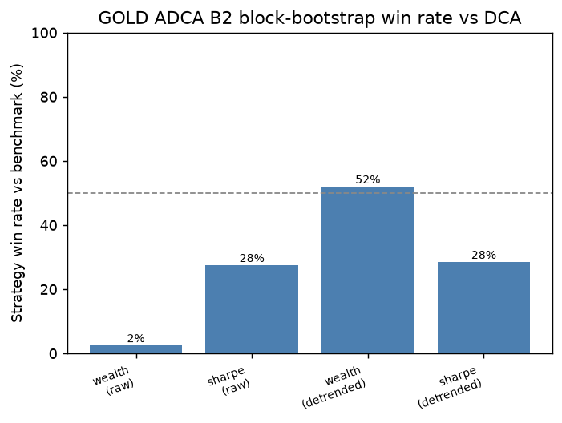

---

### SILVER — ADCA B1

- Wealth/invested: **5.00×** vs DCA **5.21×**
- MaxDD: -74.6% vs DCA -74.6%; Sharpe: 0.41 vs DCA 0.41
- **Placebo test** (shuffled regime score, 200 sims): real result sits at the **11.0th percentile** on wealth, **13.0th percentile** on Sharpe, of what a regime score with NO real link to conditions would produce

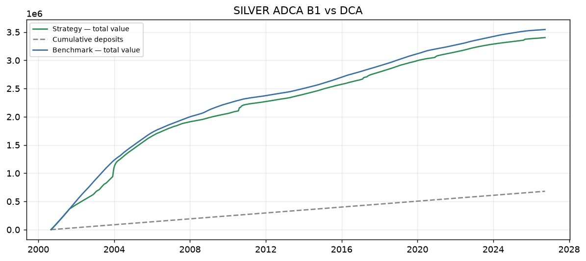

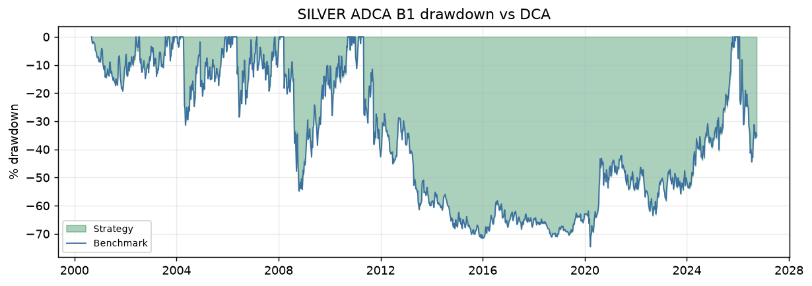

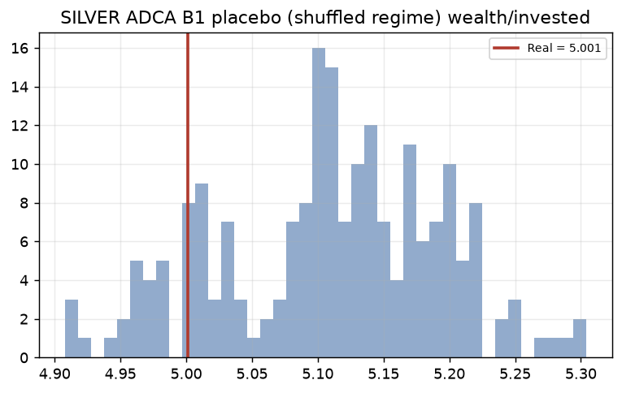

**Rolling windows vs DCA:**

- 3y: 93 windows, wins on wealth 26.9%, on Sharpe 22.6%
- 5y: 85 windows, wins on wealth 16.5%, on Sharpe 23.5%

**Block bootstrap win rate vs DCA:**

- wealth (raw): 26.5%
- sharpe (raw): 40.5%
- wealth (detrended): 51.5%
- sharpe (detrended): 41.5%

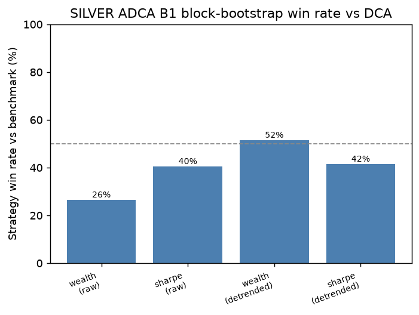

---

### SILVER — ADCA B2

- Wealth/invested: **5.15×** vs DCA **5.21×**
- MaxDD: -74.6% vs DCA -74.6%; Sharpe: 0.41 vs DCA 0.41
- **Placebo test** (shuffled regime score, 200 sims): real result sits at the **81.0th percentile** on wealth, **39.5th percentile** on Sharpe, of what a regime score with NO real link to conditions would produce

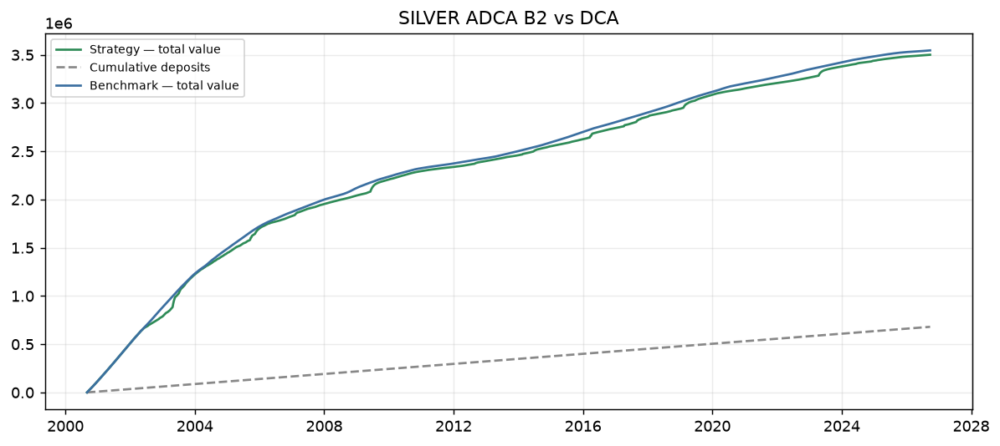


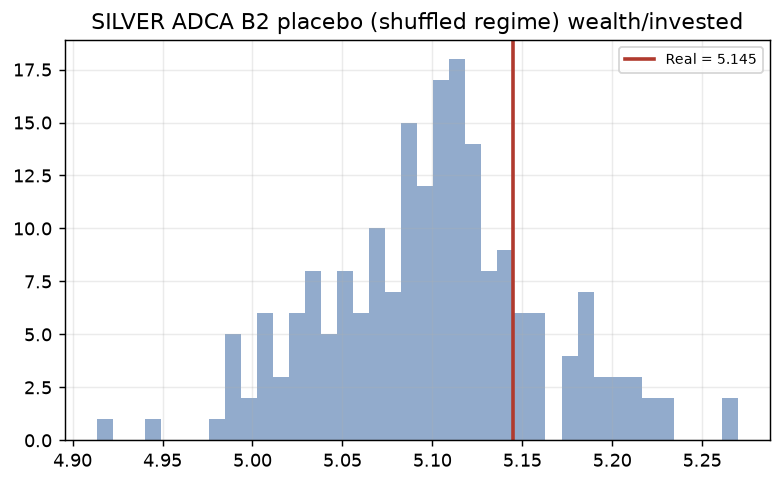

**Rolling windows vs DCA:**

- 3y: 93 windows, wins on wealth 31.2%, on Sharpe 23.7%
- 5y: 85 windows, wins on wealth 29.4%, on Sharpe 28.2%

**Block bootstrap win rate vs DCA:**

- wealth (raw): 9.0%
- sharpe (raw): 23.0%
- wealth (detrended): 44.0%
- sharpe (detrended): 18.5%

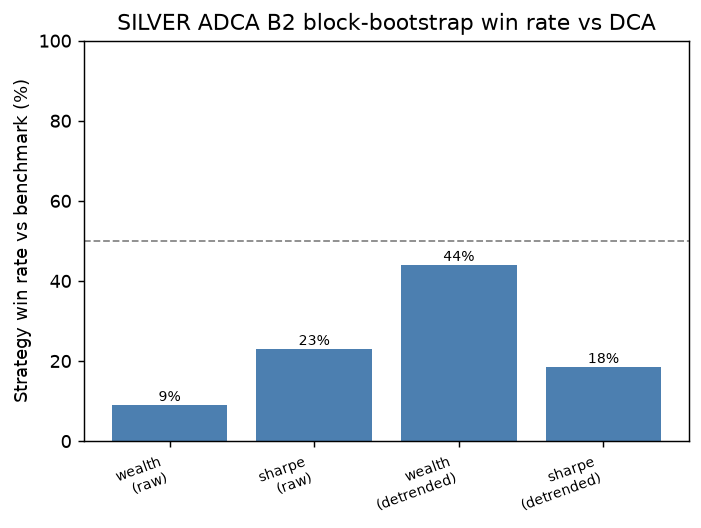

---

## Strategy C — Rebalanced BTC/Gold/Silver Portfolio

| Era | Scheme | Trigger | Wealth/Inv | Fixed-wt W/I | MaxDD | Fixed MaxDD | Sharpe | Fixed Sharpe | #Rebal |
|---|---|---|---|---|---|---|---|---|---|
| BTC+Gold+Silver | C1 | bands_5_25 | 7.39 | 8.21 | -42.5% | -69.2% | 1.21 | 0.92 | 72 |
| BTC+Gold+Silver | C2 | bands_5_25 | 4.32 | 8.13 | -27.3% | -68.9% | 1.16 | 0.92 | 61 |
| BTC+Gold+Silver | C1 | bands_10_50 | 7.87 | 8.21 | -42.0% | -69.2% | 1.21 | 0.92 | 25 |
| BTC+Gold+Silver | C2 | bands_10_50 | 4.79 | 8.13 | -25.8% | -68.9% | 1.19 | 0.92 | 26 |
| BTC+Gold+Silver | C1 | calendar_quarterly | 9.96 | 8.21 | -39.8% | -69.2% | 1.25 | 0.92 | 45 |
| BTC+Gold+Silver | C2 | calendar_quarterly | 5.03 | 8.13 | -28.2% | -68.9% | 1.22 | 0.92 | 45 |
| BTC+Gold+Silver | C3 | bands_5_25 | 3.69 | 8.09 | -23.5% | -69.0% | 1.18 | 0.92 | 326 |
| BTC+Gold+Silver | 100% BTC DCA | nan | 29.59 | nan | -81.7% | nan% | 1.09 | nan | 0 |
| BTC+Gold+Silver | 100% GOLD DCA | nan | 2.53 | nan | -23.4% | nan% | 0.70 | nan | 0 |
| BTC+Gold+Silver | 100% SILVER DCA | nan | 3.05 | nan | -44.5% | nan% | 0.51 | nan | 0 |
| Gold+Silver only | C1 | bands_5_25 | 5.34 | 4.99 | -56.8% | -57.9% | 0.54 | 0.52 | 30 |
| Gold+Silver only | C2 | bands_5_25 | 5.40 | 4.92 | -52.4% | -54.5% | 0.57 | 0.54 | 38 |
| Gold+Silver only | C1 | bands_10_50 | 5.33 | 4.99 | -56.3% | -57.9% | 0.54 | 0.52 | 9 |
| Gold+Silver only | C2 | bands_10_50 | 5.40 | 4.92 | -52.2% | -54.5% | 0.57 | 0.54 | 12 |
| Gold+Silver only | C1 | calendar_quarterly | 5.30 | 4.99 | -56.9% | -57.9% | 0.54 | 0.52 | 101 |
| Gold+Silver only | C2 | calendar_quarterly | 5.30 | 4.92 | -52.3% | -54.5% | 0.57 | 0.54 | 101 |
| Gold+Silver only | C3 | bands_5_25 | 4.25 | 4.90 | -45.5% | -54.5% | 0.56 | 0.54 | 802 |
| Gold+Silver only | 100% GOLD DCA | nan | 4.80 | nan | -43.6% | nan% | 0.62 | nan | 0 |
| Gold+Silver only | 100% SILVER DCA | nan | 4.84 | nan | -74.6% | nan% | 0.45 | nan | 0 |

Full grid: [`rebalance_grid.csv`](rebalance_grid.csv)

### BTC+Gold+Silver — C2 (5/25 bands) vs fixed-weight, never rebalanced

- Wealth/invested: **4.32×** vs fixed-weight **8.13×**
- MaxDD: -27.3% vs fixed-weight -68.9%; Sharpe: 1.16 vs fixed-weight 0.92; 61 rebalances triggered

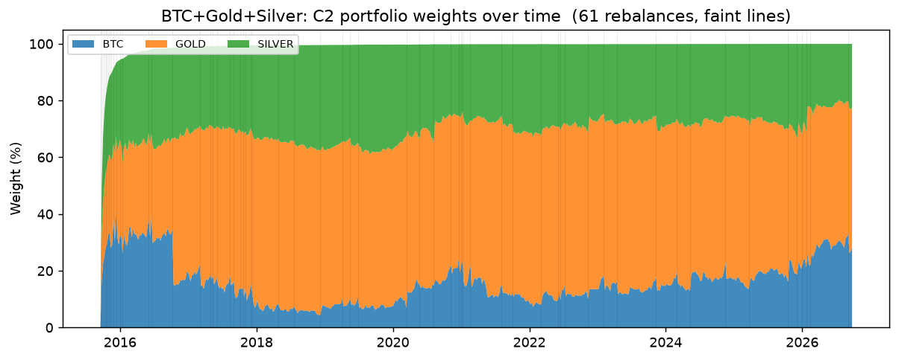

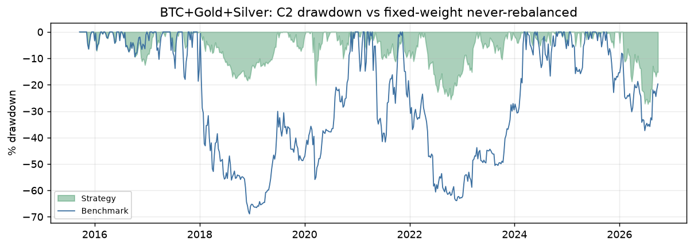

**Rolling windows vs fixed-weight:**

- 2y: 37 windows, wins on wealth 45.9%, on Sharpe 51.4%
- 3y: 33 windows, wins on wealth 33.3%, on Sharpe 69.7%

**Block bootstrap win rate vs fixed-weight:**

- wealth (raw): 8.3%
- sharpe (raw): 56.7%
- wealth (detrended): 63.3%
- sharpe (detrended): 51.7%

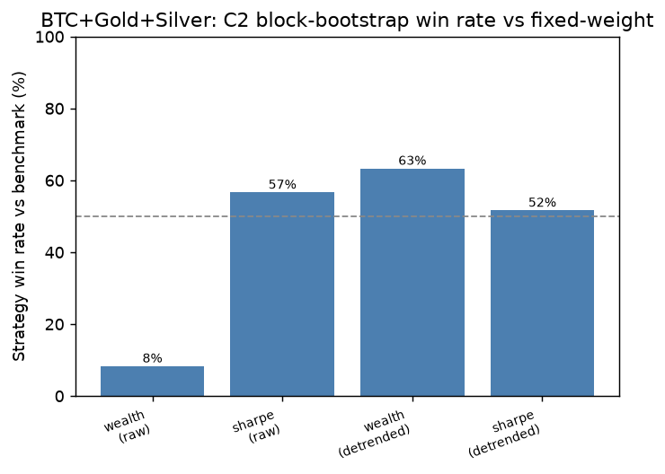

---

### BTC+Gold+Silver — C3 (5/25 bands) vs fixed-weight, never rebalanced

- Wealth/invested: **3.69×** vs fixed-weight **8.09×**
- MaxDD: -23.5% vs fixed-weight -69.0%; Sharpe: 1.18 vs fixed-weight 0.92; 326 rebalances triggered
- **Placebo test** (shuffled trend filter, 200 sims): real result sits at the **77.0th percentile** on wealth, **76.0th percentile** on Sharpe

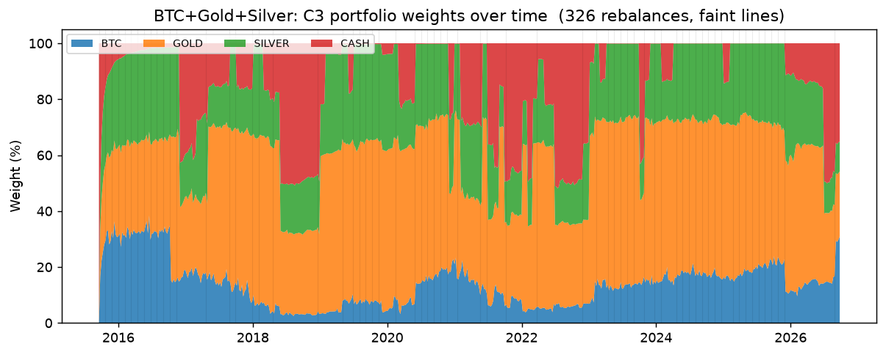

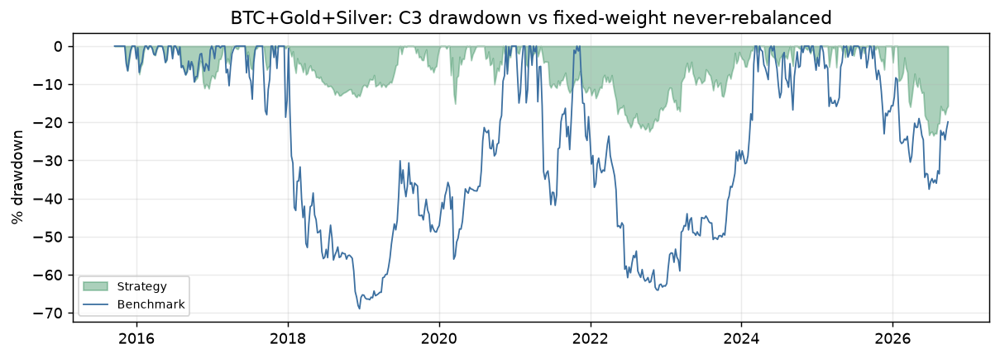

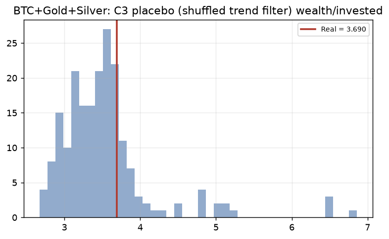

**Rolling windows vs fixed-weight:**

- 2y: 37 windows, wins on wealth 24.3%, on Sharpe 56.8%
- 3y: 33 windows, wins on wealth 18.2%, on Sharpe 63.6%

**Block bootstrap win rate vs fixed-weight:**

- wealth (raw): 3.3%
- sharpe (raw): 48.3%
- wealth (detrended): 51.7%
- sharpe (detrended): 38.3%

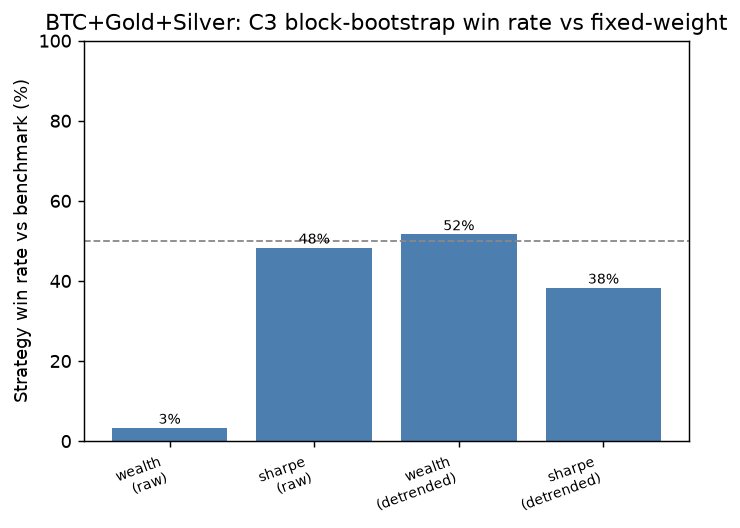

---

### Gold+Silver only — C2 (5/25 bands) vs fixed-weight, never rebalanced

- Wealth/invested: **5.40×** vs fixed-weight **4.92×**
- MaxDD: -52.4% vs fixed-weight -54.5%; Sharpe: 0.57 vs fixed-weight 0.54; 38 rebalances triggered

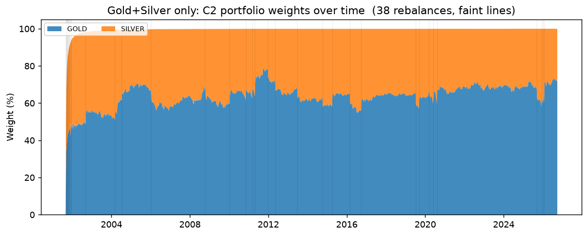

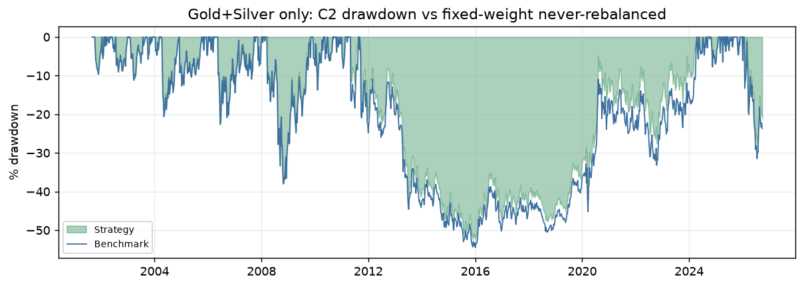

**Rolling windows vs fixed-weight:**

- 3y: 89 windows, wins on wealth 74.2%, on Sharpe 67.4%
- 5y: 81 windows, wins on wealth 82.7%, on Sharpe 74.1%

**Block bootstrap win rate vs fixed-weight:**

- wealth (raw): 53.3%
- sharpe (raw): 73.3%
- wealth (detrended): 56.7%
- sharpe (detrended): 45.0%

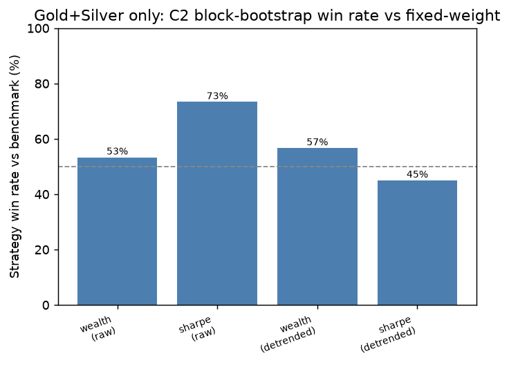

---

### Gold+Silver only — C3 (5/25 bands) vs fixed-weight, never rebalanced

- Wealth/invested: **4.25×** vs fixed-weight **4.90×**
- MaxDD: -45.5% vs fixed-weight -54.5%; Sharpe: 0.56 vs fixed-weight 0.54; 802 rebalances triggered
- **Placebo test** (shuffled trend filter, 200 sims): real result sits at the **44.0th percentile** on wealth, **53.0th percentile** on Sharpe

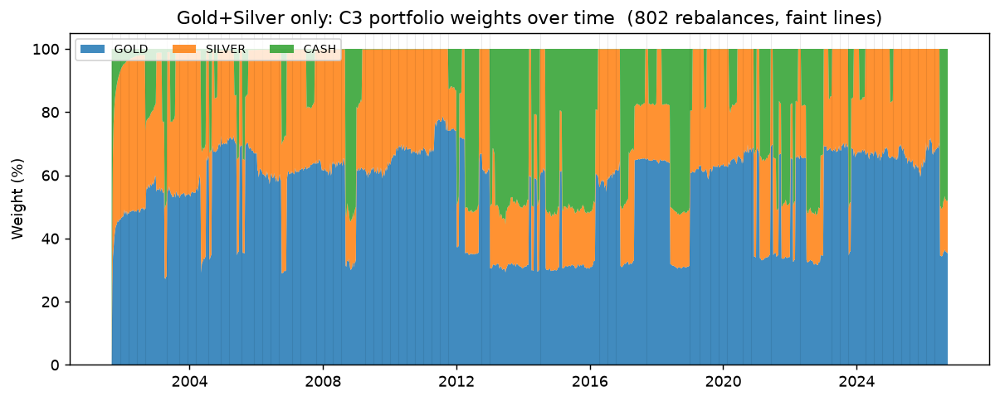

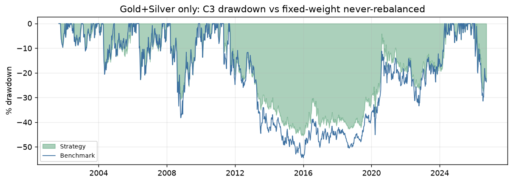

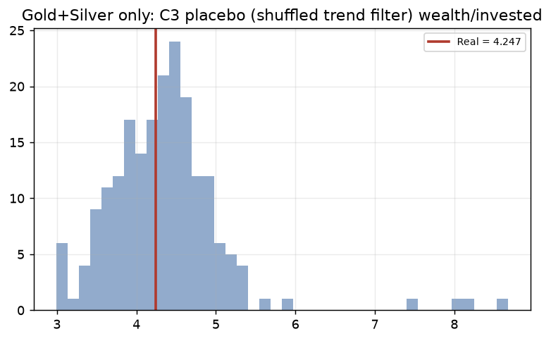

**Rolling windows vs fixed-weight:**

- 3y: 89 windows, wins on wealth 30.3%, on Sharpe 34.8%
- 5y: 81 windows, wins on wealth 25.9%, on Sharpe 40.7%

**Block bootstrap win rate vs fixed-weight:**

- wealth (raw): 13.3%
- sharpe (raw): 36.7%
- wealth (detrended): 63.3%
- sharpe (detrended): 30.0%

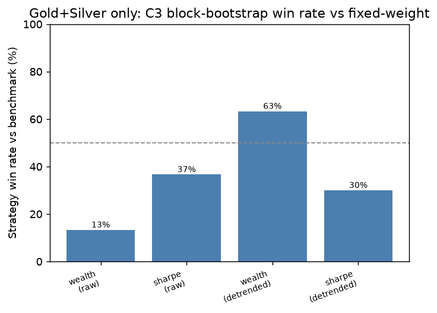

---

## Reproducing this report

```bash
python3 -m venv .venv && source .venv/bin/activate
pip install -r requirements.txt
python run_v2.py
```
