# SmartDCA / ADCA on Oil, an Energy Stock Index, and the S&P 500

Extends [`report.md`](report.md)'s Strategy A (SmartDCA) and Strategy B (ADCA) tests — unchanged code, same parameter grids and robustness methodology — to three assets that, unlike BTC, did NOT rise ~100x in a decade: **`CL=F`** (WTI crude oil continuous futures — same `=F` convention the spec already uses for gold/silver), **`XLE`** (Energy Select Sector SPDR ETF, a basket of energy equities rather than one stock, so results aren't dominated by a single company's idiosyncratic risk), and **`^GSPC`** (the S&P 500 index — a strong long-run uptrend, but nothing like BTC's). Strategy C (the rebalanced portfolio) is covered separately in [`report_five_asset_rebalance.md`](report_five_asset_rebalance.md), which extends it to 5 assets (stocks, gold, silver, BTC, oil) and studies rebalancing frequency directly.

- **OIL**: 1362 weekly candles, 2000-08-25 → 2026-09-25
- **ENERGY**: 1449 weekly candles, 1998-12-25 → 2026-09-25
- **SP500**: 5152 weekly candles, 1927-12-30 → 2026-09-25

## Strategy A — SmartDCA

| Asset | rho | m_max | sweep | #Buy | Wealth/Inv | DCA W/I | Avg cost | DCA cost | MaxDD | DCA MaxDD | Sharpe | DCA Sharpe |
|---|---|---|---|---|---|---|---|---|---|---|---|---|
| OIL | 1 | 2 | off | 1362 | 1.73 | 1.69 | 53.52 | 54.54 | -87.5% | -88.3% | 0.25 | 0.25 |
| OIL | 1 | 2 | on | 1362 | 1.72 | 1.69 | 53.79 | 54.54 | -87.7% | -88.3% | 0.25 | 0.25 |
| OIL | 1 | 3 | off | 1362 | 1.73 | 1.69 | 53.55 | 54.54 | -87.5% | -88.3% | 0.25 | 0.25 |
| OIL | 1 | 3 | on | 1362 | 1.72 | 1.69 | 53.80 | 54.54 | -87.7% | -88.3% | 0.25 | 0.25 |
| OIL | 2 | 2 | off | 1362 | 1.76 | 1.69 | 52.77 | 54.54 | -86.9% | -88.3% | 0.25 | 0.25 |
| OIL | 2 | 2 | on | 1362 | 1.72 | 1.69 | 53.77 | 54.54 | -87.6% | -88.3% | 0.25 | 0.25 |
| OIL | 2 | 3 | off | 1362 | 1.74 | 1.69 | 53.14 | 54.54 | -87.0% | -88.3% | 0.25 | 0.25 |
| OIL | 2 | 3 | on | 1362 | 1.71 | 1.69 | 54.00 | 54.54 | -87.7% | -88.3% | 0.25 | 0.25 |
| OIL | 3 | 2 | off | 1362 | 1.77 | 1.69 | 52.36 | 54.54 | -86.0% | -88.3% | 0.25 | 0.25 |
| OIL | 3 | 2 | on | 1362 | 1.71 | 1.69 | 54.17 | 54.54 | -87.7% | -88.3% | 0.25 | 0.25 |
| OIL | 3 | 3 | off | 1362 | 1.75 | 1.69 | 53.09 | 54.54 | -86.6% | -88.3% | 0.25 | 0.25 |
| OIL | 3 | 3 | on | 1362 | 1.69 | 1.69 | 54.55 | 54.54 | -87.8% | -88.3% | 0.25 | 0.25 |
| ENERGY | 1 | 2 | off | 1449 | 2.51 | 2.50 | 24.73 | 25.03 | -73.7% | -74.4% | 0.28 | 0.28 |
| ENERGY | 1 | 2 | on | 1449 | 2.50 | 2.50 | 24.85 | 25.03 | -73.9% | -74.4% | 0.28 | 0.28 |
| ENERGY | 1 | 3 | off | 1449 | 2.52 | 2.50 | 24.72 | 25.03 | -73.7% | -74.4% | 0.28 | 0.28 |
| ENERGY | 1 | 3 | on | 1449 | 2.51 | 2.50 | 24.85 | 25.03 | -73.9% | -74.4% | 0.28 | 0.28 |
| ENERGY | 2 | 2 | off | 1449 | 2.51 | 2.50 | 24.60 | 25.03 | -73.3% | -74.4% | 0.28 | 0.28 |
| ENERGY | 2 | 2 | on | 1449 | 2.48 | 2.50 | 25.11 | 25.03 | -74.2% | -74.4% | 0.28 | 0.28 |
| ENERGY | 2 | 3 | off | 1449 | 2.51 | 2.50 | 24.59 | 25.03 | -73.6% | -74.4% | 0.28 | 0.28 |
| ENERGY | 2 | 3 | on | 1449 | 2.48 | 2.50 | 25.12 | 25.03 | -74.2% | -74.4% | 0.28 | 0.28 |
| ENERGY | 3 | 2 | off | 1449 | 2.52 | 2.50 | 24.46 | 25.03 | -72.8% | -74.4% | 0.28 | 0.28 |
| ENERGY | 3 | 2 | on | 1449 | 2.47 | 2.50 | 25.23 | 25.03 | -74.2% | -74.4% | 0.28 | 0.28 |
| ENERGY | 3 | 3 | off | 1449 | 2.50 | 2.50 | 24.61 | 25.03 | -73.8% | -74.4% | 0.28 | 0.28 |
| ENERGY | 3 | 3 | on | 1449 | 2.47 | 2.50 | 25.24 | 25.03 | -74.2% | -74.4% | 0.28 | 0.28 |
| SP500 | 1 | 2 | off | 5152 | 187.98 | 189.61 | 39.92 | 40.62 | -85.6% | -86.0% | 0.19 | 0.19 |
| SP500 | 1 | 2 | on | 5152 | 190.33 | 189.61 | 41.01 | 40.62 | -85.6% | -86.0% | 0.19 | 0.19 |
| SP500 | 1 | 3 | off | 5152 | 187.98 | 189.61 | 39.92 | 40.62 | -85.6% | -86.0% | 0.19 | 0.19 |
| SP500 | 1 | 3 | on | 5152 | 190.33 | 189.61 | 41.01 | 40.62 | -85.6% | -86.0% | 0.19 | 0.19 |
| SP500 | 2 | 2 | off | 5152 | 186.57 | 189.61 | 39.43 | 40.62 | -85.3% | -86.0% | 0.19 | 0.19 |
| SP500 | 2 | 2 | on | 5152 | 190.03 | 189.61 | 41.02 | 40.62 | -85.3% | -86.0% | 0.19 | 0.19 |
| SP500 | 2 | 3 | off | 5152 | 186.54 | 189.61 | 39.46 | 40.62 | -85.3% | -86.0% | 0.19 | 0.19 |
| SP500 | 2 | 3 | on | 5152 | 190.03 | 189.61 | 41.02 | 40.62 | -85.3% | -86.0% | 0.19 | 0.19 |
| SP500 | 3 | 2 | off | 5152 | 185.64 | 189.61 | 38.94 | 40.62 | -85.0% | -86.0% | 0.19 | 0.19 |
| SP500 | 3 | 2 | on | 5152 | 190.11 | 189.61 | 40.99 | 40.62 | -85.0% | -86.0% | 0.19 | 0.19 |
| SP500 | 3 | 3 | off | 5152 | 185.41 | 189.61 | 39.18 | 40.62 | -85.0% | -86.0% | 0.19 | 0.19 |
| SP500 | 3 | 3 | on | 5152 | 190.12 | 189.61 | 40.99 | 40.62 | -85.0% | -86.0% | 0.19 | 0.19 |

Full grid: [`smartdca_grid_extra.csv`](smartdca_grid_extra.csv)

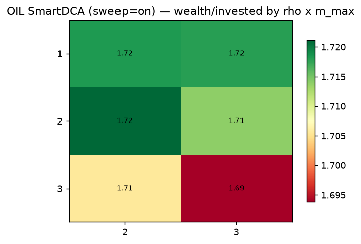

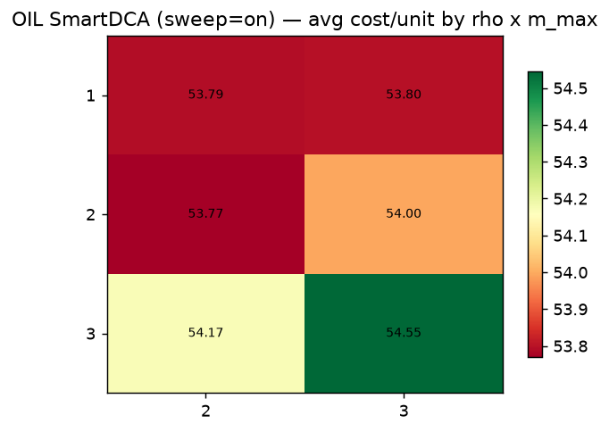

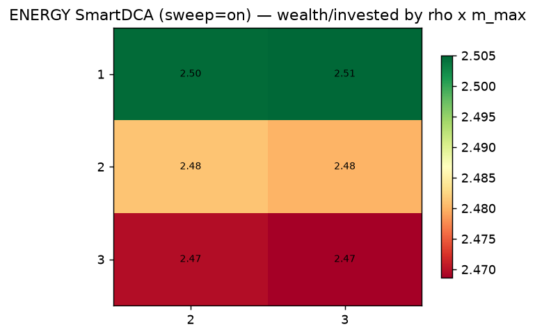

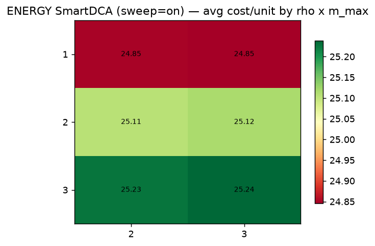

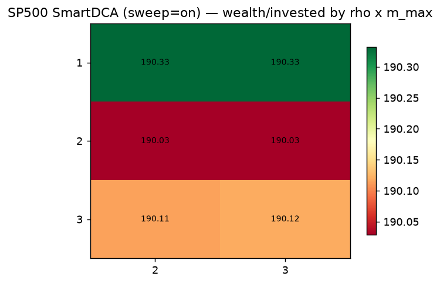

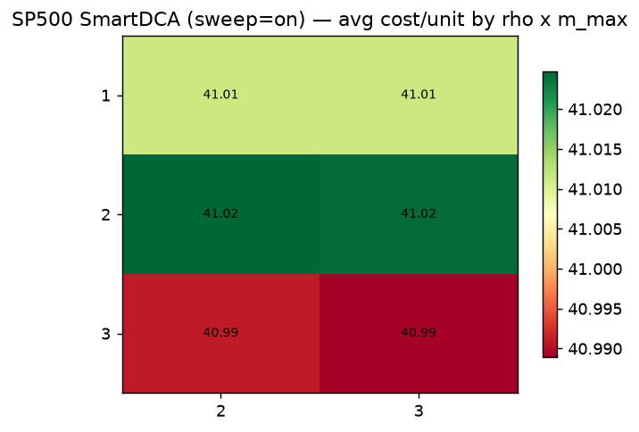

### OIL — SmartDCA deep dive (rho=2, m_max=3, sweep=on)

- Wealth/invested: **1.71×** vs DCA **1.69×**
- Avg cost per unit: **54.00** vs DCA **54.54** (LOWER)
- MaxDD: -87.7% vs DCA -88.3%; Sharpe: 0.25 vs DCA 0.25

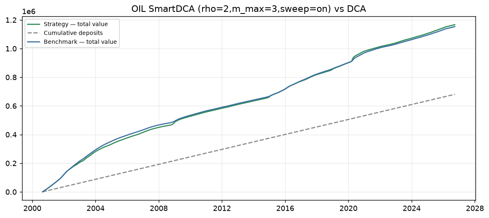

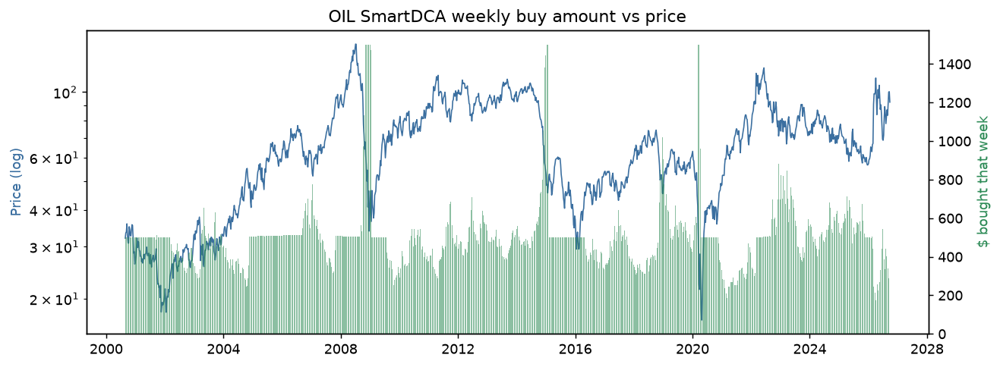

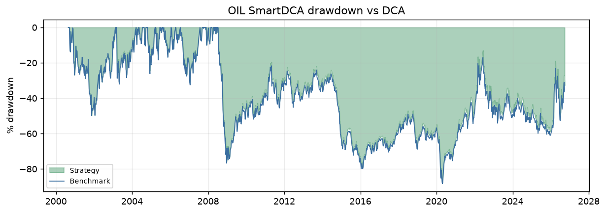

**Rolling windows vs DCA:**

- 3y: 93 windows, wins on wealth 59.1%, on Sharpe 64.5%

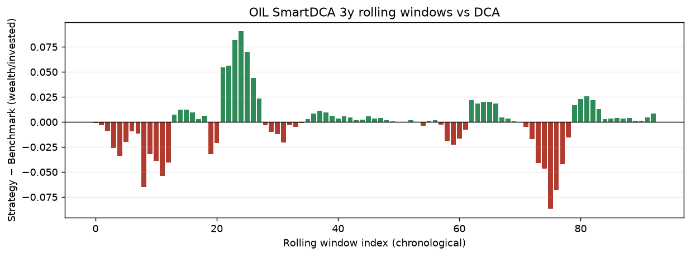

- 5y: 85 windows, wins on wealth 57.6%, on Sharpe 56.5%

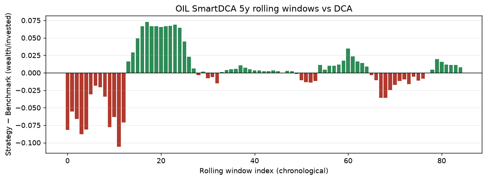

**Block bootstrap win rate vs DCA:**

- wealth (raw): 51.0%
- sharpe (raw): 51.5%
- wealth (detrended): 62.0%
- sharpe (detrended): 54.5%

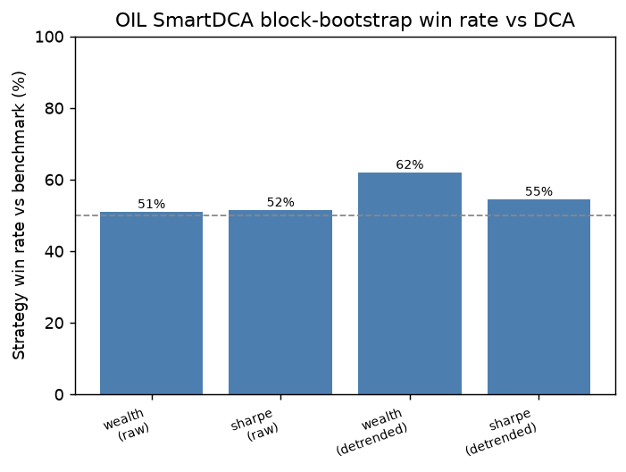

---

### ENERGY — SmartDCA deep dive (rho=2, m_max=3, sweep=on)

- Wealth/invested: **2.48×** vs DCA **2.50×**
- Avg cost per unit: **25.12** vs DCA **25.03** (HIGHER)
- MaxDD: -74.2% vs DCA -74.4%; Sharpe: 0.28 vs DCA 0.28

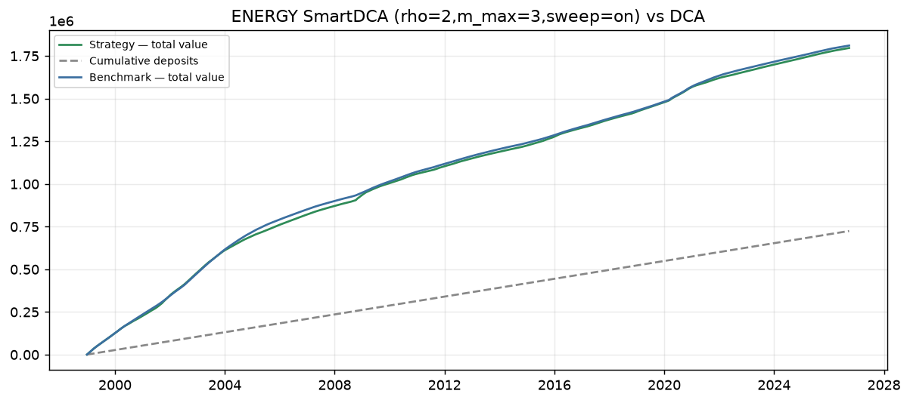

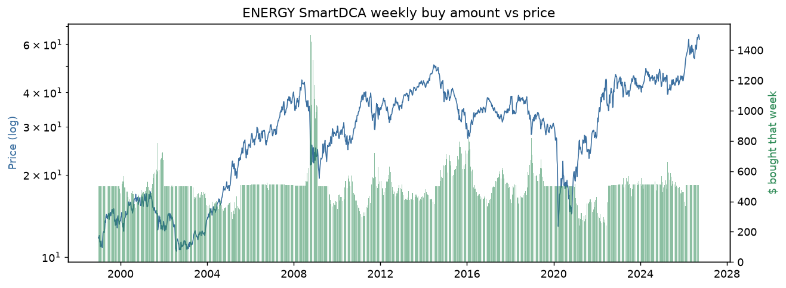


**Rolling windows vs DCA:**

- 3y: 100 windows, wins on wealth 55.0%, on Sharpe 66.0%

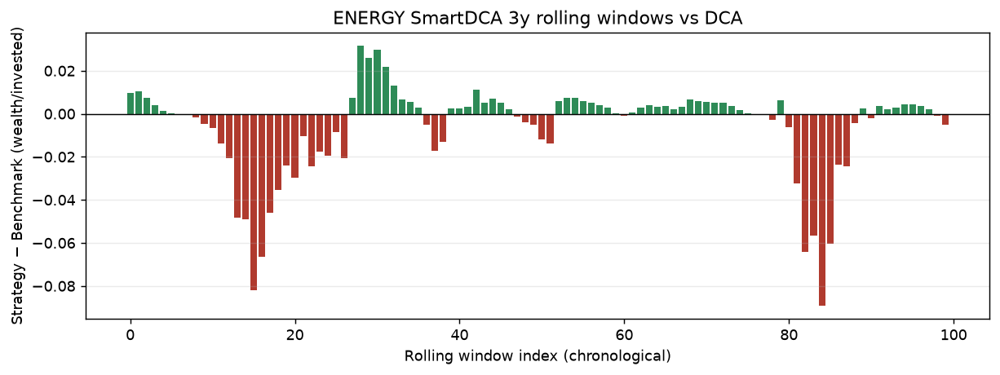

- 5y: 92 windows, wins on wealth 50.0%, on Sharpe 66.3%

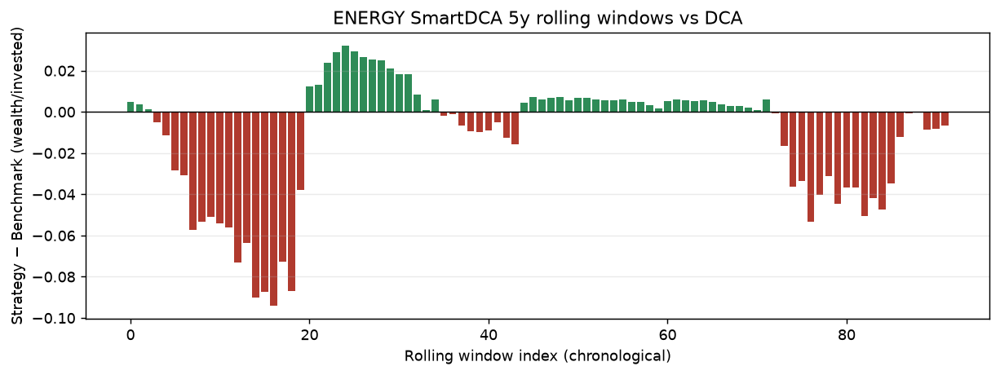

**Block bootstrap win rate vs DCA:**

- wealth (raw): 33.0%
- sharpe (raw): 54.5%
- wealth (detrended): 66.0%
- sharpe (detrended): 52.5%

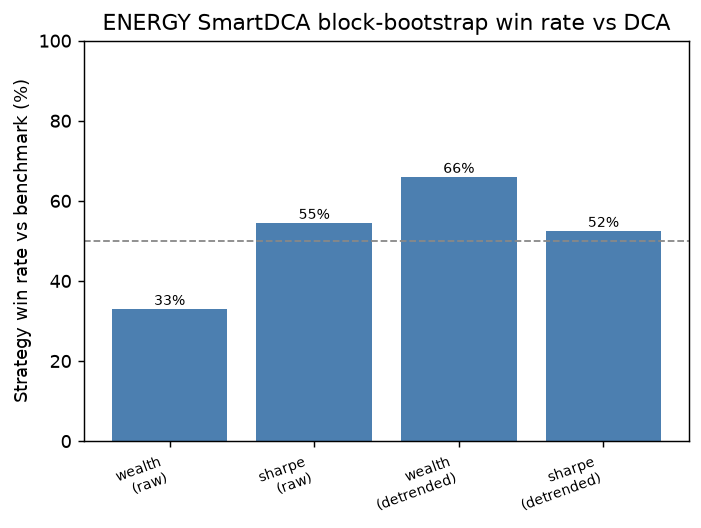

---

### SP500 — SmartDCA deep dive (rho=2, m_max=3, sweep=on)

- Wealth/invested: **190.03×** vs DCA **189.61×**
- Avg cost per unit: **41.02** vs DCA **40.62** (HIGHER)
- MaxDD: -85.3% vs DCA -86.0%; Sharpe: 0.19 vs DCA 0.19

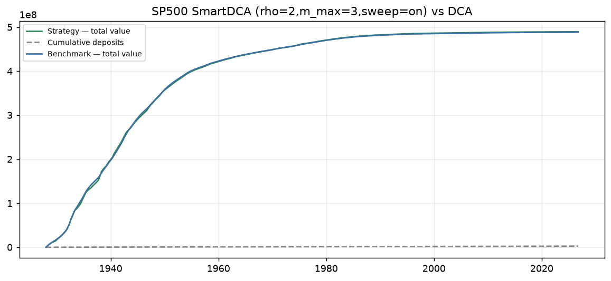

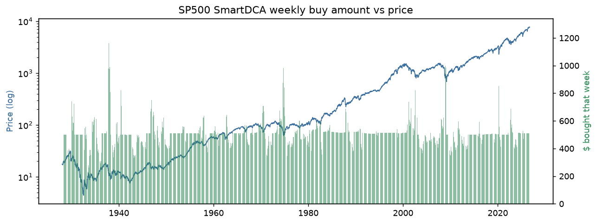


**Rolling windows vs DCA:**

- 3y: 385 windows, wins on wealth 48.8%, on Sharpe 65.2%

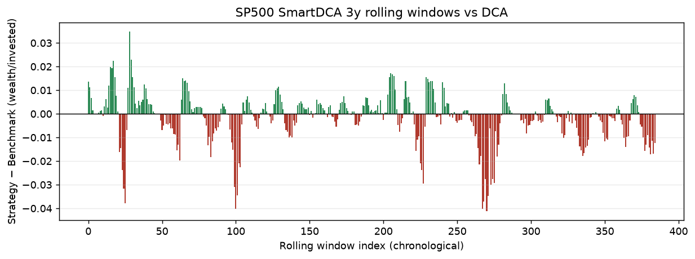

- 5y: 377 windows, wins on wealth 46.4%, on Sharpe 63.4%

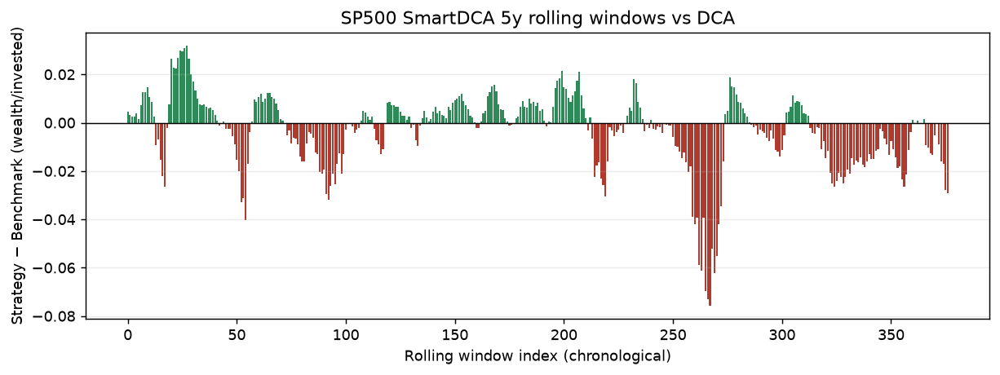

**Block bootstrap win rate vs DCA:**

- wealth (raw): 45.5%
- sharpe (raw): 56.0%
- wealth (detrended): 94.5%
- sharpe (detrended): 59.0%

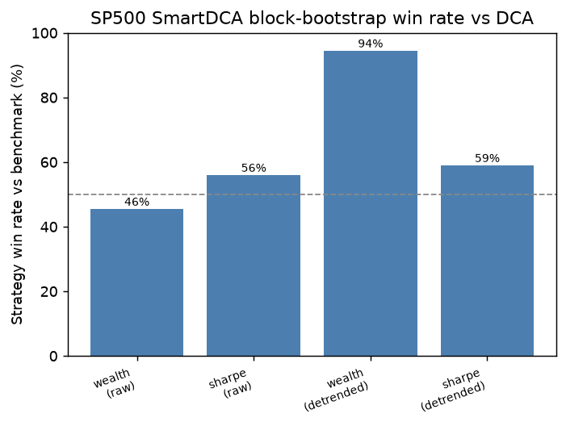

---

## Strategy B — ADCA

| Asset | Variant | #Buy | Wealth/Inv | DCA W/I | MaxDD | DCA MaxDD | Sharpe | DCA Sharpe | Avg cash share |
|---|---|---|---|---|---|---|---|---|---|
| OIL | B1 | 1362 | 1.66 | 1.69 | -88.0% | -88.3% | 0.24 | 0.25 | 3.7% |
| OIL | B2 | 1362 | 1.64 | 1.69 | -88.3% | -88.3% | 0.25 | 0.25 | 1.9% |
| ENERGY | B1 | 1449 | 2.51 | 2.50 | -74.1% | -74.4% | 0.29 | 0.28 | 3.8% |
| ENERGY | B2 | 1449 | 2.49 | 2.50 | -73.4% | -74.4% | 0.28 | 0.28 | 2.1% |
| SP500 | B1 | 5152 | 189.58 | 189.61 | -86.0% | -86.0% | 0.19 | 0.19 | 0.2% |
| SP500 | B2 | 5152 | 189.61 | 189.61 | -86.0% | -86.0% | 0.19 | 0.19 | 0.2% |

Full grid: [`adca_grid_extra.csv`](adca_grid_extra.csv)

### OIL — ADCA B1

- Wealth/invested: **1.66×** vs DCA **1.69×**
- MaxDD: -88.0% vs DCA -88.3%; Sharpe: 0.24 vs DCA 0.25
- **Placebo test** (shuffled regime score, 200 sims): real result sits at the **32.0th percentile** on wealth, **9.0th percentile** on Sharpe

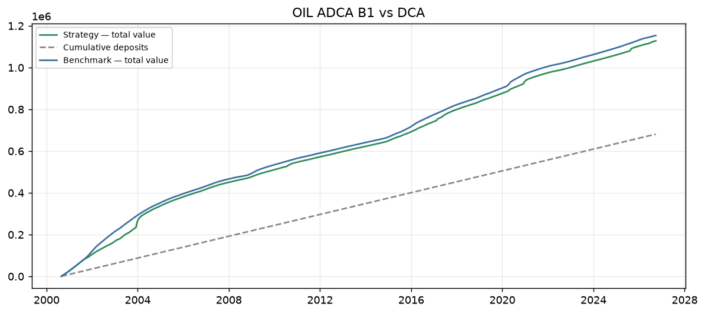

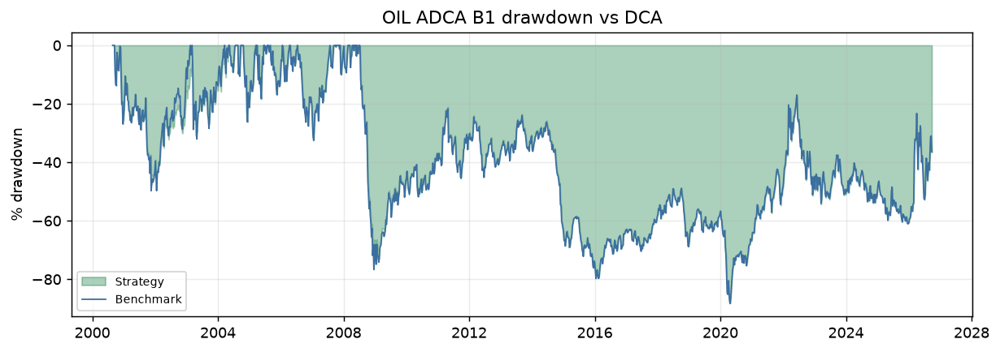

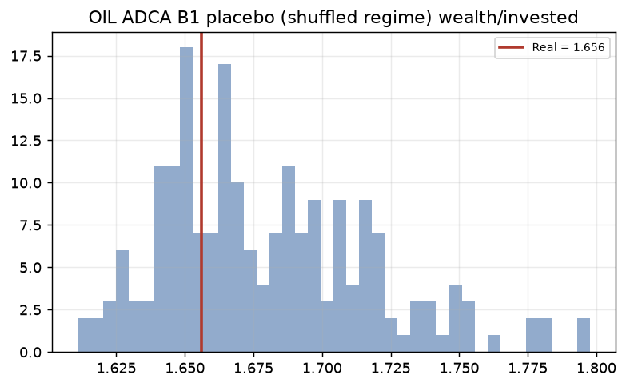

**Rolling windows vs DCA:**

- 3y: 93 windows, wins on wealth 28.0%, on Sharpe 23.7%
- 5y: 85 windows, wins on wealth 22.4%, on Sharpe 29.4%

**Block bootstrap win rate vs DCA:**

- wealth (raw): 44.0%
- sharpe (raw): 36.5%
- wealth (detrended): 54.5%
- sharpe (detrended): 38.0%

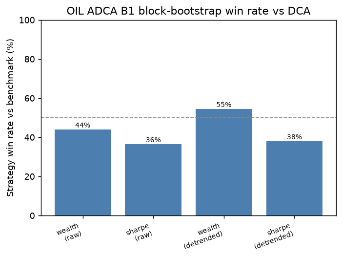

---

### OIL — ADCA B2

- Wealth/invested: **1.64×** vs DCA **1.69×**
- MaxDD: -88.3% vs DCA -88.3%; Sharpe: 0.25 vs DCA 0.25
- **Placebo test** (shuffled regime score, 200 sims): real result sits at the **6.5th percentile** on wealth, **20.0th percentile** on Sharpe

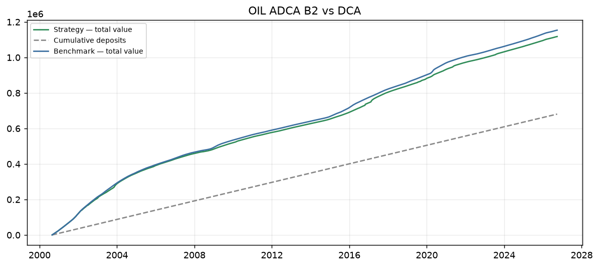


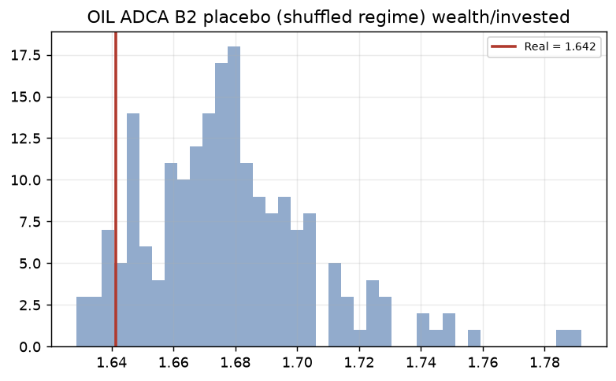

**Rolling windows vs DCA:**

- 3y: 93 windows, wins on wealth 25.8%, on Sharpe 21.5%
- 5y: 85 windows, wins on wealth 21.2%, on Sharpe 15.3%

**Block bootstrap win rate vs DCA:**

- wealth (raw): 30.0%
- sharpe (raw): 24.0%
- wealth (detrended): 46.5%
- sharpe (detrended): 25.5%

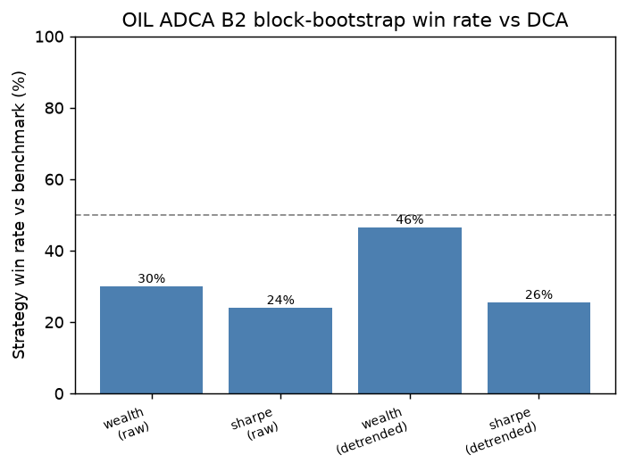

---

### ENERGY — ADCA B1

- Wealth/invested: **2.51×** vs DCA **2.50×**
- MaxDD: -74.1% vs DCA -74.4%; Sharpe: 0.29 vs DCA 0.28
- **Placebo test** (shuffled regime score, 200 sims): real result sits at the **72.0th percentile** on wealth, **79.5th percentile** on Sharpe

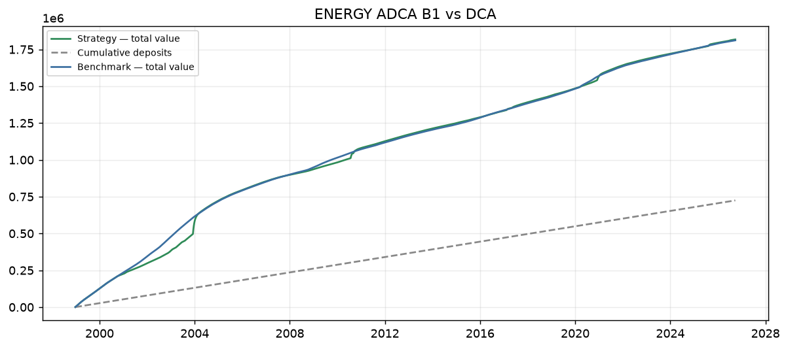

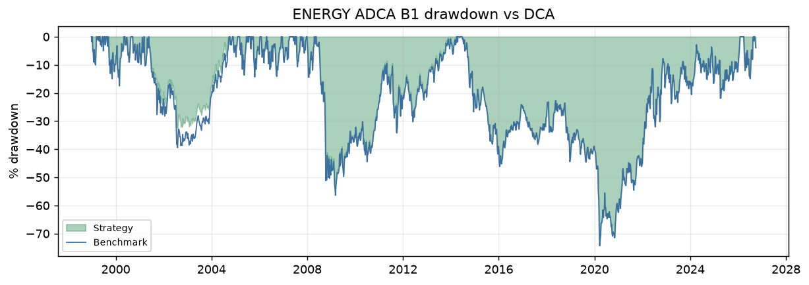

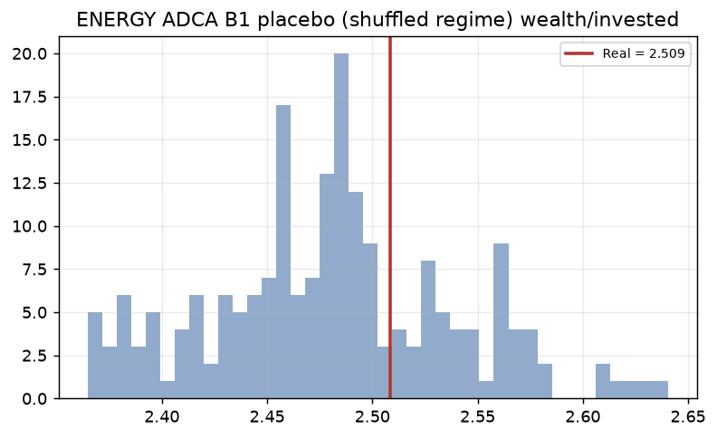

**Rolling windows vs DCA:**

- 3y: 100 windows, wins on wealth 36.0%, on Sharpe 32.0%
- 5y: 92 windows, wins on wealth 43.5%, on Sharpe 43.5%

**Block bootstrap win rate vs DCA:**

- wealth (raw): 33.5%
- sharpe (raw): 38.5%
- wealth (detrended): 53.5%
- sharpe (detrended): 39.0%

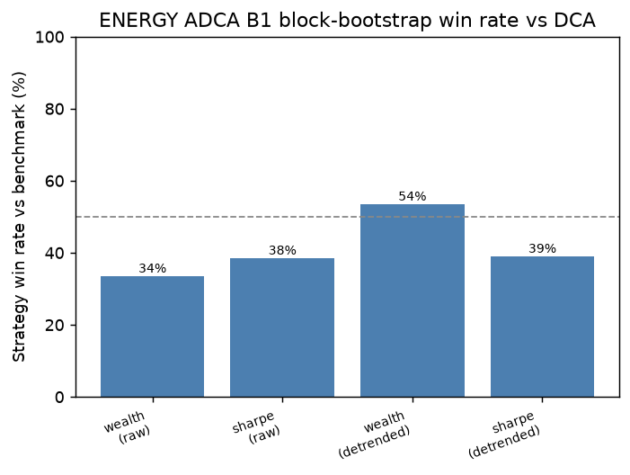

---

### ENERGY — ADCA B2

- Wealth/invested: **2.49×** vs DCA **2.50×**
- MaxDD: -73.4% vs DCA -74.4%; Sharpe: 0.28 vs DCA 0.28
- **Placebo test** (shuffled regime score, 200 sims): real result sits at the **60.0th percentile** on wealth, **73.5th percentile** on Sharpe

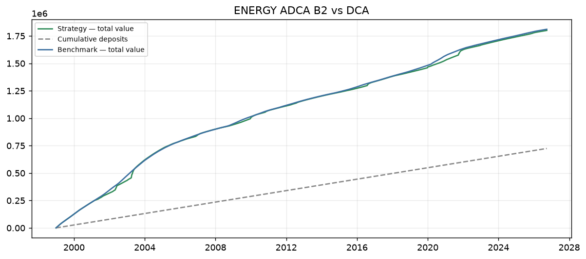


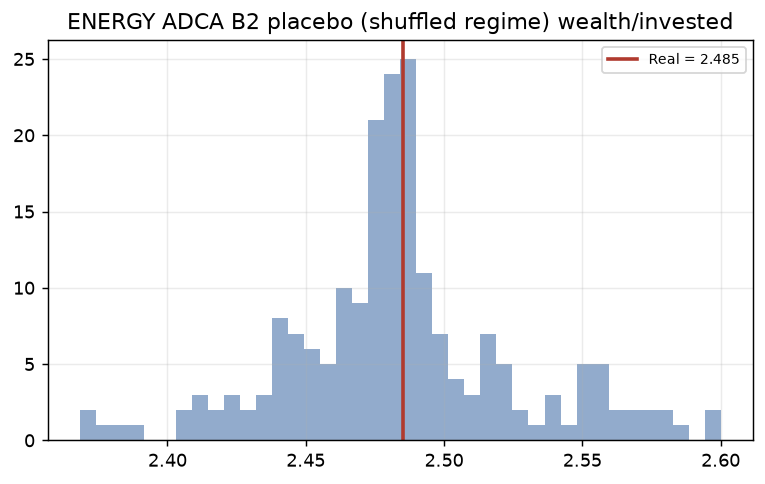

**Rolling windows vs DCA:**

- 3y: 100 windows, wins on wealth 30.0%, on Sharpe 29.0%
- 5y: 92 windows, wins on wealth 34.8%, on Sharpe 45.7%

**Block bootstrap win rate vs DCA:**

- wealth (raw): 26.0%
- sharpe (raw): 28.0%
- wealth (detrended): 51.0%
- sharpe (detrended): 26.0%

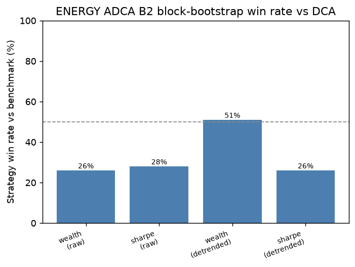

---

### SP500 — ADCA B1

- Wealth/invested: **189.58×** vs DCA **189.61×**
- MaxDD: -86.0% vs DCA -86.0%; Sharpe: 0.19 vs DCA 0.19
- **Placebo test** (shuffled regime score, 200 sims): real result sits at the **47.0th percentile** on wealth, **48.0th percentile** on Sharpe


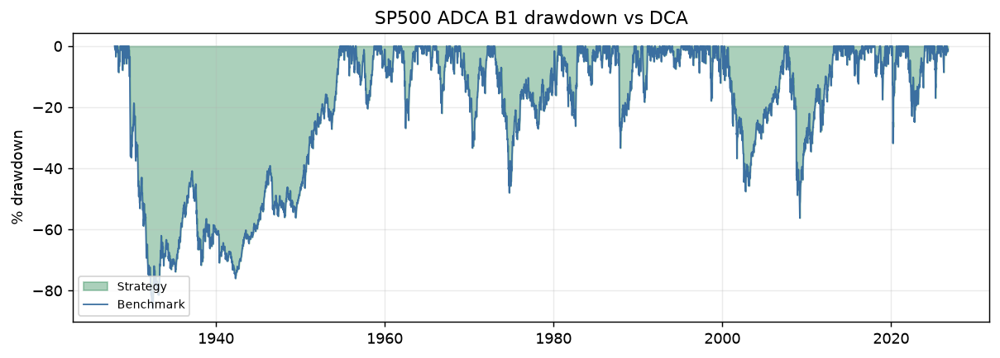

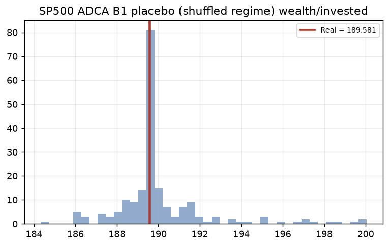

**Rolling windows vs DCA:**

- 3y: 385 windows, wins on wealth 5.7%, on Sharpe 10.4%
- 5y: 377 windows, wins on wealth 5.8%, on Sharpe 7.2%

**Block bootstrap win rate vs DCA:**

- wealth (raw): 29.0%
- sharpe (raw): 28.5%
- wealth (detrended): 68.0%
- sharpe (detrended): 30.0%

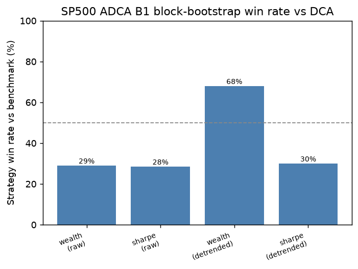

---

### SP500 — ADCA B2

- Wealth/invested: **189.61×** vs DCA **189.61×**
- MaxDD: -86.0% vs DCA -86.0%; Sharpe: 0.19 vs DCA 0.19
- **Placebo test** (shuffled regime score, 200 sims): real result sits at the **51.0th percentile** on wealth, **49.0th percentile** on Sharpe

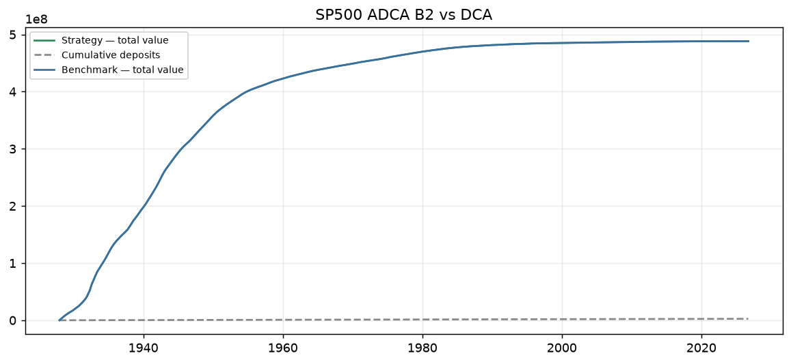


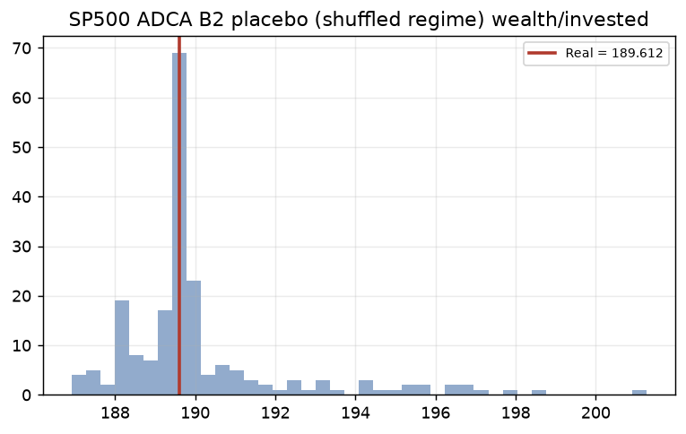

**Rolling windows vs DCA:**

- 3y: 385 windows, wins on wealth 7.5%, on Sharpe 11.4%
- 5y: 377 windows, wins on wealth 8.8%, on Sharpe 13.3%

**Block bootstrap win rate vs DCA:**

- wealth (raw): 22.5%
- sharpe (raw): 21.5%
- wealth (detrended): 70.5%
- sharpe (detrended): 17.0%

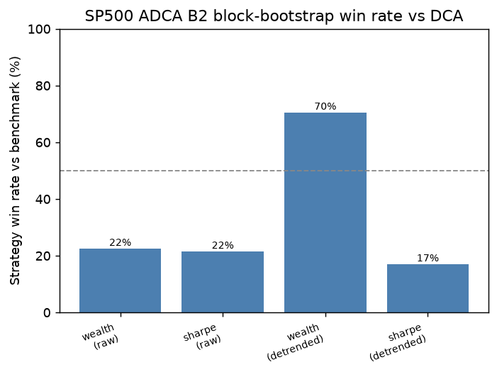

---

## Reproducing this report

```bash
python run_v2_extra_assets.py
```
