# How Often Should You Rebalance? Stocks / Gold / Silver / BTC / Oil

Extends Strategy C's rebalanced-portfolio engine (unchanged code, spec section 6) from the original 3 assets to 5: **S&P 500, gold, silver, BTC, and oil**, each getting an equal $300/week slice of a $1,500/week total deposit under equal-weight targets (or inverse-vol-weighted amounts under C2). Every asset is aligned to BTC's shorter history (its start + a 1-year warm-up), since BTC is the constraint.

- **SP500**: 576 weekly candles, 2015-09-18 → 2026-09-25
- **GOLD**: 576 weekly candles, 2015-09-18 → 2026-09-25
- **SILVER**: 576 weekly candles, 2015-09-18 → 2026-09-25
- **BTC**: 576 weekly candles, 2015-09-18 → 2026-09-25
- **OIL**: 576 weekly candles, 2015-09-18 → 2026-09-25

## The direct question: how often to rebalance?

Two target-weight schemes (**C1** equal-weight 20% each; **C2** inverse-volatility, so calmer assets like gold/silver naturally get a bigger slice than BTC) are each run under 9 rebalancing schedules, from very tight drift bands to a full year between rebalances, plus a 'never' baseline (buy whichever asset is most underweight each week, but never force a sell).

| Scheme | Trigger | Wealth/Inv | Sharpe | MaxDD | #Rebal | Avg wks/rebal | Total fees | Fees % of invested |
|---|---|---|---|---|---|---|---|---|
| C1 | 2pp/10% bands (tightest) | 4.76 | 1.19 | -33.4% | 174 | 3.3 | $12,942 | 1.50% |
| C1 | 5pp/25% bands | 4.81 | 1.18 | -33.4% | 46 | 12.5 | $7,421 | 0.86% |
| C1 | 10pp/50% bands | 5.26 | 1.22 | -33.4% | 16 | 36.0 | $5,110 | 0.59% |
| C1 | 20pp/100% bands (loosest) | 5.13 | 1.13 | -34.8% | 5 | 115.2 | $3,004 | 0.35% |
| C1 | Monthly | 4.99 | 1.20 | -34.0% | 133 | 4.3 | $12,303 | 1.42% |
| C1 | Quarterly | 5.15 | 1.19 | -33.3% | 45 | 12.8 | $8,168 | 0.95% |
| C1 | Semiannual | 5.85 | 1.17 | -37.6% | 23 | 25.0 | $7,340 | 0.85% |
| C1 | Annual | 5.20 | 1.08 | -41.2% | 12 | 48.0 | $4,591 | 0.53% |
| C1 | Never (buy & hold weights) | 5.47 | 0.86 | -60.1% | 0 | nan | $862 | 0.10% |
| C2 | 2pp/10% bands (tightest) | 3.45 | 1.17 | -28.5% | 238 | 2.4 | $10,490 | 1.21% |
| C2 | 5pp/25% bands | 3.57 | 1.18 | -28.4% | 79 | 7.3 | $7,092 | 0.82% |
| C2 | 10pp/50% bands | 3.67 | 1.18 | -26.7% | 29 | 19.9 | $4,723 | 0.55% |
| C2 | 20pp/100% bands (loosest) | 3.96 | 1.21 | -26.7% | 13 | 44.3 | $4,301 | 0.50% |
| C2 | Monthly | 3.51 | 1.16 | -28.4% | 133 | 4.3 | $8,606 | 1.00% |
| C2 | Quarterly | 3.72 | 1.22 | -27.6% | 45 | 12.8 | $6,405 | 0.74% |
| C2 | Semiannual | 4.20 | 1.27 | -27.3% | 23 | 25.0 | $6,031 | 0.70% |
| C2 | Annual | 4.17 | 1.23 | -26.4% | 12 | 48.0 | $4,957 | 0.57% |
| C2 | Never (buy & hold weights) | 5.47 | 0.87 | -59.4% | 0 | nan | $862 | 0.10% |

Full sweep: [`five_asset_rebalance_frequency.csv`](five_asset_rebalance_frequency.csv)

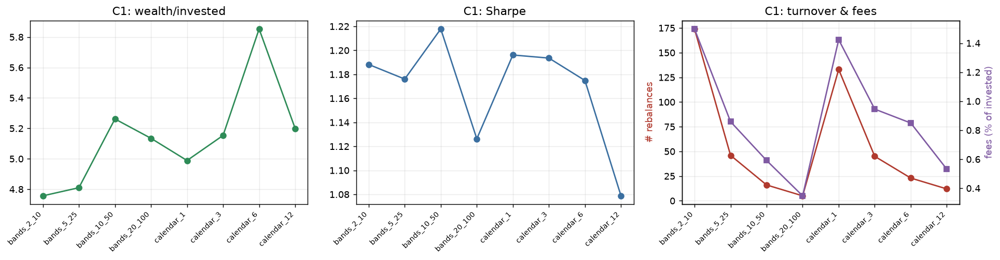

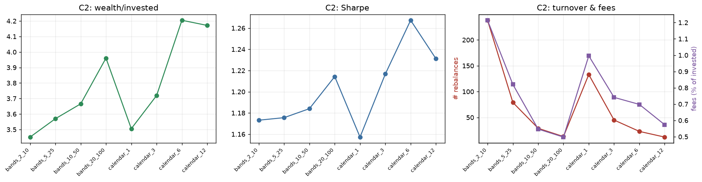

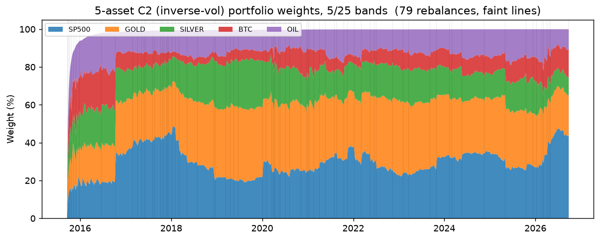

## Robustness on three representative schedules

Rolling windows and block bootstrap (60 sims per variant, raw + de-trended — reduced from the spec's 1,000 for runtime, same scoping as the rest of v2) run on a tight band (5/25), a quarterly calendar, and an annual calendar, for both weighting schemes, against the same weights' fixed-weight/never-rebalanced benchmark.

### C1 — 5pp/25% bands

- Wealth/invested: **4.81×**, Sharpe: 1.18, MaxDD: -33.4%, 46 rebalances (0.86% of invested capital spent on fees)
- 2y rolling windows: wins on wealth 45.9%, on Sharpe 81.1% (of 37 windows), vs fixed-weight/never-rebalanced
- 3y rolling windows: wins on wealth 51.5%, on Sharpe 81.8% (of 33 windows), vs fixed-weight/never-rebalanced
- Block bootstrap win rate vs fixed-weight: wealth (raw) 13.3%, sharpe (raw) 80.0%, wealth (detrended) 68.3%, sharpe (detrended) 70.0%

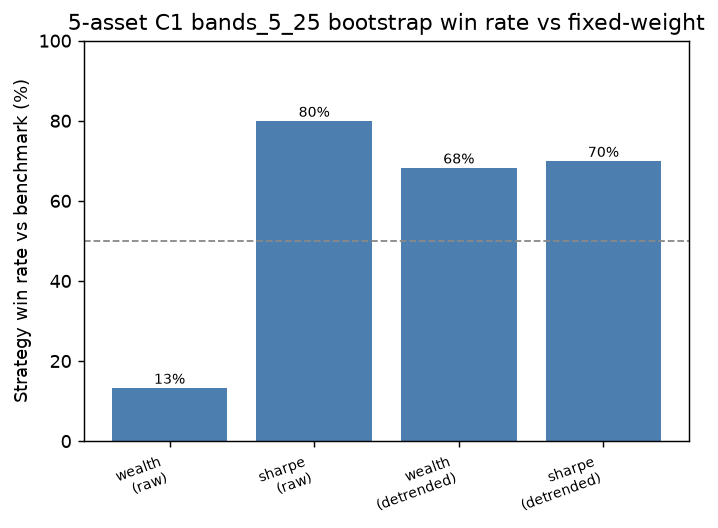

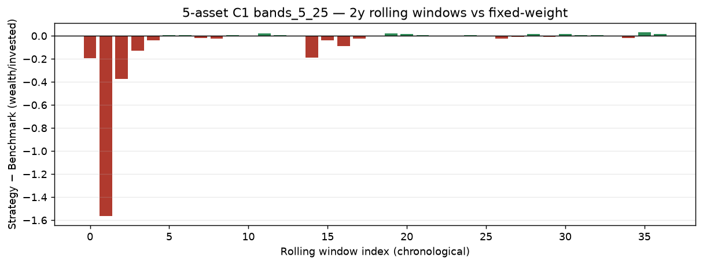

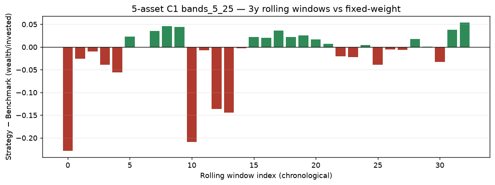

---

### C1 — Quarterly

- Wealth/invested: **5.15×**, Sharpe: 1.19, MaxDD: -33.3%, 45 rebalances (0.95% of invested capital spent on fees)
- 2y rolling windows: wins on wealth 62.2%, on Sharpe 78.4% (of 37 windows), vs fixed-weight/never-rebalanced
- 3y rolling windows: wins on wealth 63.6%, on Sharpe 84.8% (of 33 windows), vs fixed-weight/never-rebalanced
- Block bootstrap win rate vs fixed-weight: wealth (raw) 13.3%, sharpe (raw) 76.7%, wealth (detrended) 66.7%, sharpe (detrended) 68.3%

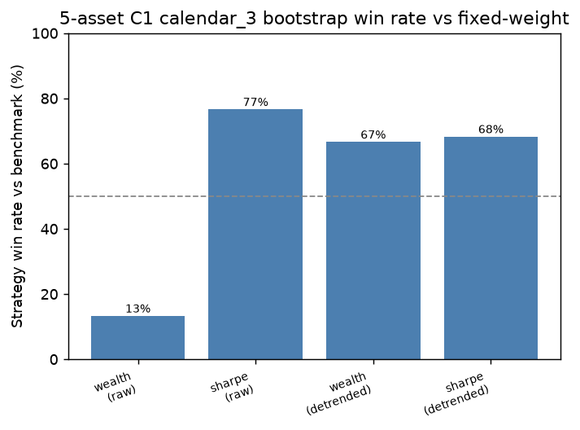

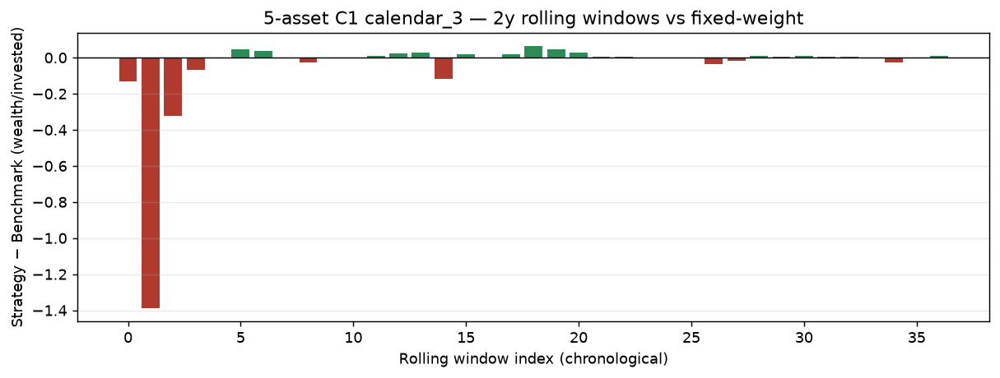

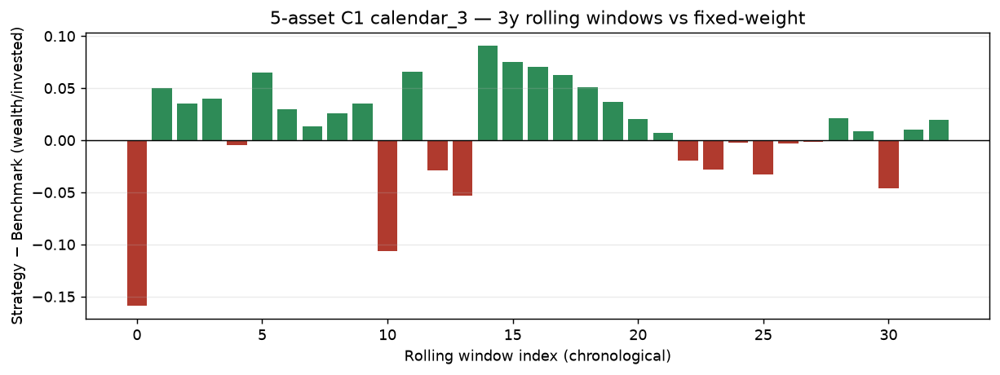

---

### C1 — Annual

- Wealth/invested: **5.20×**, Sharpe: 1.08, MaxDD: -41.2%, 12 rebalances (0.53% of invested capital spent on fees)
- 2y rolling windows: wins on wealth 56.8%, on Sharpe 75.7% (of 37 windows), vs fixed-weight/never-rebalanced
- 3y rolling windows: wins on wealth 69.7%, on Sharpe 78.8% (of 33 windows), vs fixed-weight/never-rebalanced
- Block bootstrap win rate vs fixed-weight: wealth (raw) 11.7%, sharpe (raw) 76.7%, wealth (detrended) 68.3%, sharpe (detrended) 63.3%

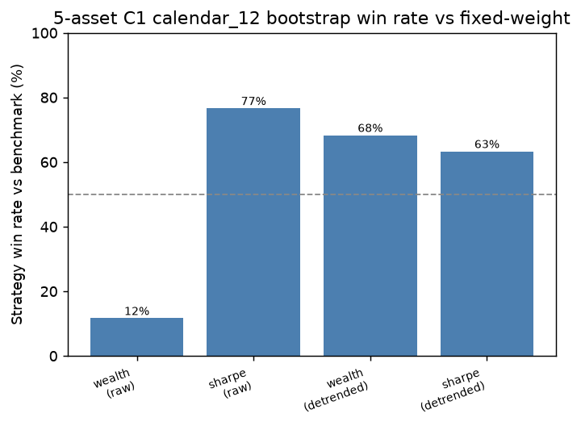

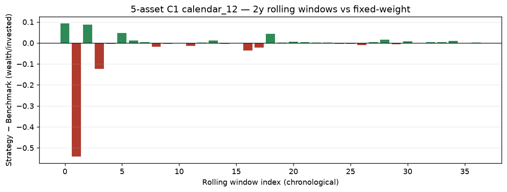

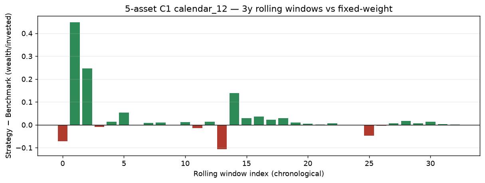

---

### C2 — 5pp/25% bands

- Wealth/invested: **3.57×**, Sharpe: 1.18, MaxDD: -28.4%, 79 rebalances (0.82% of invested capital spent on fees)
- 2y rolling windows: wins on wealth 45.9%, on Sharpe 64.9% (of 37 windows), vs fixed-weight/never-rebalanced
- 3y rolling windows: wins on wealth 33.3%, on Sharpe 72.7% (of 33 windows), vs fixed-weight/never-rebalanced
- Block bootstrap win rate vs fixed-weight: wealth (raw) 11.7%, sharpe (raw) 61.7%, wealth (detrended) 48.3%, sharpe (detrended) 45.0%

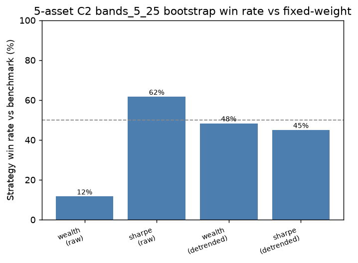

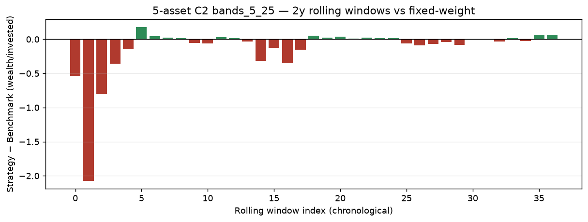

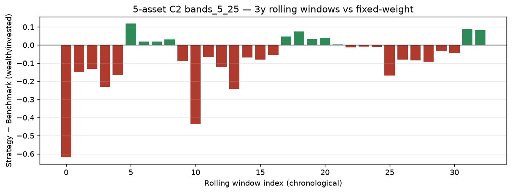

---

### C2 — Quarterly

- Wealth/invested: **3.72×**, Sharpe: 1.22, MaxDD: -27.6%, 45 rebalances (0.74% of invested capital spent on fees)
- 2y rolling windows: wins on wealth 48.6%, on Sharpe 73.0% (of 37 windows), vs fixed-weight/never-rebalanced
- 3y rolling windows: wins on wealth 39.4%, on Sharpe 78.8% (of 33 windows), vs fixed-weight/never-rebalanced
- Block bootstrap win rate vs fixed-weight: wealth (raw) 11.7%, sharpe (raw) 63.3%, wealth (detrended) 56.7%, sharpe (detrended) 43.3%

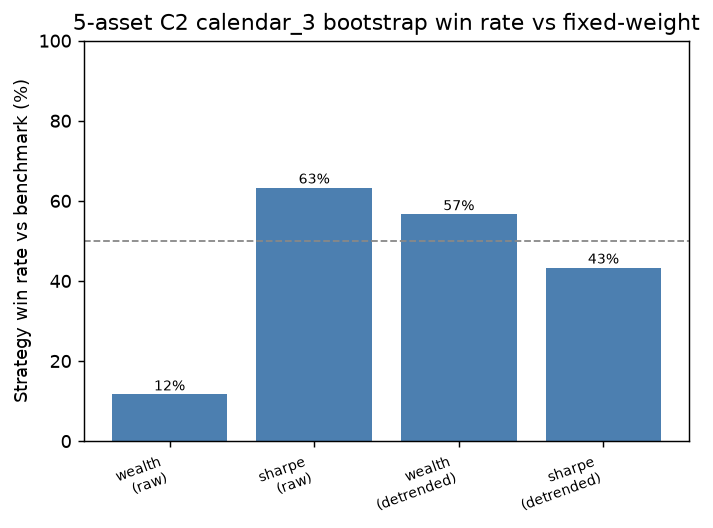

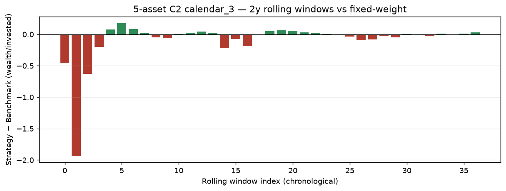

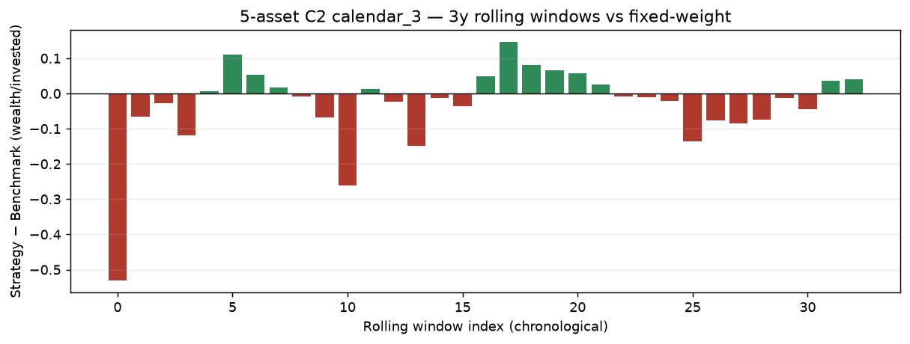

---

### C2 — Annual

- Wealth/invested: **4.17×**, Sharpe: 1.23, MaxDD: -26.4%, 12 rebalances (0.57% of invested capital spent on fees)
- 2y rolling windows: wins on wealth 54.1%, on Sharpe 78.4% (of 37 windows), vs fixed-weight/never-rebalanced
- 3y rolling windows: wins on wealth 51.5%, on Sharpe 78.8% (of 33 windows), vs fixed-weight/never-rebalanced
- Block bootstrap win rate vs fixed-weight: wealth (raw) 8.3%, sharpe (raw) 63.3%, wealth (detrended) 53.3%, sharpe (detrended) 45.0%

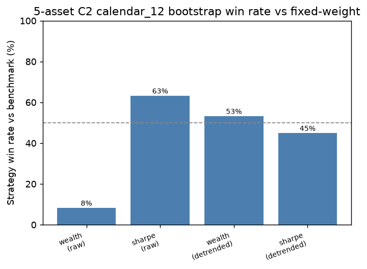

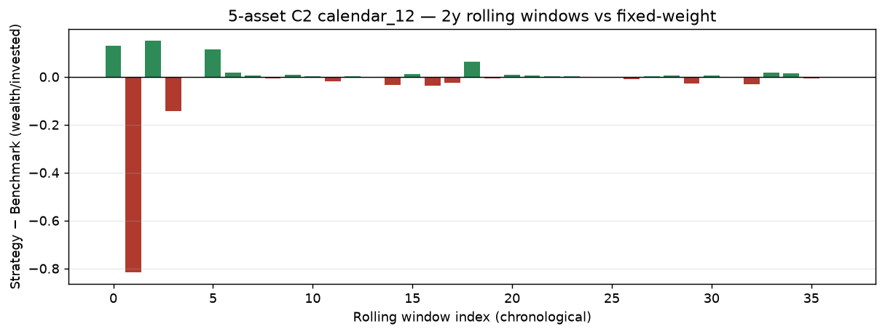

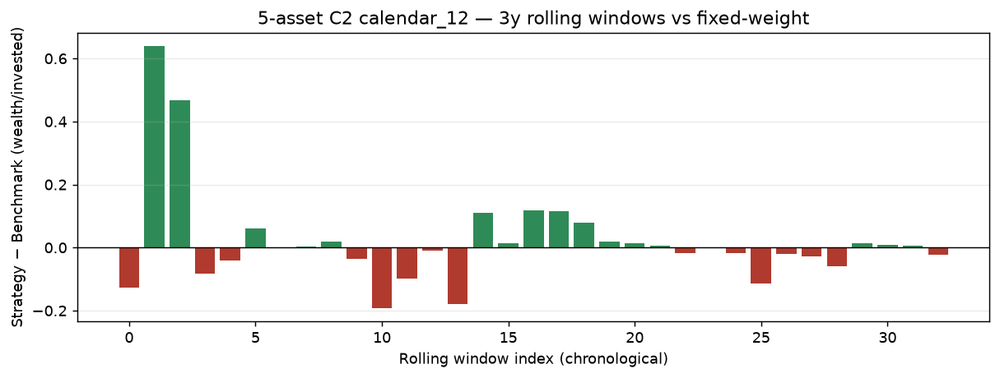

---

## Reproducing this report

```bash
python run_v2_five_asset_rebalance.py
```
