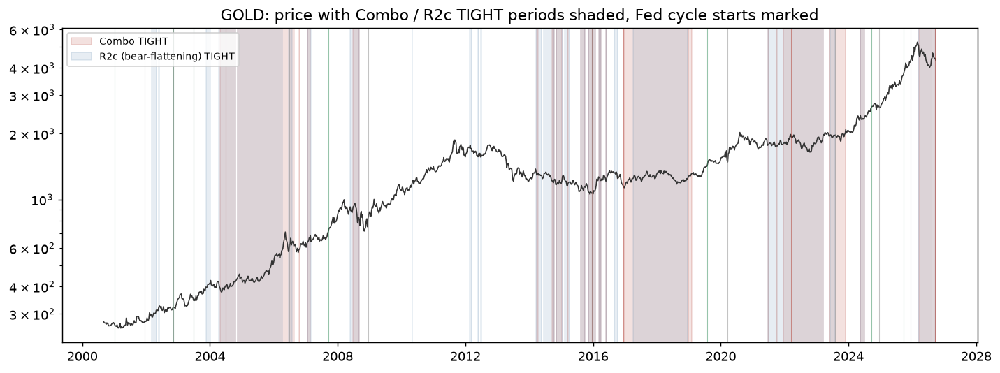
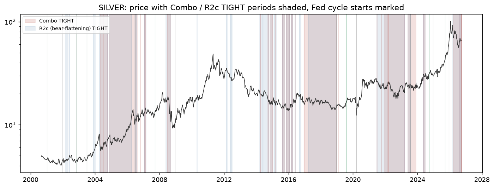
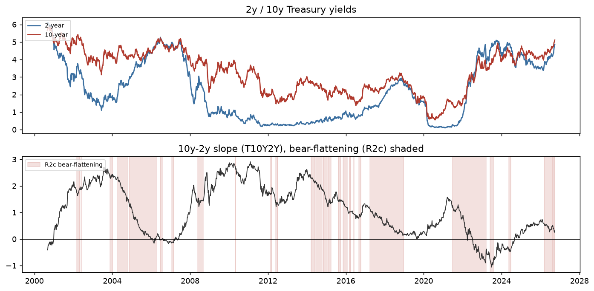

# Strategy D — Rate-Regime Switch (SmartDCA in Tightening, DCA Otherwise)

Spec: [`btc-gold-silver-backtest-spec-v2.1.md`](../../btc-gold-silver-backtest-spec-v2.1.md), section 15. Tests whether **switching to SmartDCA during monetary tightening and plain DCA otherwise** beats either strategy alone — motivated by v2's finding that SmartDCA only wins on gold/silver once you strip out the drift (detrended bootstrap: 64–70% win rate), and specifically loses in the recent gold/silver rally.

## Scoping notes (read this first)

- **R4 (dot plot)** uses real ALFRED vintages, fetched from ALFRED's actual FEDTARMD release-date dropdown. Those only go back to **2015-12-16**, not Jan 2012 as the spec's data table assumed — a real data-availability constraint, not a design choice. R4's usable sample is ~2016+ (spec itself already called this signal 'suggestive only, few cycles').
- **Placebo sims reduced to 300** (from the spec's 1,000), same scoping as the rest of v2.
- **Full placebo suite** (all 8 rate signals + Control) runs on **gold and silver**, the spec's actual primary hypothesis assets. **BTC, oil, and S&P 500** (added per your ask to cover the 'agreed' 5-asset set) get placebo tests on **Combo + Control only**, to keep runtime reasonable — the rate-regime *hypothesis itself* (opportunity cost of holding a non-yielding asset) was built around gold/silver specifically; BTC/oil/stocks are exploratory extensions, not the design target.
- The **win condition** (spec §15.7, all 4 checks) is evaluated strictly on the **Primary 2001–2023 gold+silver sample**, exactly as the spec specifies.
- Multiple-testing guard: 8 rate signals tested → a single signal needs to clear the **top 0.625%** of its placebo distribution (5% ÷ 8) to count as a real pass.

## Fed cycles (detected from the target-rate series)

Heuristic: group consecutive weekly target-rate moves of the same sign into hike/ease cycles; a flat stretch longer than 26 weeks between moves becomes its own 'hold' cycle. A simplification of the spec's 'derive from data, don't hard-code' instruction — matches the real historical Fed cycle shape closely (2001 easing, 2004-06 hiking, 2007-08 GFC easing, ZIRP hold to 2015, 2015-18 hiking, 2019 easing, COVID hold, 2022-23 hiking, 2024-25 easing, and the Sept 2026 hike the spec itself flagged).

| Type | Start | End |
|---|---|---|
| ease | 2001-01-05 | 2001-12-14 |
| hold | 2001-12-14 | 2002-11-08 |
| ease | 2002-11-08 | 2002-11-08 |
| hold | 2002-11-08 | 2003-06-27 |
| ease | 2003-06-27 | 2003-06-27 |
| hold | 2003-06-27 | 2004-07-02 |
| hike | 2004-07-02 | 2006-06-30 |
| hold | 2006-06-30 | 2007-09-21 |
| ease | 2007-09-21 | 2008-12-19 |
| hold | 2008-12-19 | 2015-12-18 |
| hike | 2015-12-18 | 2015-12-18 |
| hold | 2015-12-18 | 2016-12-16 |
| hike | 2016-12-16 | 2018-12-21 |
| hold | 2018-12-21 | 2019-08-02 |
| ease | 2019-08-02 | 2020-03-20 |
| hold | 2020-03-20 | 2022-03-18 |
| hike | 2022-03-18 | 2023-07-28 |
| hold | 2023-07-28 | 2024-09-20 |
| ease | 2024-09-20 | 2024-12-20 |
| hold | 2024-12-20 | 2025-09-19 |
| ease | 2025-09-19 | 2025-12-12 |
| hold | 2025-12-12 | 2026-09-18 |
| hike | 2026-09-18 | 2026-09-25 |

## Headline comparison: all 5 assets × 9 signals (full history)

| Asset | Signal | D Wealth/Inv | DCA W/I | SmartDCA W/I | D Sharpe | DCA Sharpe | SmartDCA Sharpe | MaxDD | %TIGHT | #Switches |
|---|---|---|---|---|---|---|---|---|---|---|
| GOLD | R1 | 5.22 | 5.24 | 5.08 | 0.59 | 0.59 | 0.59 | -43.6% | 28.3% | 9 |
| GOLD | R2a | 5.23 | 5.24 | 5.08 | 0.59 | 0.59 | 0.59 | -43.6% | 51.5% | 75 |
| GOLD | R2b | 5.21 | 5.24 | 5.08 | 0.59 | 0.59 | 0.59 | -43.6% | 52.3% | 49 |
| GOLD | R2b-inv | 5.23 | 5.24 | 5.08 | 0.59 | 0.59 | 0.59 | -43.6% | 13.1% | 11 |
| GOLD | R2c | 5.23 | 5.24 | 5.08 | 0.59 | 0.59 | 0.59 | -43.6% | 34.5% | 53 |
| GOLD | R3 | 5.23 | 5.24 | 5.08 | 0.59 | 0.59 | 0.59 | -43.6% | 43.4% | 79 |
| GOLD | R4 | 5.24 | 5.24 | 5.08 | 0.59 | 0.59 | 0.59 | -43.6% | 21.0% | 9 |
| GOLD | Combo | 5.23 | 5.24 | 5.08 | 0.59 | 0.59 | 0.59 | -43.6% | 31.1% | 45 |
| GOLD | Control | 5.24 | 5.24 | 5.08 | 0.59 | 0.59 | 0.59 | -43.6% | 28.2% | 55 |
| SILVER | R1 | 5.18 | 5.21 | 5.13 | 0.41 | 0.41 | 0.41 | -74.6% | 28.3% | 9 |
| SILVER | R2a | 5.19 | 5.21 | 5.13 | 0.41 | 0.41 | 0.41 | -74.6% | 51.5% | 75 |
| SILVER | R2b | 5.16 | 5.21 | 5.13 | 0.41 | 0.41 | 0.41 | -74.6% | 52.3% | 49 |
| SILVER | R2b-inv | 5.21 | 5.21 | 5.13 | 0.41 | 0.41 | 0.41 | -74.6% | 13.1% | 11 |
| SILVER | R2c | 5.19 | 5.21 | 5.13 | 0.41 | 0.41 | 0.41 | -74.6% | 34.5% | 53 |
| SILVER | R3 | 5.20 | 5.21 | 5.13 | 0.41 | 0.41 | 0.41 | -74.6% | 43.4% | 79 |
| SILVER | R4 | 5.22 | 5.21 | 5.13 | 0.41 | 0.41 | 0.41 | -74.6% | 21.0% | 9 |
| SILVER | Combo | 5.19 | 5.21 | 5.13 | 0.41 | 0.41 | 0.41 | -74.6% | 31.1% | 45 |
| SILVER | Control | 5.21 | 5.21 | 5.13 | 0.41 | 0.41 | 0.41 | -74.6% | 39.2% | 81 |
| BTC | R1 | 50.28 | 52.90 | 46.24 | 0.96 | 0.97 | 0.95 | -81.5% | 40.6% | 7 |
| BTC | R2a | 49.91 | 52.90 | 46.24 | 0.96 | 0.97 | 0.95 | -81.5% | 57.3% | 27 |
| BTC | R2b | 49.80 | 52.90 | 46.24 | 0.96 | 0.97 | 0.95 | -81.5% | 52.5% | 19 |
| BTC | R2b-inv | 52.86 | 52.90 | 46.24 | 0.97 | 0.97 | 0.95 | -81.7% | 17.8% | 2 |
| BTC | R2c | 51.82 | 52.90 | 46.24 | 0.97 | 0.97 | 0.95 | -81.5% | 41.7% | 23 |
| BTC | R3 | 51.63 | 52.90 | 46.24 | 0.97 | 0.97 | 0.95 | -81.6% | 52.5% | 41 |
| BTC | R4 | 47.11 | 52.90 | 46.24 | 0.96 | 0.97 | 0.95 | -81.5% | 45.5% | 9 |
| BTC | Combo | 50.99 | 52.90 | 46.24 | 0.97 | 0.97 | 0.95 | -81.5% | 42.2% | 27 |
| BTC | Control | 52.92 | 52.90 | 46.24 | 0.97 | 0.97 | 0.95 | -81.7% | 33.9% | 20 |
| OIL | R1 | 1.70 | 1.69 | 1.71 | 0.25 | 0.25 | 0.25 | -88.3% | 28.3% | 9 |
| OIL | R2a | 1.70 | 1.69 | 1.71 | 0.25 | 0.25 | 0.25 | -88.2% | 51.5% | 75 |
| OIL | R2b | 1.70 | 1.69 | 1.71 | 0.25 | 0.25 | 0.25 | -88.3% | 52.3% | 49 |
| OIL | R2b-inv | 1.69 | 1.69 | 1.71 | 0.25 | 0.25 | 0.25 | -88.3% | 13.1% | 11 |
| OIL | R2c | 1.70 | 1.69 | 1.71 | 0.25 | 0.25 | 0.25 | -88.3% | 34.4% | 53 |
| OIL | R3 | 1.70 | 1.69 | 1.71 | 0.25 | 0.25 | 0.25 | -88.3% | 43.4% | 79 |
| OIL | R4 | 1.70 | 1.69 | 1.71 | 0.25 | 0.25 | 0.25 | -88.3% | 21.0% | 9 |
| OIL | Combo | 1.70 | 1.69 | 1.71 | 0.25 | 0.25 | 0.25 | -88.3% | 31.1% | 45 |
| OIL | Control | 1.69 | 1.69 | 1.71 | 0.25 | 0.25 | 0.25 | -88.3% | 41.3% | 62 |
| SP500 | R1 | 189.62 | 189.61 | 190.03 | 0.19 | 0.19 | 0.19 | -86.0% | 14.4% | 27 |
| SP500 | R2a | 189.65 | 189.61 | 190.03 | 0.19 | 0.19 | 0.19 | -86.0% | 25.9% | 125 |
| SP500 | R2b | 189.61 | 189.61 | 190.03 | 0.19 | 0.19 | 0.19 | -86.0% | 27.6% | 111 |
| SP500 | R2b-inv | 189.63 | 189.61 | 190.03 | 0.19 | 0.19 | 0.19 | -86.0% | 8.2% | 26 |
| SP500 | R2c | 189.62 | 189.61 | 190.03 | 0.19 | 0.19 | 0.19 | -86.0% | 18.5% | 111 |
| SP500 | R3 | 189.61 | 189.61 | 190.03 | 0.19 | 0.19 | 0.19 | -86.0% | 11.5% | 79 |
| SP500 | R4 | 189.61 | 189.61 | 190.03 | 0.19 | 0.19 | 0.19 | -86.0% | 5.6% | 9 |
| SP500 | Combo | 189.61 | 189.61 | 190.03 | 0.19 | 0.19 | 0.19 | -86.0% | 12.2% | 65 |
| SP500 | Control | 189.60 | 189.61 | 190.03 | 0.19 | 0.19 | 0.19 | -86.0% | 32.6% | 178 |

Full table: [`regime_switch_headline.csv`](regime_switch_headline.csv)







## Primary hypothesis test: gold & silver, 2001–2023 vs 2024+

The **2001-2023 window predates** the 2024-2026 rally that motivated Strategy D in the first place, so it's the closest thing to a real out-of-sample test the available history allows. 2024+ is reported separately and explicitly **not treated as confirmation** (spec 15.6).

| Asset | Period | Signal | D W/I | DCA W/I | SmartDCA W/I | D Sharpe | DCA Sharpe | SmartDCA Sharpe |
|---|---|---|---|---|---|---|---|---|
| GOLD | Primary 2001-2023 | R1 | 2.63 | 2.64 | 2.57 | 0.52 | 0.52 | 0.51 |
| GOLD | Primary 2001-2023 | R2a | 2.64 | 2.64 | 2.57 | 0.52 | 0.52 | 0.51 |
| GOLD | Primary 2001-2023 | R2b | 2.63 | 2.64 | 2.57 | 0.51 | 0.52 | 0.51 |
| GOLD | Primary 2001-2023 | R2b-inv | 2.64 | 2.64 | 2.57 | 0.52 | 0.52 | 0.51 |
| GOLD | Primary 2001-2023 | R2c | 2.64 | 2.64 | 2.57 | 0.52 | 0.52 | 0.51 |
| GOLD | Primary 2001-2023 | R3 | 2.64 | 2.64 | 2.57 | 0.52 | 0.52 | 0.51 |
| GOLD | Primary 2001-2023 | R4 | 2.64 | 2.64 | 2.57 | 0.52 | 0.52 | 0.51 |
| GOLD | Primary 2001-2023 | Combo | 2.64 | 2.64 | 2.57 | 0.52 | 0.52 | 0.51 |
| GOLD | Primary 2001-2023 | Control | 2.64 | 2.64 | 2.57 | 0.52 | 0.52 | 0.51 |
| GOLD | Secondary 2024+ (hypothesis-forming) | R1 | 1.39 | 1.39 | 1.37 | 1.27 | 1.27 | 1.32 |
| GOLD | Secondary 2024+ (hypothesis-forming) | R2a | 1.39 | 1.39 | 1.37 | 1.28 | 1.27 | 1.32 |
| GOLD | Secondary 2024+ (hypothesis-forming) | R2b | 1.39 | 1.39 | 1.37 | 1.28 | 1.27 | 1.32 |
| GOLD | Secondary 2024+ (hypothesis-forming) | R2b-inv | 1.39 | 1.39 | 1.37 | 1.27 | 1.27 | 1.32 |
| GOLD | Secondary 2024+ (hypothesis-forming) | R2c | 1.39 | 1.39 | 1.37 | 1.28 | 1.27 | 1.32 |
| GOLD | Secondary 2024+ (hypothesis-forming) | R3 | 1.38 | 1.39 | 1.37 | 1.28 | 1.27 | 1.32 |
| GOLD | Secondary 2024+ (hypothesis-forming) | R4 | 1.39 | 1.39 | 1.37 | 1.27 | 1.27 | 1.32 |
| GOLD | Secondary 2024+ (hypothesis-forming) | Combo | 1.39 | 1.39 | 1.37 | 1.28 | 1.27 | 1.32 |
| GOLD | Secondary 2024+ (hypothesis-forming) | Control | 1.39 | 1.39 | 1.37 | 1.27 | 1.27 | 1.32 |
| SILVER | Primary 2001-2023 | R1 | 2.00 | 2.01 | 1.99 | 0.34 | 0.34 | 0.34 |
| SILVER | Primary 2001-2023 | R2a | 2.00 | 2.01 | 1.99 | 0.34 | 0.34 | 0.34 |
| SILVER | Primary 2001-2023 | R2b | 1.99 | 2.01 | 1.99 | 0.34 | 0.34 | 0.34 |
| SILVER | Primary 2001-2023 | R2b-inv | 2.01 | 2.01 | 1.99 | 0.34 | 0.34 | 0.34 |
| SILVER | Primary 2001-2023 | R2c | 2.00 | 2.01 | 1.99 | 0.34 | 0.34 | 0.34 |
| SILVER | Primary 2001-2023 | R3 | 2.01 | 2.01 | 1.99 | 0.34 | 0.34 | 0.34 |
| SILVER | Primary 2001-2023 | R4 | 2.01 | 2.01 | 1.99 | 0.34 | 0.34 | 0.34 |
| SILVER | Primary 2001-2023 | Combo | 2.00 | 2.01 | 1.99 | 0.34 | 0.34 | 0.34 |
| SILVER | Primary 2001-2023 | Control | 2.01 | 2.01 | 1.99 | 0.34 | 0.34 | 0.34 |
| SILVER | Secondary 2024+ (hypothesis-forming) | R1 | 1.72 | 1.72 | 1.69 | 1.07 | 1.07 | 1.08 |
| SILVER | Secondary 2024+ (hypothesis-forming) | R2a | 1.73 | 1.72 | 1.69 | 1.08 | 1.07 | 1.08 |
| SILVER | Secondary 2024+ (hypothesis-forming) | R2b | 1.73 | 1.72 | 1.69 | 1.08 | 1.07 | 1.08 |
| SILVER | Secondary 2024+ (hypothesis-forming) | R2b-inv | 1.72 | 1.72 | 1.69 | 1.07 | 1.07 | 1.08 |
| SILVER | Secondary 2024+ (hypothesis-forming) | R2c | 1.73 | 1.72 | 1.69 | 1.07 | 1.07 | 1.08 |
| SILVER | Secondary 2024+ (hypothesis-forming) | R3 | 1.73 | 1.72 | 1.69 | 1.08 | 1.07 | 1.08 |
| SILVER | Secondary 2024+ (hypothesis-forming) | R4 | 1.72 | 1.72 | 1.69 | 1.07 | 1.07 | 1.08 |
| SILVER | Secondary 2024+ (hypothesis-forming) | Combo | 1.73 | 1.72 | 1.69 | 1.07 | 1.07 | 1.08 |
| SILVER | Secondary 2024+ (hypothesis-forming) | Control | 1.72 | 1.72 | 1.69 | 1.07 | 1.07 | 1.08 |

Full table: [`regime_switch_periods.csv`](regime_switch_periods.csv)

## Per-cycle table (gold & silver, Combo and R2c signals)

| Asset | Signal | Cycle type | # cycles | D beats DCA (wealth) | ... of which hikes |
|---|---|---|---|---|---|
| GOLD | Combo | all | 17 | 23.5% | hikes: 66.7% (3 cycles) |
| GOLD | R2c | all | 17 | 17.6% | hikes: 33.3% (3 cycles) |
| SILVER | Combo | all | 17 | 11.8% | hikes: 33.3% (3 cycles) |
| SILVER | R2c | all | 17 | 17.6% | hikes: 33.3% (3 cycles) |

Full per-cycle detail: [`regime_switch_percycle.csv`](regime_switch_percycle.csv)

## Placebo tests

Real result's percentile within 300 circular-shifted placebo runs (higher = more likely real, not luck):

| Asset | Signal | Wealth percentile | Sharpe percentile |
|---|---|---|---|
| GOLD | R1 | 53.7 | 57.3 |
| GOLD | R2a | 84.0 | 67.0 |
| GOLD | R2b | 24.0 | 23.3 |
| GOLD | R2b-inv | 44.0 | 37.0 |
| GOLD | R2c | 38.7 | 20.7 |
| GOLD | R3 | 79.3 | 69.0 |
| GOLD | R4 | 74.3 | 60.0 |
| GOLD | Combo | 72.7 | 74.3 |
| GOLD | Control | 94.7 | 50.7 |
| SILVER | R1 | 11.7 | 9.0 |
| SILVER | R2a | 20.0 | 7.0 |
| SILVER | R2b | 0.3 | 0.3 |
| SILVER | R2b-inv | 30.3 | 28.3 |
| SILVER | R2c | 7.0 | 1.3 |
| SILVER | R3 | 32.7 | 24.3 |
| SILVER | R4 | 79.0 | 75.7 |
| SILVER | Combo | 24.3 | 14.3 |
| SILVER | Control | 61.0 | 45.7 |
| BTC | Combo | 30.0 | 38.3 |
| BTC | Control | 88.3 | 84.7 |
| OIL | Combo | 84.3 | 46.3 |
| OIL | Control | 56.3 | 74.3 |
| SP500 | Combo | 52.0 | 47.3 |
| SP500 | Control | 46.0 | 33.0 |

## Win condition verdict (spec §15.7, Primary gold+silver sample)

| Signal | Beats DCA & SmartDCA | Beats Control | Wins majority of hike cycles | Passes placebo guard | **WINS** |
|---|---|---|---|---|---|
| R1 | ❌ | ❌ | ❌ | ❌ | No |
| R2a | ❌ | ❌ | ❌ | ❌ | No |
| R2b | ❌ | ❌ | ❌ | ❌ | No |
| R2b-inv | ❌ | ❌ | ❌ | ❌ | No |
| R2c | ❌ | ❌ | ❌ | ❌ | No |
| R3 | ❌ | ❌ | ❌ | ❌ | No |
| R4 | ❌ | ❌ | ❌ | ❌ | No |
| Combo | ❌ | ❌ | ❌ | ❌ | No |

**Individual-signal verdict:** no individual signal passes all four checks on the primary gold+silver sample.

**Family-level check** (spec's alternative bar: at least half of the 8 rate signals land in the top 5% of their own placebo distribution, across gold+silver):

- 0 of 16 (asset × rate-signal) placebo results land in the top 5% on wealth — does not clear the ≥50% family bar.

## Diagnostics

**Current signal readings (most recent week):**

| Asset | R1 | R2a | R2b | R2b-inv | R2c | R3 | R4 | Combo | Control |
|---|---|---|---|---|---|---|---|---|---|
| GOLD | TIGHT | TIGHT | TIGHT | not | TIGHT | TIGHT | TIGHT | TIGHT | TIGHT |
| SILVER | TIGHT | TIGHT | TIGHT | not | TIGHT | TIGHT | TIGHT | TIGHT | TIGHT |
| BTC | TIGHT | TIGHT | TIGHT | not | TIGHT | TIGHT | TIGHT | TIGHT | not |
| OIL | TIGHT | TIGHT | TIGHT | not | TIGHT | TIGHT | TIGHT | TIGHT | not |
| SP500 | TIGHT | TIGHT | TIGHT | not | TIGHT | TIGHT | TIGHT | TIGHT | not |

*(These are current readings as of the data pulled for this report, not a trading recommendation — spec 15.8.)*

## Reproducing this report

```bash
python run_v2_regime_switch.py
```
